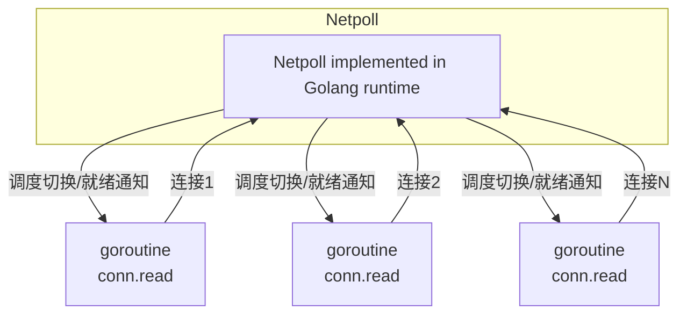
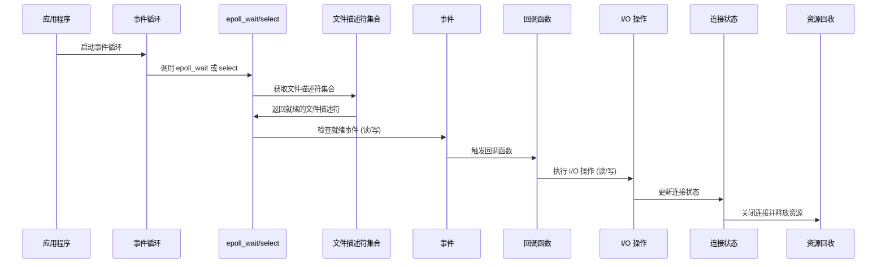

# Netpoll 模型介绍

Netpoll 是 Linux 操作系统中的一种网络 I/O 事件通知机制，广泛用于高性能网络编程中，尤其在处理大量并发连接时。它主要通过高效的事件驱动机制减少线程和系统调用的开销，以支持大规模并发连接的处理。

## 1. Netpoll 架构

Netpoll 模型的核心在于通过非阻塞的 I/O 事件驱动模型来处理大量并发连接。在 Linux 中，Netpoll 是通过 `epoll`、`select`、`poll` 等 I/O 多路复用机制实现的。Netpoll 主要依赖于以下几个组件：

- **I/O 复用**：Netpoll 使用 `epoll` 或 `select` 等机制来实现 I/O 复用，能够在单个线程中同时监视多个文件描述符，减少线程切换和阻塞的开销。

- **事件通知机制**：通过事件通知（如 `epoll` 的 `EPOLLIN`, `EPOLLOUT` 等事件标志），Netpoll 可以高效地响应网络连接状态变化，触发相应的处理函数。

- **非阻塞 I/O**：Netpoll 通过非阻塞模式对每个网络连接进行轮询，不会阻塞进程，能使得单个进程可以高效地处理多个并发连接。

### Netpoll 模型图



#### 解释
1. **Netpoll 模块**：
    - 表示 `Netpoll` 的底层实现（如在 Go runtime 中的实现）。
    - 负责监听连接的就绪状态并通知相应的 `goroutine`。

2. **Goroutines**：
    - 每个连接（如 `conn1`, `conn2`, ...）对应一个 `goroutine`，用于处理具体的读操作（如 `conn.read`）。

3. **调度与通知**：
    - `Netpoll` 会监测连接的状态变化，并通过调度机制通知对应的 `goroutine` 进行操作。


### 调用时序图


### Netpoll 调用流程

1. **应用程序启动事件循环**  
   应用程序启动主线程中的事件循环，用于监听网络事件的发生。

2. **事件循环调用 I/O 多路复用函数**  
   事件循环调用 `epoll_wait` 或 `select` 等 I/O 多路复用函数，获取文件描述符集合。

3. **检查文件描述符状态**  
   对获取的文件描述符集合进行检查，判断哪些文件描述符有事件发生（如可读、可写等）。

4. **触发回调函数**  
   根据检查到的就绪事件，触发相应的回调函数，执行 I/O 操作（如读或写数据）。

5. **更新连接状态**  
   I/O 操作完成后，更新连接的状态信息（如关闭连接、设置连接为可复用等）。

6. **释放资源**  
   如果连接不再需要，则释放相应的资源（如关闭 socket、释放内存等）。


## 2. 连接数处理

Netpoll 模型特别适合用于高并发连接的处理，特别是在网络服务器（如 HTTP、DNS、数据库等）中，能够支持数万甚至数十万个连接。

### 2.1 高效的连接调度

Netpoll 模型的核心在于事件的处理和调度，采用轮询和回调的方式，使得每次只能处理已经就绪的事件。对于每个连接，Netpoll 会在 `epoll_wait` 或 `select` 等调用时检查连接的状态，确定哪些连接有数据可以读写，避免了传统的阻塞等待和线程切换的开销。

### 2.2 连接数限制与内存管理

尽管 Netpoll 能处理大量连接，但系统仍然受到以下因素的限制：

- **操作系统限制**：操作系统的文件描述符数量是有限的，这决定了应用程序能够同时处理的最大连接数。通过调整 `ulimit` 或操作系统参数，可以增加连接数上限。

- **内存消耗**：每个连接的状态（如 socket 缓冲区、`epoll` 事件等）都会占用一定的内存。当连接数过多时，可能会导致内存压力。因此，需要通过合理的内存管理策略来防止内存泄漏或过度消耗。

## 3. 内存处理

Netpoll 模型的内存处理相对复杂，因为每个连接的状态和 I/O 缓冲区都需要占用一定的内存。高效的内存管理对于系统的稳定性和性能至关重要。

### 3.1 I/O 缓冲区管理

对于每个连接，Netpoll 通常会分配相应的 I/O 缓冲区，用于存储数据的读取和写入。为了提高性能，通常采用以下策略：

- **内存池**：为了避免频繁的内存分配和释放，Netpoll 可以使用内存池（Memory Pool）来重用内存块，从而减少内存碎片化和提高效率。

- **零拷贝技术**：使用零拷贝技术（如 `mmap` 和 `sendfile`）减少内存拷贝次数，从而提高数据传输效率。

- **内存限制**：为了防止内存溢出，可以为每个连接设置最大内存使用限制。如果连接的内存消耗超过该限制，系统可以采取断开连接或其他机制进行处理。

### 3.2 内存泄漏与优化

- **内存泄漏监控**：Netpoll 实现中可能存在内存泄漏的风险，尤其在连接关闭时未能及时释放内存。因此，在编写高性能网络应用时，内存泄漏的监控和修复是非常重要的。

- **优化内存分配**：通过使用线程池、内存池等机制优化内存分配，减少内存分配的次数和开销，从而提高系统的吞吐量。

## 4. Netpoll 的实现思路

Netpoll 的实现基于事件驱动和非阻塞 I/O 模型。其主要流程包括：

1. **初始化**：在初始化阶段，Netpoll 会创建一个 `epoll` 或 `select` 监视器，用于监控多个文件描述符的状态。

2. **事件循环**：应用程序在主线程中执行一个事件循环，调用 `epoll_wait` 等函数获取就绪的文件描述符。根据这些文件描述符的状态，程序会相应地进行读取、写入或其他操作。

3. **回调机制**：每当一个连接的状态发生变化（如可读、可写等），Netpoll 会触发回调函数，处理相关事件。

4. **资源回收**：对于关闭的连接，Netpoll 会及时释放资源，包括关闭 socket、释放内存等。

## 5. 具体代码例子
# 使用 netpoll 实现 WebSocket 服务

---

## 示例代码

```go
package main

import (
	"log"
	"net"
	"sync"

	"github.com/gorilla/websocket"
	"github.com/cloudwego/netpoll"
)

// 定义 WebSocket 连接的管理器
type WebSocketConnection struct {
	conn *websocket.Conn
	mu   sync.Mutex
}

// 向客户端发送消息
func (ws *WebSocketConnection) WriteMessage(messageType int, data []byte) error {
	ws.mu.Lock()
	defer ws.mu.Unlock()
	return ws.conn.WriteMessage(messageType, data)
}

// 主函数
func main() {
	// 初始化 netpoll
	poller, err := netpoll.Create(netpoll.WithOnWaitError(func(err error) {
		log.Printf("poller error: %v", err)
	}))
	if err != nil {
		log.Fatalf("failed to create poller: %v", err)
	}

	// 创建一个 TCP 监听器
	listener, err := net.Listen("tcp", "0.0.0.0:8080")
	if err != nil {
		log.Fatalf("failed to start listener: %v", err)
	}
	defer listener.Close()
	log.Println("WebSocket server started at ws://0.0.0.0:8080")

	// 启动接受连接的循环
	for {
		conn, err := listener.Accept()
		if err != nil {
			log.Printf("failed to accept connection: %v", err)
			continue
		}

		// 将新的连接注册到 poller
		err = handleConnection(conn, poller)
		if err != nil {
			log.Printf("failed to handle connection: %v", err)
			conn.Close()
		}
	}
}

// 处理新连接
func handleConnection(rawConn net.Conn, poller netpoll.Poller) error {
	// 升级到 WebSocket 连接
	upgrader := websocket.Upgrader{
		CheckOrigin: func(r *http.Request) bool {
			return true
		},
	}

	wsConn, _, _, err := upgrader.Upgrade(rawConn, nil)
	if err != nil {
		return err
	}

	// 封装为 WebSocketConnection
	client := &WebSocketConnection{conn: wsConn}

	// 创建 netpoll 的事件描述符
	desc, err := netpoll.HandleReadOnce(rawConn)
	if err != nil {
		return err
	}

	// 注册事件处理
	err = poller.Start(desc, func(event netpoll.Event) {
		if event&netpoll.EventReadHup != 0 {
			// 处理连接关闭
			poller.Stop(desc)
			client.conn.Close()
			return
		}

		// 处理 WebSocket 消息
		messageType, message, err := client.conn.ReadMessage()
		if err != nil {
			log.Printf("failed to read message: %v", err)
			poller.Stop(desc)
			client.conn.Close()
			return
		}

		log.Printf("received: %s", message)

		// Echo 消息回客户端
		err = client.WriteMessage(messageType, message)
		if err != nil {
			log.Printf("failed to write message: %v", err)
			poller.Stop(desc)
			client.conn.Close()
			return
		}
	})

	return err
}
```


## 6. 总结

Netpoll 模型提供了一种高效的网络事件通知机制，适用于高并发连接的场景。通过事件驱动和非阻塞 I/O 的方式，Netpoll 能够高效地处理大量的网络连接，同时通过合理的内存管理和优化，提高系统的性能。它的实现依赖于操作系统提供的 I/O 多路复用机制，如 `epoll`，并结合内存池和零拷贝技术，以减少系统调用和内存开销。

## 参考文献

- [Linux epoll 文档](https://man7.org/linux/man-pages/man7/epoll.7.html)
- [高并发网络编程](https://www.amazon.com/High-Performance-Linux-Server-Programming/dp/0596002024)
