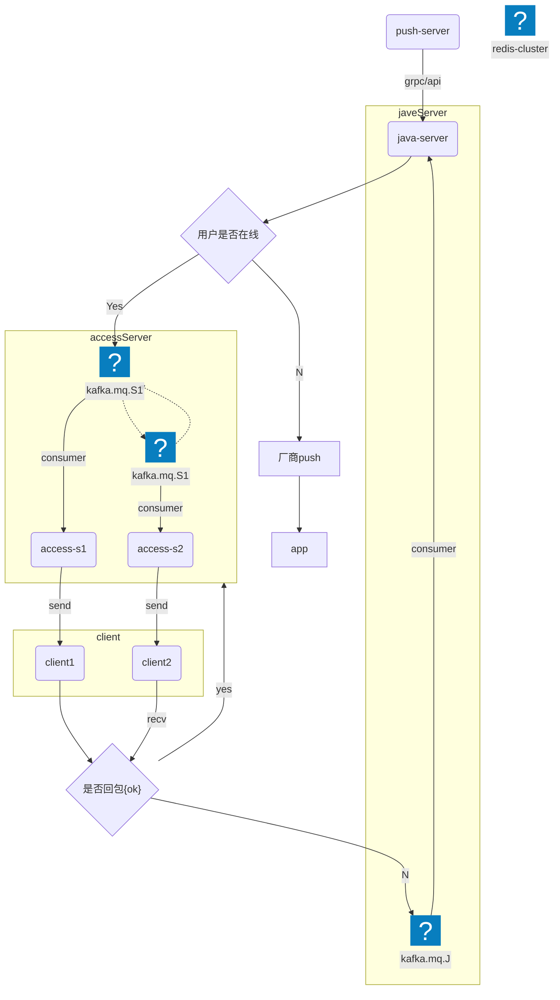

# 核心模块设计

## 接入层设计

### WebSocket连接管理
- **功能**：提供长连接支持，实现实时双向通信。
- **设计要点**：
    - 连接生命周期管理，包括连接建立、保持与断开。
    - 心跳检测与重连机制，保证连接稳定性。
    - 支持高并发场景的连接池优化。
- 详细设计：
  - 建立conn连接池
    - ClientsPool
      - 增加连接
        - 新conn加入
        - 心跳更新conn
      - 删除
        - 30s内没有心跳则删除
        - 定时任务检测删除
      - 修改
        - 心跳更新时间
  - 频道池
    - 管理频道连接
    - 用户加入房间
      - 特殊msgType
      - 维护房间凭悼ID
    - 用户退出房间
      - 特殊msgType
      - 删除用户频道ID
      - 检测是否频道有conn
        - No
          - 删除
        - YES
          - 保留
    - 用户断线/关闭conn
      - 走用户退出房间流程


### HTTP/REST API支持
- **功能**：为客户端提供标准化的接口，支持业务请求和响应。
- **设计要点**：
    - RESTful接口设计，符合HTTP标准。
    - 接口版本管理，兼容多版本客户端。
    - 支持负载均衡与跨域请求。
- **详细**
  - 在线用户接口
  - 拉取历史消息
  - 红点
  - 未读消息
  - 离线消息推送
  - ...

## 消息路由与分发

### 点对点消息路由
- **功能**：实现用户间的私信通信。
- **设计要点**：
    - 根据用户ID进行消息目标路由。
    - 确保消息送达的可靠性与一致性。
    - 支持消息加密与解密。
- 加密
  - TLS（Transport Layer Security）加密：
    - 这是最常见的加密方式，WebSocket连接通常通过wss://协议（WebSocket Secure）建立，即通过TLS加密的WebSocket协议。TLS可以保证数据在传输过程中不会被窃取或篡改。
    wss://是WebSocket协议的加密版本，类似于https://与HTTP的关系，能有效防止中间人攻击。
  - 对称加密：
    - 在WebSocket连接建立后，可能会采用对称加密算法（如AES）对消息内容进行加密。这是因为对称加密的加密和解密速度较快，适合大规模数据传输。
    对称加密通常通过预共享密钥（或者在TLS建立连接时交换密钥）来实现。
- 消息可达性
  - 这是消息非常重要的一环。
    - 因为社交消息有很重要的顺序属性而且是付费消息，所以发送消息丢失不可接收
      - 消息不可丢失
        - 消息不可丢失，对特定消息类型加权重表示重要，所以业务端传递的消息类型有几个字段来标识：
      ```go
      type Message struct {
          msgId int // 消息ID
          lossTime int  // 丢失时间
          ...
      }
      ```
      - `lossTime`用来标识消息的重要性
        - 0 ： 代表不能丢弃，一定得发出去
        - int: 有值，如果当前时间大于 lossTime时间，则丢弃，否则继续投递到休息队列
      - im中台业务端消费未发送成功的消息
        - 是否离线：
          - Y： 继续投递
          - N： 走离线消息
      - access-server
        - websocket接入端投递之后未收到成功回包，则将消息重新投递到中台业务端消费队列
        - 收到回包，则不投递
      - 消息不可丢失流程图：

- 整体流程
  - 1、push-Server调用javaServer GRPC接口
  - 2、javaServer 检测用户是否在线
    - yes:
      - 投递消息到access-server对应的服务器kafka队列
      - access-server消费消息send到对于的客户端conn
      - 客户端收到消息后回包ok
        - yes: 客户端正常回包，消息不处理
        - NO： 没有接受到客户端的对于的消息回包
          - 将消息投递到javaServer 未成功队列，重新走步骤2
    - No:
      - 走厂商推送流程
- 需要注意的几个点：
  - 因为消息顺序性需要保证所以采用kafka，而没有采用订阅模式
  - 每个access-server 服务都需要绑定一个队列
  - 整体了流程消息保证成功投递的关键，在于客户端有没有对应的回包
  - 消息顺序性还需要客户端配合，比如重发消息，重要消息，客户端保留去重效果
  - 客户端根据msgId 调整顺序
**


### 群组消息广播
- **功能**：支持多人群组消息的快速分发。
- **设计要点**：
    - 群组成员列表的高效管理与更新。
    - 广播消息时避免重复与遗漏。
    - 采用分片或分层策略提升性能。

### 消息队列选型与优化
- **功能**：处理异步消息，提升系统吞吐量。
- **设计要点**：
    - 使用RabbitMQ、Kafka等分布式消息队列工具。
    - 消息队列的持久化与事务支持。
    - 消息消费与重试机制，防止消息丢失。

## 存储层设计

### 消息存储模型
- **功能**：为用户的聊天消息提供高效存储。
- **设计要点**：
    - 采用分库分表策略优化存储性能。
    - 支持结构化与非结构化数据存储。
    - 消息索引的优化设计，提升查询效率。

### 历史消息查询优化
- **功能**：快速检索用户的历史聊天记录。
- **设计要点**：
    - 使用缓存（如Redis）加速热点数据查询。
    - 分页查询与时间范围过滤。
    - 利用全文检索引擎（如Elasticsearch）提高查询性能。

## 用户与会话管理

### 用户在线状态
- **功能**：实时跟踪用户在线与离线状态。
- **设计要点**：
    - 在线状态的高效存储与更新。
    - 分布式状态同步与广播。
    - 提供状态查询接口，支持客户端实时显示。

### 会话上下文管理
- **功能**：维护用户会话信息，支持断点续传。
- **设计要点**：
    - 会话信息的持久化与快速读取。
    - 提供接口支持会话的恢复与管理。
    - 跨设备同步会话上下文，提升用户体验。
