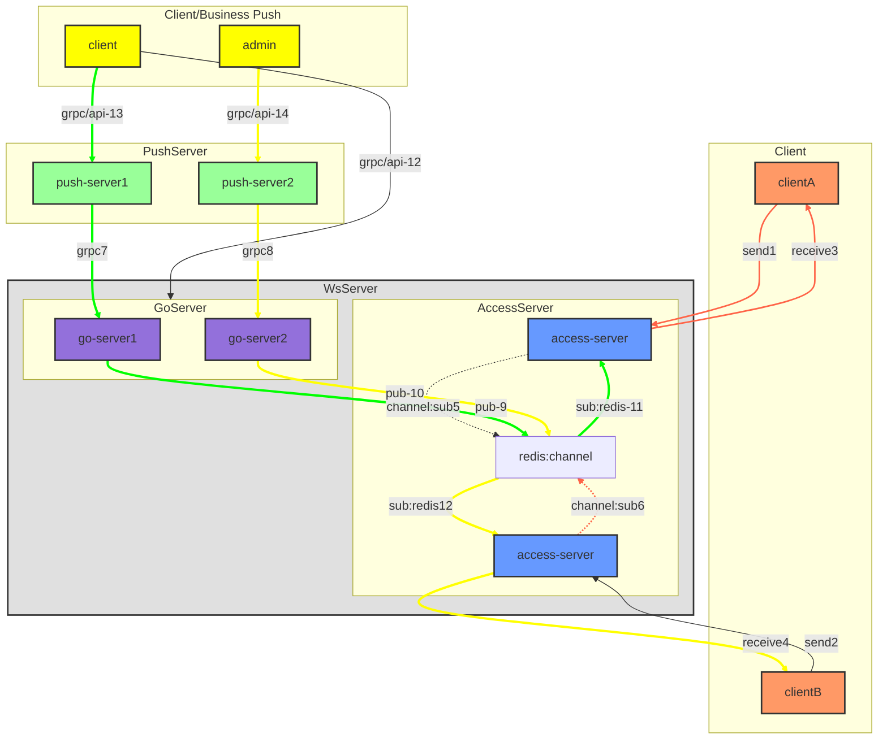
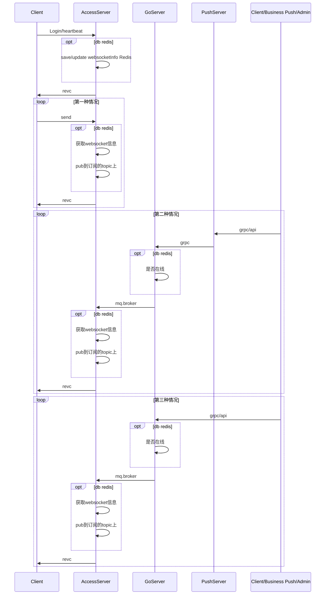

## 总体架构设计

### 系统架构概览

IM 消息中台采用模块化架构设计，确保系统的可扩展性、可靠性和可维护性。系统主要分为以下三层：

#### 1. 前端接入层
- **作用：** 负责管理客户端连接，是所有客户端请求的入口。
- **功能：**
    - 支持 WebSocket 协议，实现实时通信。
    - 通过负载均衡分发进入的连接请求。
    - 支持群组消息的广播机制。
    - 通过确认机制确保消息的可靠投递。
    - 心跳/房间/频道管理
- **实现要点：**
    - 使用连接池管理高并发用户。
    - 支持多种客户端类型（如移动端、网页端）。
    - sub redis channel读取消息

#### 2. 消息中台业务层
- **作用：** 提供 HTTP/REST API/Grpc，方便外部系统或服务集成
- **功能：**
    - 处理业务端的的消息业务。
    - 提供grpc接口或者http接口方便外部获取。
    - 消息持久化
- **实现要点：**
    - grpc连接池的管理。
    - 消息格式组装
    - pub消息到channel

#### 3. 存储层
- **作用：** 负责消息的持久化，并支持历史数据的检索。
- **功能：**
    - 高性能数据库用于实时数据存储。
    - 长期数据归档存储。
    - 索引和缓存机制加速查询。
- **实现要点：**
    - 采用 SQL 与 NoSQL 数据库混合存储策略。
    - 集成分布式文件系统以支持大规模数据存储。

### 技术选型

合理的技术选型是 IM 消息中台成功的关键。具体选择如下：

- **前端接入层：**
  - 语言：golang
  - 中间件：redis
  - 接入协议：websocket
  - 序列化协议：json/protobuf
  - 使用 NGINX 或 HAProxy 进行负载均衡。

- **消息中台业务层：**
    - 语言：java
    - 中间件：redis
    - 接入协议：grpc
    - 序列化协议：json/protobuf

- **存储层：**
    - 使用 MySQL 或 PostgreSQL 存储结构化数据。
    - 使用 MongoDB 或 Cassandra 处理高并发和可扩展存储需求。
    - 使用 Redis 或 Memcached 提升查询性能。

### 架构图/流程图
**架构图**

#### 各层级/组件解释
- Client （客户端）
  - 接入websocket服务（保持连接）
  - 心跳检测
  - 主动心跳检测
    - 建议每10s一次心跳包，不通过ping，直接通过发心跳的方式
- Ws Server （websocket-Server）
  - GoServer（对外提供接口层）
    - Go-server
      - go服务
      - 对外提供grpc接口
        - client可以直接连接
        - 业务端也可以直接连接
  - mq-broker
    - kafka
    - go-server将数据推送Kafka队列
- AccessServer （接入层）
  - 维持websocket连接
    - 更新维持心跳信息
  - pub/sub 订阅发布模式
    - 消费mq.broker消息，对应投递
  - 鉴权
- PushServer （业务方推送）
  - 将需要发送的消息推送到go-server
    - Client
      - 客户端调用业务端grpc接口，业务端服务调用websocket提供的grpc接口
- Admin
  - 后台推送逻辑
    - 后台可以指定用户推送，根据业务逻辑处处理
  - Client/Business Push （业务方推送终端）
    - 直接websocketServer推送
    - 调用业务端服务，业务端再走自己的逻辑推送
- redis-cluster （redis中间价）
  - 保存连接信息
  - 保存group在线用户
  - 保存在线用户

**流程图**

**时序图解释**
- 对应时序图如上所示：
    - 第一：直接accessServer参与的第一种情况
        - client---->accessServer---->client
    - 第二：push-server主要参与者的推送消息
        - Client/Business Push ---> pushServer--->goServer--->accessServer--->client
        - 客户端/admin/业务端调用业务端的接口，业务端的接口调用goServer暴露的grpc接口，go Server推送数据到客户端
    - 第三种：push-server不参与
        - Client/Business Push --->goServer--->accessServer--->client
        - 第三种和第二种的主要区别，就是client直接调用grpc接口，推送数据

