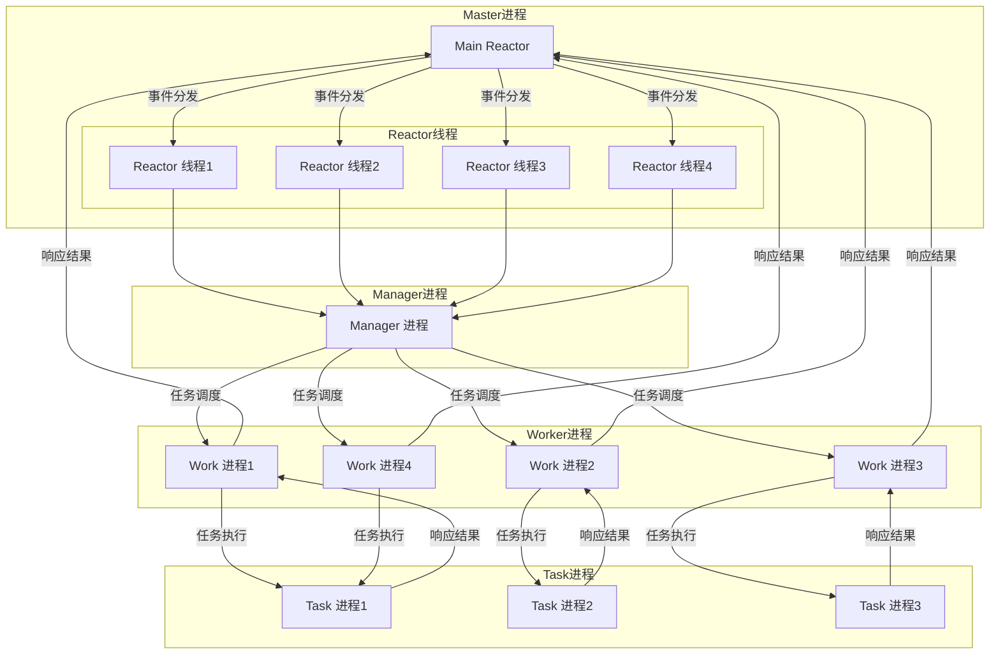

# Swoole 详细介绍
**为什么要讲swoole，没有什么理由，因为swoole设计的非常工整，虽然PHP的在很多地方会被诟病，不过swoole作为PHP的补充，确实非常值的学习，后面会有从源码和网络模型来讲解swoole，如果站在作者韩天峰的视角上解构swoole**
**如果想学网络编程，swoole绝对是一个值的作为学习的工程**
**后续也主要从网络编程这一块来完成swoole的源码解读**

## 1. 什么是 Swoole?

[Swoole](https://www.swoole.co.uk/) 是一款高性能的 PHP 扩展，专为构建高并发、异步、分布式、可伸缩的网络应用而设计。它通过将 PHP 从传统的同步阻塞模型切换到异步非阻塞的模型，显著提高了 PHP 的并发能力。

Swoole 的特点包括：
- 高性能：充分利用多核 CPU，支持异步、协程、并发、任务调度等特性。
- 网络编程支持：支持 TCP、UDP、WebSocket、HTTP、gRPC、MQ 等协议。
- 支持进程管理：支持协程、进程、线程池等技术。
- 支持服务端与客户端的通信：同时支持 HTTP、WebSocket、TCP、UDP 等网络协议。

## 2. Swoole 网络模式

Swoole 提供了多种网络模式，每种模式适合不同的使用场景。主要包括以下几种模式：

### 2.1 异步 IO（Asynchronous IO）
异步 IO 模式可以使 PHP 执行非阻塞操作。所有的请求和任务将通过事件循环进行调度，在执行 I/O 操作时，PHP 不会阻塞等待结果，而是继续执行其他任务。

- **应用场景**：适用于高并发的应用，如 WebSocket、HTTP 长连接等。

### 2.2 协程（Coroutine）
协程是 Swoole 提供的轻量级线程，每个协程拥有自己的栈空间，可以模拟并发操作而无需显式的多线程。它允许在 PHP 中编写同步代码的风格，但在底层以异步的方式执行。

- **应用场景**：适用于需要高并发、高性能的网络服务，如处理大量请求的 API 服务。

### 2.3 Worker 进程（Worker Processes）
Swoole 提供的 worker 模式通过多进程来处理请求，类似于传统的 web 服务器（如 Nginx、Apache）的工作方式。

- **应用场景**：适用于处理 CPU 密集型任务。

### 2.4 服务端与客户端支持
Swoole 支持各种网络协议，包括：
- **TCP、UDP 协议**：适用于自定义协议的实现。
- **WebSocket**：适用于实时通信。
- **HTTP**：适用于 Web 服务的构建。
- **gRPC**：用于高性能的微服务架构。

### 2.5 Swoole 流程图

**Mermaid 代码说明：**
1. **Master进程**：
    - 包含 `Main Reactor` 和多个 `Reactor 线程`。
2. **Manager进程**：
    - 负责管理和调度 Worker 进程。
3. **Worker进程**：
    - 负责处理具体的任务。
4. **Task进程**：
    - 专门处理需要异步执行的任务（例如耗时操作），并返回结果。

