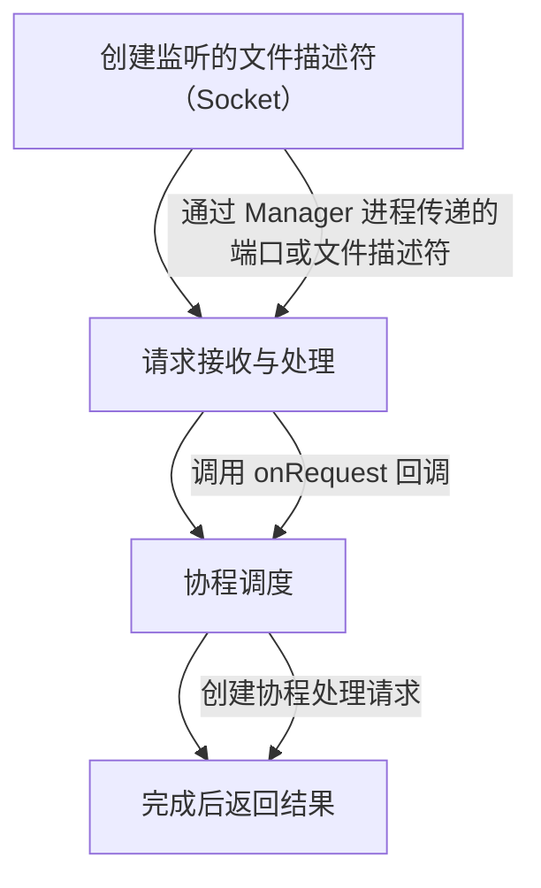

# Swoole Worker 进程源码解读

在 Swoole 中，`Worker` 进程负责处理客户端的请求。理解 `Worker` 进程的源码能够帮助深入了解 Swoole 的工作原理，特别是在高并发和协程的处理机制上。以下是对 `Worker` 进程的生命周期、任务处理机制以及与其他进程的协作进行的源码解读。

## 1. Worker 进程的生命周期

### Manager 进程与 Worker 进程的关系
- Swoole 启动时，首先会创建一个 `Manager` 进程，`Manager` 负责管理多个 `Worker` 进程。
- 每个 `Worker` 进程处理客户端请求，`Manager` 进程会监控 `Worker` 进程的状态，必要时进行重启或重新加载等管理操作。

### 启动 Worker 进程
Swoole 通过 `swoole_server` 的 `start()` 方法来启动 Worker 进程。`Worker` 进程会调用其 `run` 方法开始执行。

## 2. Worker 进程的主要流程

以下是 `Worker` 进程的核心处理流程：

1. **创建监听的文件描述符（Socket）**：`Worker` 进程使用从 `Manager` 进程传递来的监听端口或文件描述符进行监听，等待客户端请求。
2. **请求接收与处理**：当客户端发送请求时，`Worker` 进程接受请求，并通过 `onRequest` 回调处理请求。在此过程中，`Worker` 会调用用户定义的业务逻辑代码来处理请求并生成响应。
3. **协程调度**：Swoole 使用协程来处理高并发的请求。每个请求会在协程中异步执行，避免了传统阻塞 I/O 的问题。`Worker` 进程会创建一个协程来处理每个请求。
4. **完成后返回结果**：`Worker` 进程在完成请求处理后，将响应结果返回给客户端。



## 3. Worker 使用例子

### `Swoole\Server` 类的 `start()` 方法

```php
public function start()
{
    // 创建 Manager 进程
    $this->manager = new Manager($this);

    // 创建 Worker 进程
    for ($i = 0; $i < $this->setting['worker_num']; $i++) {
        $worker = new Worker($this, $i);
        $this->workers[] = $worker;
    }

    // 启动所有 Worker 进程
    $this->manager->start();
}
```

在 `Swoole\Server` 的 `start()` 方法中，`Manager` 进程首先被创建，然后根据配置创建多个 `Worker` 进程，最后启动 `Manager`。

### `Worker` 类的 `run()` 方法

```php
public function run()
{
    // 设置当前进程名称为 Worker 进程
    swoole_set_process_name("swoole-worker");

    // 进入事件循环
    while (true) {
        // 等待并接收客户端请求
        $conn = $this->server->accept();

        // 使用协程处理请求
        go(function () use ($conn) {
            $this->handleRequest($conn);
        });
    }
}

private function handleRequest($conn)
{
    // 处理具体的请求
    $data = $conn->recv();
    // 业务逻辑处理
    $response = $this->process($data);

    // 将响应数据发送给客户端
    $conn->send($response);
}
```

`Worker` 进程的 `run()` 方法是核心，它会不断等待客户端连接，并使用协程处理每个请求。通过 `go()` 函数启动协程，这样可以在一个 `Worker` 进程中并发处理多个请求。

### `Worker` 进程中的 `handleRequest` 方法

`handleRequest` 方法会接收客户端请求，进行处理，并返回响应。实际的请求处理逻辑会在 `process()` 方法中进行，具体的业务代码由开发者实现。

## 4. Worker 进程的协作

#### 与 Manager 进程的通信：
`Worker` 进程与 `Manager` 进程之间有着紧密的合作关系。`Manager` 进程负责监控 `Worker` 进程的状态，并根据需要重启、重新加载工作进程。`Worker` 进程则负责实际的请求处理。

#### 与 Task 进程的协作：
`Worker` 进程还可以与 `Task` 进程协作，任务分发给 `Task` 进程执行，然后返回结果给 `Worker`。这在处理异步任务时非常有用，通常用于执行一些不需要立即返回的操作，比如发送邮件、处理图片等。

## Worker 进程的核心流程

Swoole 中的 Worker 进程执行的主要任务包括：

1. **创建监听的文件描述符（Socket）**
2. **请求接收与处理**
3. **协程调度**
4. **处理完成后返回结果**

###  创建监听的文件描述符（Socket）

在 Swoole 中，Worker 进程的监听操作由 `Server` 对象进行初始化。当 Swoole 启动时，`swoole_server` 会创建监听的 `socket` 文件描述符，负责等待并接收客户端的连接请求。`Server` 在初始化时会设置监听的端口，并将其传递给 Worker 进程。

代码示例：

```c
int swoole_server_create_socket(swoole_server *serv)
{
    struct sockaddr_in addr;
    int sockfd = socket(AF_INET, SOCK_STREAM, 0);
    if (sockfd < 0) {
        return -1;
    }

    memset(&addr, 0, sizeof(addr));
    addr.sin_family = AF_INET;
    addr.sin_port = htons(serv->listen_port);
    addr.sin_addr.s_addr = INADDR_ANY;

    if (bind(sockfd, (struct sockaddr *)&addr, sizeof(addr)) < 0) {
        return -1;
    }

    if (listen(sockfd, SOMAXCONN) < 0) {
        return -1;
    }

    return sockfd;
}
```

### 请求接收与处理

`Worker` 进程通过调用 `accept` 函数来接收客户端连接。一旦客户端连接成功，`Worker` 进程会将连接分配给一个线程或协程进行处理。在 Swoole 的 C 语言实现中，`swoole_event` 和 `swoole_coroutine` 是实现异步事件驱动和协程调度的关键组件。

Swoole 使用事件轮询机制来等待连接请求，一旦有请求到达，`Worker` 进程会通过 `recv` 和 `send` 等系统调用来进行数据接收和响应发送。

```c
// 事件轮询及处理逻辑
void swoole_event_wait()
{
    while (1) {
        int nfd = epoll_wait(efd, events, max_events, -1);
        if (nfd > 0) {
            for (int i = 0; i < nfd; i++) {
                if (events[i].events & EPOLLIN) {
                    // 接收数据并交给协程处理
                    swoole_coroutine_create(handle_request);
                }
            }
        }
    }
}


```


### 协程调度

Swoole 的协程调度是通过 `swoole_coroutine_create` 和 `swoole_coroutine` 来实现的。每个请求在一个协程中执行，避免了传统 I/O 阻塞的问题。协程可以在处理过程中挂起（通过 co_yield）并在某些 I/O 操作（如网络通信、数据库查询等）完成时恢复执行。

Swoole 使用协程池来管理协程，并且每个 Worker 进程内可以有多个协程同时运行。
```c
int swoole_coroutine_create(void (*func)(void))
{
    coroutine_t *co = coroutine_new(func);
    co->status = CORO_READY;
    return 0;
}

void handle_request()
{
    char buffer[1024];
    recv(client_fd, buffer, sizeof(buffer), 0);
    // 异步处理业务逻辑
    co_yield();
    send(client_fd, response, strlen(response), 0);
}

```

### 处理完成后返回结果

请求处理完成后，`Worker` 进程通过调用 `send` 系统调用将结果返回给客户端。如果协程被挂起，等待 I/O 完成后再恢复执行，最终将响应发送给客户端。

```c

int send_response(int client_fd, const char *data)
{
    return send(client_fd, data, strlen(data), 0);
}

```

## Worker 进程的调度与管理

在 `Swoole` 中，`Worker` 进程的调度和管理是由 `Manager` 进程负责的。`Manager` 进程会监听 `Worker` 进程的状态，并确保 `Worker` 进程的高可用性。一旦某个 `Worker` 进程出现异常或崩溃，`Manager` 进程会重新启动该进程。

Swoole 使用了 `epoll` 等高效的 I/O 多路复用机制来确保 `Worker` 进程的高性能。

