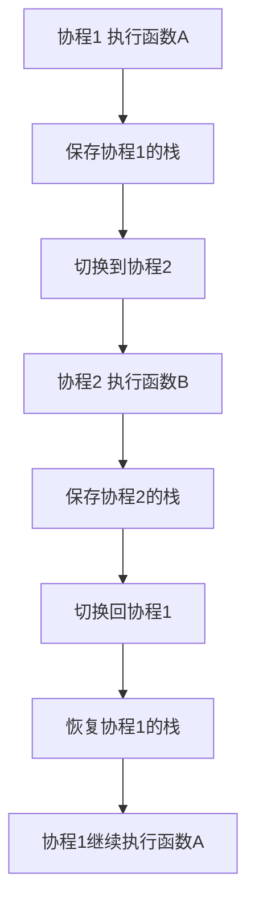
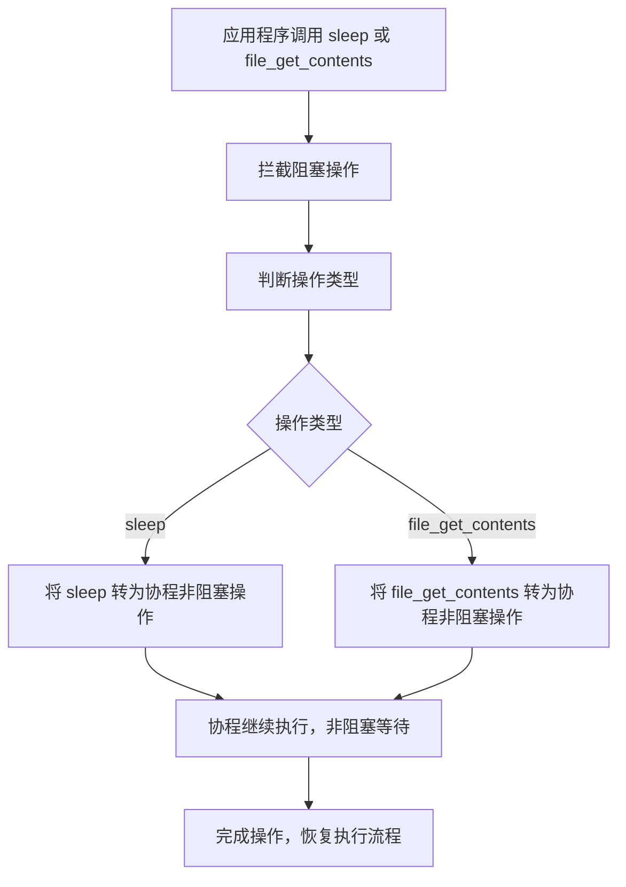

# Swoole 协程实现及简单源码解读

## 什么是协程？
协程是一种轻量级线程，具有较低的资源消耗和更高的性能。与传统线程相比，协程由用户态调度，可以实现非阻塞异步 IO，大幅提升并发能力。

## 源码文件组织结构
- **swoole_coroutine.h**：定义协程类。
- **swoole_coroutine.cc**：实现协程创建、调度和上下文切换。
- **swoole_hook.h/.cc**：实现对系统调用的 Hook。
- **io_manager.h/.cc**：实现 IO 调度和事件循环。
- **tests/**：包含协程功能的单元测试。

## Swoole 协程的核心原理
Swoole 的协程基于以下技术实现：
1. **用户态栈切换**：通过保存和恢复函数调用栈，实现协程上下文切换。



2. **异步 IO 调度**：利用 epoll/kqueue 等事件循环机制处理非阻塞 IO。
3. **Hook 系统调用**：拦截和重写常见阻塞操作（如 `sleep`、`file_get_contents`），将其转为非阻塞协程操作。




### 协程上下文切换
协程的上下文切换主要包括：
- **保存上下文**：保存当前协程的寄存器状态和调用栈。
- **恢复上下文**：恢复目标协程的寄存器状态和调用栈。

Swoole 使用 ucontext 或 Boost.Context 等技术实现这一功能。

## 核心源码解读
以下是 Swoole 协程核心实现的简化源码解读：

### 协程类定义与实现
`swoole_coroutine.h` 文件定义了协程类的结构，`swoole_coroutine.cc` 文件实现了协程的创建、调度和上下文切换。

#### swoole_coroutine.h
```cpp
class Coroutine {
public:
    Coroutine(std::function<void()> fn);
    ~Coroutine();

    void resume();
    void yield();

private:
    Context *context_;
    char *stack_;
    std::function<void()> function_;
};
```

- `context_`：存储协程的上下文信息。
- `stack_`：协程的栈内存，用于保存函数调用栈。
- `function_`：协程的执行函数。

#### swoole_coroutine.cc
以下是协程创建与上下文切换的关键代码：

```cpp
// 构造函数：初始化协程上下文和执行函数
Coroutine::Coroutine(std::function<void()> fn) {
    context_ = new Context();
    stack_ = new char[STACK_SIZE];
    function_ = std::move(fn);
}

// 恢复协程的执行
void Coroutine::resume() {
    if (context_->status == Context::READY) {
        context_->switch_in();
    }
}

// 挂起当前协程
void Coroutine::yield() {
    context_->switch_out();
}

Coroutine::~Coroutine() {
    delete[] stack_;
    delete context_;
}
```

### 协程调度器
`Coroutine::create()` 用于创建一个协程。

```cpp
// 文件：swoole_coroutine.cc
Coroutine::Coroutine(std::function<void()> fn) {
    // 初始化协程上下文
    context_ = new Context();
    stack_ = new char[STACK_SIZE];
    // 绑定函数
    function_ = std::move(fn);
}

void Coroutine::resume() {
    if (context_->status == Context::READY) {
        // 切换到协程的上下文
        context_->switch_in();
    }
}

void Coroutine::yield() {
    // 暂停当前协程，切回主上下文
    context_->switch_out();
}
```

### Hook 系统调用
Swoole 将阻塞系统调用转为非阻塞协程操作，核心代码如下：

```cpp
// 文件：swoole_hook.cc
ssize_t Coroutine::hook_read(int fd, void *buf, size_t count) {
    Coroutine::yield(); // 暂停当前协程
    // 使用 epoll/kqueue 检查可读状态
    IOManager::wait_readable(fd);
    // 恢复协程继续执行
    Coroutine::resume();
    return ::read(fd, buf, count);
}
```

#### swoole_hook.h/.cc 文件的核心实现
swoole_hook.h/.cc 的关键功能在于通过重载常见的系统调用（如 `read`、`write` 等），将其阻塞行为转换为协程的非阻塞行为。

实现步骤包括：
1. **拦截系统调用**：利用动态链接库的加载机制，拦截 libc 函数调用，替换为自定义的 Hook 函数。
2. **非阻塞处理**：在 Hook 函数中，检查文件描述符的可读或可写状态。
3. **协程切换**：如果当前操作无法立即完成，则挂起当前协程，并将其加入事件循环队列。
4. **事件就绪通知**：当 epoll/kqueue 检测到文件描述符就绪时，恢复协程并继续执行。

核心代码示例：

```cpp
// Hook read 函数的实现
ssize_t swoole_hook_read(int fd, void *buf, size_t count) {
    if (!is_non_blocking(fd)) {
        // 如果是阻塞模式，切换为非阻塞模式
        set_non_blocking(fd);
    }

    while (true) {
        ssize_t n = ::read(fd, buf, count);
        if (n < 0 && errno == EAGAIN) {
            // 挂起协程并等待文件描述符可读
            IOManager::wait_readable(fd);
        } else {
            return n; // 读取成功或发生错误
        }
    }
}
```

### IO 管理器
IO 管理器负责管理所有协程的异步 IO 调度：

```cpp
// 文件：io_manager.cc
void IOManager::wait_readable(int fd) {
    epoll_event ev = {0};
    ev.events = EPOLLIN;
    epoll_ctl(epoll_fd, EPOLL_CTL_ADD, fd, &ev);
    // 挂起协程等待 IO 就绪
    Coroutine::yield();
}

void IOManager::notify(int fd) {
    epoll_event ev = {0};
    ev.events = EPOLLIN;
    epoll_ctl(epoll_fd, EPOLL_CTL_DEL, fd, &ev);
    // 恢复对应协程
    Coroutine::resume();
}
```

## 示例代码
以下是一个基于 Swoole 协程的简单示例：

```php
use Swoole\Coroutine;

Co\run(function() {
    Coroutine::create(function() {
        echo "协程 1: 开始\n";
        Co::sleep(1);
        echo "协程 1: 结束\n";
    });

    Coroutine::create(function() {
        echo "协程 2: 开始\n";
        Co::sleep(2);
        echo "协程 2: 结束\n";
    });
});
```

运行结果：
```
协程 1: 开始
协程 2: 开始
协程 1: 结束
协程 2: 结束
```

## 总结
Swoole 协程通过用户态上下文切换和异步 IO 调度，显著提升了 PHP 在高并发场景下的性能。通过源码解读，可以更深刻地理解其内部实现原理，并根据需求进行定制化开发。
