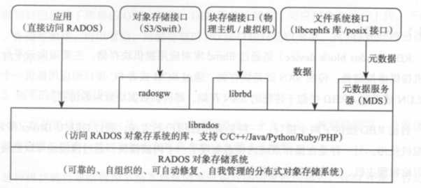

# Ceph 集群的基本组成

Ceph 是一个高度分布式的存储系统，设计目标是提供可扩展、高性能、高可用的存储服务。Ceph 集群由多个节点组成，这些节点被划分为不同的角色，以共同实现存储、数据分发、恢复等功能。Ceph 集群的核心组件包括监视器（Monitor）、对象存储设备（OSD）、管理守护进程（Manager）、客户端接口等。下面将详细描述 Ceph 集群的基本组成，并提供一个系统架构图来帮助理解各个组件的协作方式。

## 1. Ceph 集群的基本组件

### 1.1. **Ceph Monitor (MON)**
Ceph Monitor（简称 MON）是 Ceph 集群中的一个核心组件，其主要功能是维护集群状态、节点信息以及监控集群的健康状况。每个 Ceph 集群至少需要一个 Monitor 节点来保持集群的元数据和状态信息。当集群规模较大时，为了提供高可用性和容错性，通常会部署多个 MON 节点，并采用选举机制选举出一个主 MON 节点。

**MON 的主要功能包括：**
- 跟踪集群的健康状态。
- 存储集群的元数据。
- 维护集群成员（OSD、MGR等）的信息。
- 启动时，客户端和 OSD 守护进程通过 MON 节点来查询集群的状态。

### 1.2. **Ceph OSD (Object Storage Daemon)**
Ceph OSD 是 Ceph 集群中最重要的组件之一，它负责数据的存储和管理。每个 OSD 守护进程与物理磁盘绑定，负责将数据存储为对象。Ceph 使用 CRUSH 算法（Controlled Replication Under Scalable Hashing）来将数据分布到不同的 OSD 节点上。每个 OSD 节点会管理一定数量的数据对象，并负责数据的复制、恢复以及数据的再平衡。

**OSD 的主要功能包括：**
- 存储对象数据。
- 处理数据的读写请求。
- 负责数据的复制和恢复。
- 实现数据的负载均衡和再平衡。

### 1.3. **Ceph Manager (MGR)**
Ceph Manager（简称 MGR）是 Ceph 集群的管理组件，负责提供集群的管理和监控功能。MGR 提供了一个 REST API 接口，供外部管理工具（如 Ceph Dashboard）和用户查询集群状态，并进行操作。MGR 还负责集群的扩展性和数据的负载均衡。

**MGR 的主要功能包括：**
- 提供集群健康状况的监控。
- 提供 Ceph Dashboard，用于管理 Ceph 集群。
- 执行集群状态的查询和统计。
- 负责集群扩展、负载均衡和一些管理任务。

### 1.4. **Ceph OSD Daemon (OSD守护进程)**
Ceph OSD 是 Ceph 存储集群的工作马，每个 OSD 守护进程通常与一个磁盘驱动器绑定。其主要负责存储数据并提供数据的访问功能，包括数据的读写请求以及维护数据的副本。

**OSD的关键任务包括：**
- 存储数据：每个 OSD 守护进程管理一块存储设备，负责将数据存储为对象。
- 数据的复制：每个数据对象都会有多个副本，OSD 负责确保数据副本的一致性。
- 数据恢复：当某个 OSD 节点发生故障时，其他 OSD 节点会自动恢复数据。

### 1.5. **Ceph Client**
Ceph 客户端是 Ceph 存储系统的用户接口，客户端通过不同的接口与 Ceph 集群进行交互。Ceph 支持对象存储、块存储和文件存储三种存储接口，客户端可以通过这些接口访问存储的数据。

**Ceph 客户端的主要接口包括：**
- **RADOS**：Ceph 的原生对象存储接口，客户端可以通过该接口直接访问存储对象。
- **RBD**：块存储接口，常用于虚拟化平台（如 OpenStack）。
- **CephFS**：分布式文件系统接口，提供 POSIX 兼容的文件系统支持。

### 1.6. **CRUSH Algorithm**
CRUSH（Controlled Replication Under Scalable Hashing）是 Ceph 用于数据分布和副本管理的核心算法。它通过在集群中对数据进行哈希计算，确保数据在多个 OSD 节点上的均匀分布，并支持自动化的数据副本管理、负载均衡和故障恢复。

## 2. Ceph 集群的架构图

Ceph 集群的架构图展示了不同组件如何协同工作。

支持三种接口： - Object：有原生的API，而且也兼容Swift和S3的API。 - Block：支持精简配置、快照、克隆。 - File：Posix接口，支持快照。

## 3. 关键技术：CRUSH 和数据分布

Ceph 使用 CRUSH 算法来决定数据如何在集群中分布。与传统的哈希分布不同，CRUSH 使用一个自定义的、层次化的映射系统来确保数据的高效分配和副本管理。通过 CRUSH 算法，Ceph 可以实现以下特点：

- **数据均衡分布**：CRUSH 会根据集群中的每个 OSD 节点的存储能力，均匀地分配数据对象。
- **容错性和可靠性**：通过多副本机制，Ceph 能在一个或多个 OSD 节点失败的情况下继续保持数据的可靠性。
- **扩展性**：集群可以通过添加更多 OSD 节点来水平扩展，而无需重新调整已有的存储分布。

## 4. 参考文献

- **Zhang, L., et al. (2018).** *Ceph: A Scalable and Highly Available Distributed Storage System*. ACM Computing Surveys.  
  该论文详细讨论了 Ceph 的架构设计，特别是 CRUSH 算法如何帮助 Ceph 实现高可扩展性和高容错性。

- **Liu, Q., et al. (2017).** *Fault Tolerance in Ceph: Data Recovery and Failure Detection*. Journal of Cloud Computing.  
  论文分析了 Ceph 在数据恢复和故障检测方面的机制，详细介绍了 OSD 节点如何进行数据的复制与恢复。

## 总结

Ceph 集群由多个关键组件组成，其中 MON、OSD 和 MGR 是最重要的部分。通过采用 CRUSH 算法，Ceph 实现了高效的数据分布、复制与恢复机制。集群的高可扩展性和容错性使得 Ceph 成为大规模存储解决方案的理想选择，尤其适合云计算、大数据分析等存储密集型应用场景。