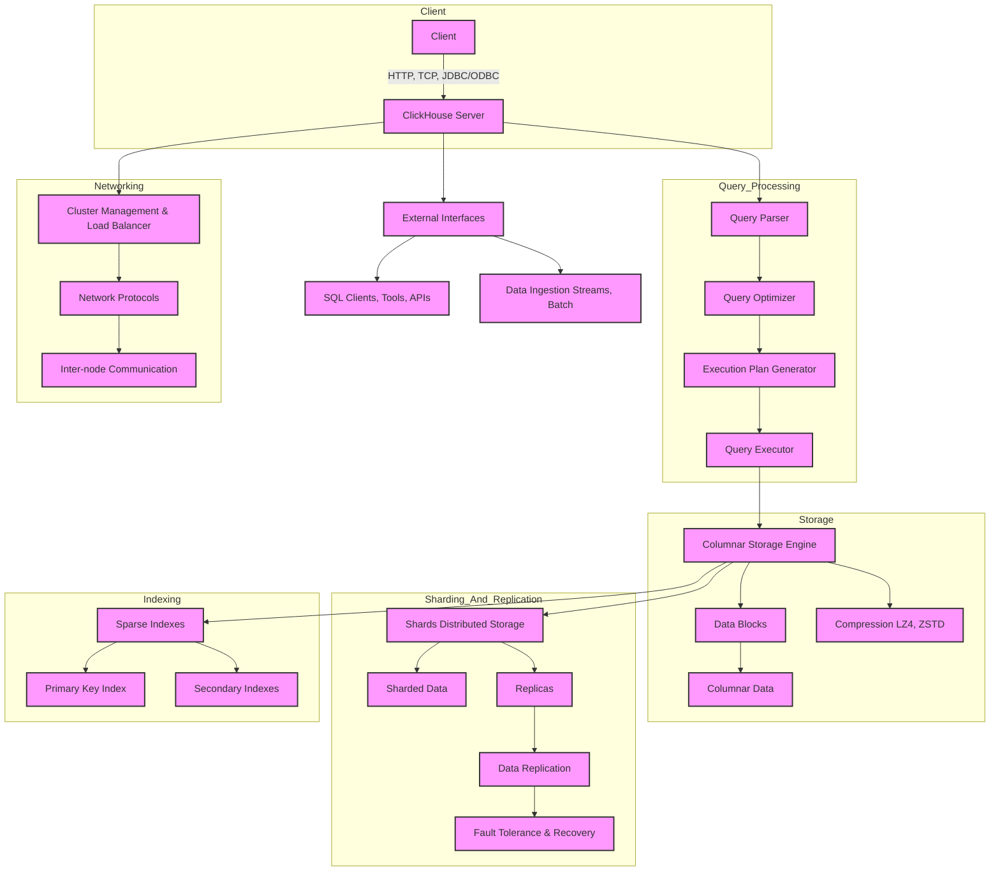

# ClickHouse 简介与架构概览

ClickHouse 是一个开源的列式数据库管理系统（Columnar DBMS），专为在线分析处理（OLAP）而设计，能够快速处理大规模的查询。ClickHouse 提供高性能、可扩展、分布式的数据库解决方案，广泛应用于大数据分析、实时分析、日志处理、监控系统等领域。

## ClickHouse 主要特性

- **列式存储**：ClickHouse 使用列式存储模型，这使得它在处理大规模数据分析时具有高效的性能，特别是对需要按列进行聚合或分析的查询场景。
- **高性能查询**：ClickHouse 的查询引擎优化良好，能够处理复杂的 SQL 查询，包括联接、聚合、分组等操作。查询响应时间非常低，尤其适合高吞吐量的分析型查询。
- **分布式架构**：ClickHouse 支持分布式部署，通过将数据分片并存储在多个节点上来实现水平扩展。这样，它能够支持大规模数据集，同时保证高可用性和容错性。
- **实时数据插入与查询**：ClickHouse 支持高效的实时数据插入和查询，适用于需要实时分析的应用场景，如流式数据分析、监控、日志聚合等。
- **高并发支持**：ClickHouse 设计上支持高并发查询，采用了多线程和并行计算技术，能有效处理大量并发的查询请求。

## ClickHouse 架构概览

ClickHouse 的架构设计旨在提供高性能、高可扩展性和高可用性。它由多个关键组件组成：

1. **客户端**：用户通过客户端（如 HTTP 接口、JDBC、ODBC 或 native protocol）连接到 ClickHouse 服务器并提交查询。

2. **查询处理引擎**：ClickHouse 的查询引擎负责解析、优化和执行 SQL 查询。查询过程通常分为以下几个步骤：
    - **解析**：将 SQL 查询解析为抽象语法树（AST）。
    - **优化**：优化查询执行计划，例如合并相似的操作，优化执行顺序等。
    - **执行**：查询被分解成多个并行操作，并由分布式的计算节点执行。

3. **存储引擎**：ClickHouse 使用列式存储引擎，这使得它能高效地进行聚合操作。每个表的数据按列存储，每列的值被压缩和存储为块。
    - **数据块**：数据存储的最小单位，ClickHouse 将数据按块存储，并利用压缩算法减少磁盘空间占用。
    - **索引**：ClickHouse 使用稀疏索引来加速查询，它通过索引块快速定位数据。

4. **分布式架构**：
    - **分片（Sharding）**：ClickHouse 支持数据的水平切分（分片），每个分片可以存储在不同的物理节点上。这使得它能够处理PB级别的数据。
    - **副本（Replication）**：ClickHouse 通过在多个节点上存储副本来确保数据的高可用性。每个分片的副本在不同的节点上进行冗余存储，防止数据丢失。

5. **存储与压缩**：ClickHouse 内建了高效的压缩算法（如 LZ4、ZSTD），通过减少存储空间来提高性能。

6. **容错与恢复**：ClickHouse 设计支持容错，分布式系统可以容忍部分节点的故障。数据通过副本机制进行冗余存储，当某个节点发生故障时，查询可以转发到其他副本节点，保证系统的高可用性。

### 基本架构图

#### 说明：

- **`Client`**：客户端通过 HTTP、TCP 或其他接口连接到 ClickHouse 服务器，发起查询请求。

- **`Query Processing`**：查询处理阶段，涉及 SQL 解析、优化、执行计划生成和查询执行。
    - **`Query Parser`**：解析 SQL 查询，生成抽象语法树。
    - **`Query Optimizer`**：优化查询，生成最佳的执行计划。
    - **`Execution Plan Generator`**：根据优化后的查询生成执行计划。
    - **`Query Executor`**：实际执行查询，处理计算和数据访问。

- **`Storage`**：存储引擎，使用列式存储和压缩技术。
    - **`Columnar Storage Engine`**：列式存储引擎，存储和管理列数据。
    - **`Data Blocks`**：数据块是存储的基本单位，数据按列组织。
    - **`Compression`**：使用压缩算法（如 LZ4、ZSTD）减少存储空间。
    - **`Columnar Data`**：数据按列存储，每列的数据被独立处理。

- **`Sharding and Replication`**：数据分片与副本，提供分布式存储和容错机制。
    - **`Shards`**：水平分片，数据分布在多个节点上。
    - **`Replicas`**：每个分片的副本存储，保证数据冗余和高可用性。
    - **`Fault Tolerance & Recovery`**：容错与恢复机制，在节点故障时自动切换到副本。

- **`Indexing`**：索引机制，提高查询效率。
    - **`Sparse Indexes`**：稀疏索引，用于快速定位数据。
    - **`Primary Key Index`**：主键索引。
    - **`Secondary Indexes`**：二级索引，用于加速特定字段的查询。

- **`Networking`**：集群管理和节点间通信。
    - **`Cluster Management & Load Balancer`**：集群管理和负载均衡，确保请求分配到合适的节点。
    - **`Network Protocols`**：支持多种网络协议，确保节点间的通信。
    - **`Inter-node Communication`**：节点之间的通信，协调数据的分布和查询的执行。

- **`External Interfaces`**：外部接口，支持 SQL 客户端、工具和数据导入。
    - **`SQL Clients, Tools, APIs`**：支持多种 SQL 客户端和 API 接口。
    - **`Data Ingestion`**：支持批量和流式数据导入。

## 总结

ClickHouse 是一个专为 OLAP 设计的高性能列式数据库，具备分布式架构、实时分析能力和强大的查询引擎，适用于大规模数据分析应用。通过列式存储、压缩和分布式处理，ClickHouse 能够高效地处理大规模数据查询，同时保证高可用性和高并发处理能力。
