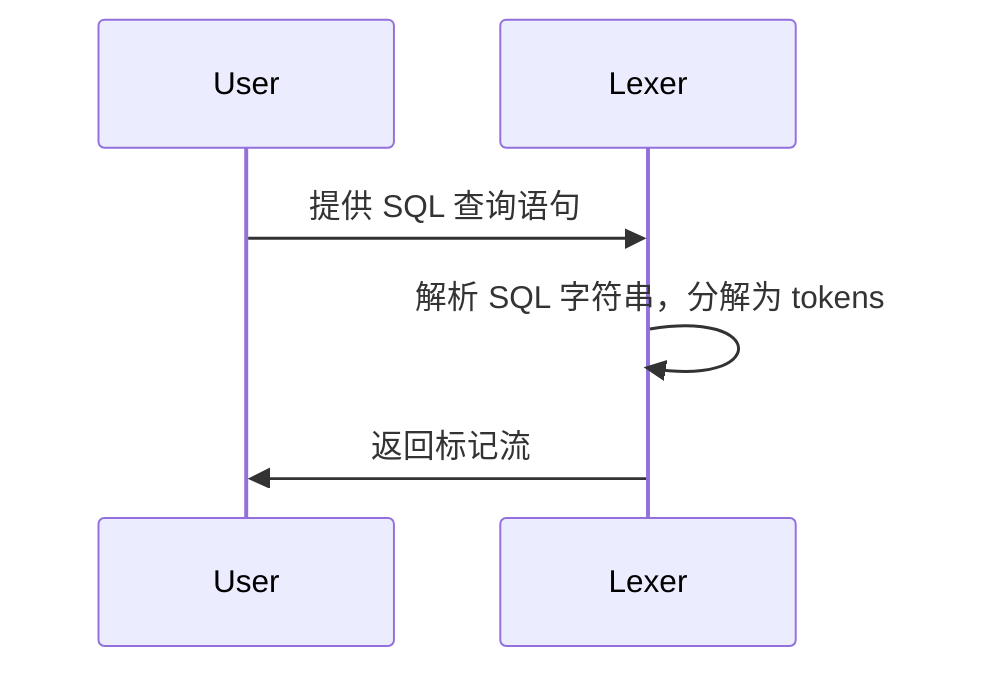
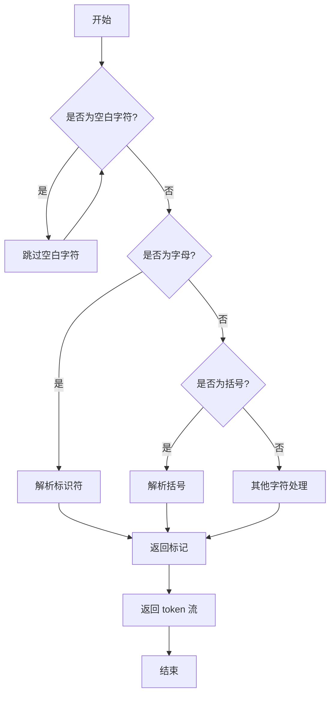
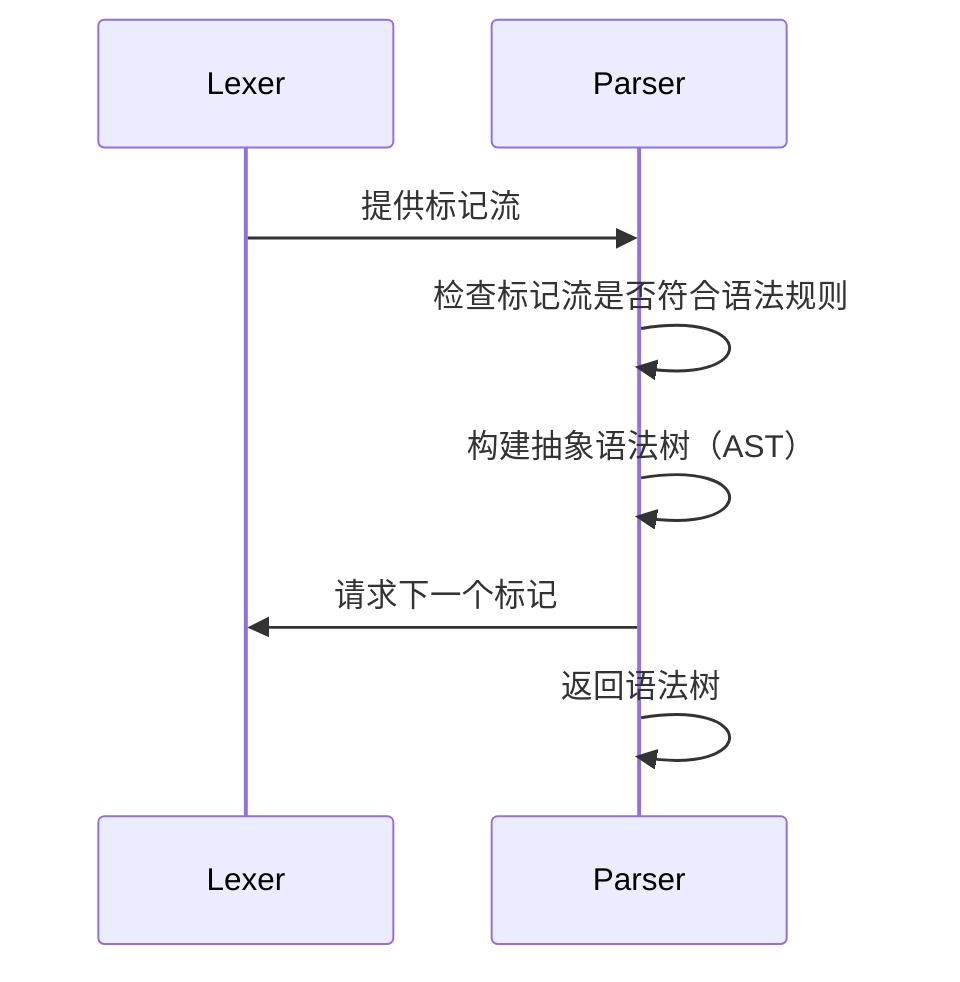
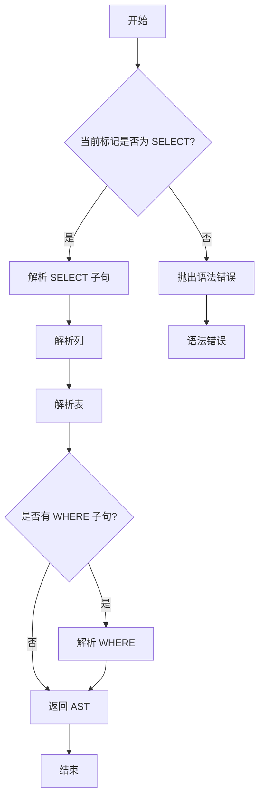
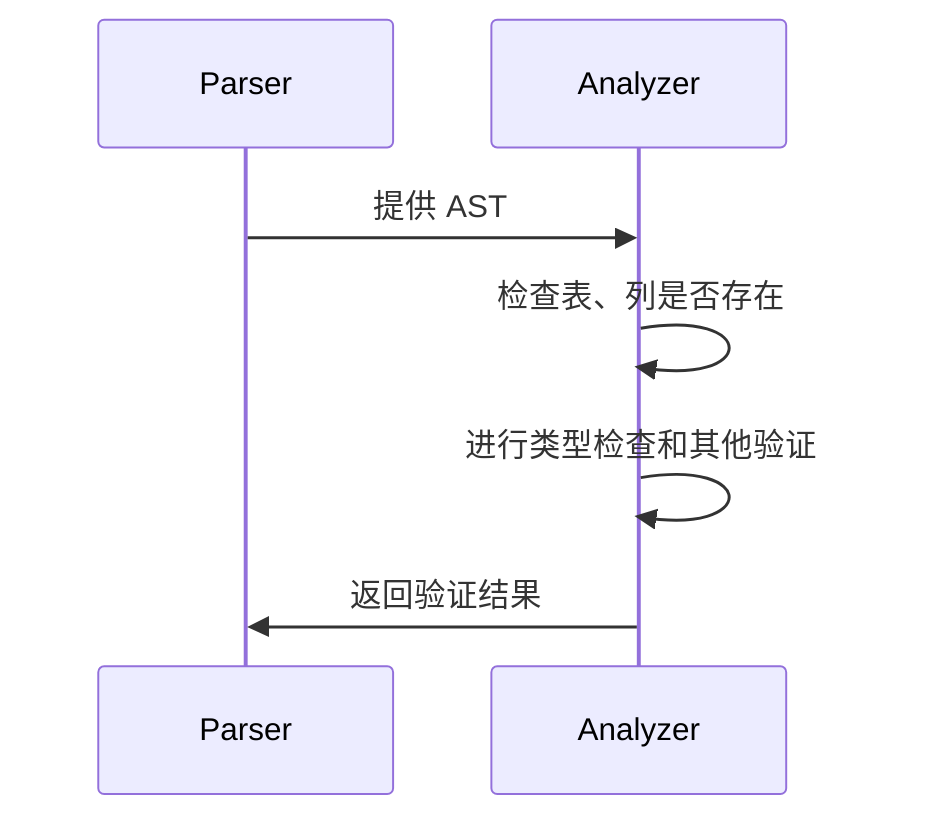
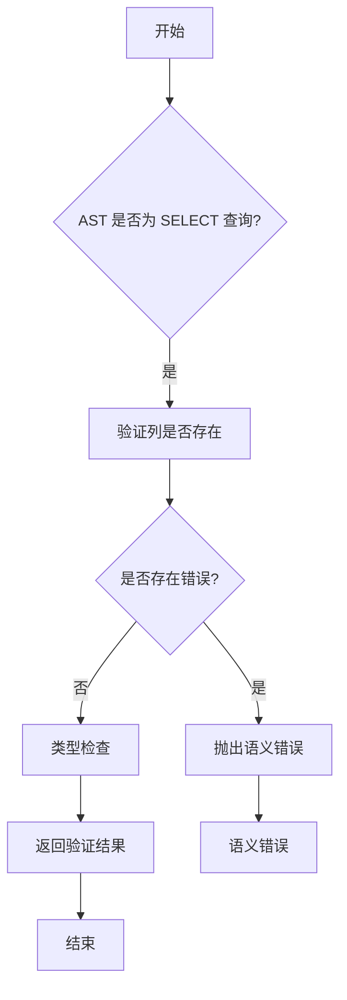

# ClickHouse 查询执行流程与源码分析

## 2.1 查询解析与优化

### 1. 查询解析器：解析 SQL 查询，并将其转化为计算图
在 ClickHouse 中，查询的执行从 SQL 解析开始。查询解析器负责将输入的 SQL 查询语句转化为查询树（AST）。解析器的作用是将 SQL 语法结构转化为 ClickHouse 内部能理解的表达式结构，这个过程主要由以下几个步骤组成：
- **词法分析**：将 SQL 查询语句分解为标记（tokens）。
- **语法分析**：检查 SQL 的语法是否合法，并将 SQL 查询转化为抽象语法树（AST）。
- **语义分析**：验证 SQL 查询中的表、列、函数等是否存在，确保查询的有效性。

**1. 词法分析**

词法分析（Lexical Analysis）负责将原始 SQL 查询字符串分解为一个个标记（tokens）。这些标记可以是关键字、操作符、标识符、字符串等。
```cpp
// Lexer.cpp
Token Lexer::getNextToken() {
    while (position < input.size()) {
        char currentChar = input[position];
        if (isWhitespace(currentChar)) {
            // 跳过空白字符
            position++;
        } else if (isAlpha(currentChar)) {
            // 解析标识符（关键字、表名等）
            return parseIdentifier();
        } else if (currentChar == '(' || currentChar == ')') {
            // 解析括号
            position++;
            return Token(TokenType::Parenthesis, std::string(1, currentChar));
        }
        // 其他字符的处理逻辑...
    }
    // 返回结束标记
    return Token(TokenType::EndOfFile, "");
}
```
**时序图**

**流程图**


**2. 词法分析**
语法分析（Syntax Analysis）负责将词法分析得到的标记流转化为抽象语法树（AST）。语法分析会检查查询语句的结构是否符合 SQL 语法规则。
语法分析通常由 Parser 类来完成，核心代码如下：
```cpp
// Parser.cpp
ASTPtr Parser::parseSelectQuery() {
    // 解析 SELECT 语句
    if (currentToken().type == TokenType::SELECT) {
        consumeToken(); // 消费 SELECT 关键字
        ASTPtr selectQuery = std::make_shared<ASTSelectQuery>();
        selectQuery->columns = parseColumns();
        selectQuery->tables = parseTables();
        // 进一步解析其他部分，如 WHERE, GROUP BY 等
        return selectQuery;
    }
    throw SyntaxError("Expected SELECT query");
}


```

**时序图**


**流程图**


**3、语义分析**

语义分析（Semantic Analysis）主要验证 SQL 查询中的表、列、函数等是否存在，并且进行类型检查和其他语义验证。该阶段确保 SQL 查询不仅语法上正确，而且在语义上也是合理的。

语义分析的核心在于验证解析出的 AST 中的表和字段是否存在，通常由 SemanticAnalyzer 类来实现，代码示例如下：

```cpp

// SemanticAnalyzer.cpp
void SemanticAnalyzer::analyze(const ASTPtr & ast) {
    if (auto * selectQuery = dynamic_cast<ASTSelectQuery *>(ast.get())) {
        for (const auto & column : selectQuery->columns) {
            if (!isColumnExist(column)) {
                throw SemanticError("Column not found: " + column);
            }
        }
    }
}

```

**时序图**


**流程图**



#### 解析器的核心文件：
- `Parser.cpp`: 包含 SQL 查询的解析功能，将 SQL 语法转化为 AST。
- `AST` 结构：用于存储 SQL 语句的解析结果，包含每个 SQL 元素的相关信息。


### 2. 优化器：执行查询优化，选择最合适的查询执行计划
查询优化器的任务是基于给定的查询树，通过一系列优化算法生成查询的执行计划。优化器会根据统计信息、查询复杂度、查询模式等来选择最优的执行策略，主要包括：
- **表达式简化**：如常量折叠、子查询优化等。
- **谓词推导**：在执行之前，通过分析 SQL 中的条件表达式，将条件尽早应用到数据集。
- **查询重写**：对查询进行重写，使其更高效，如合并子查询、分解联合查询等。

常见的优化方式：
- **选择性优化**：根据表的统计信息选择不同的查询执行策略。
- **索引与分区优化**：通过优化分区扫描与索引查询来减少扫描的行数。

优化器的核心文件：
- `QueryOptimizer.cpp`: 执行查询优化。
- `Rewrite.cpp`: 负责查询重写操作。

## 2.2 查询执行流程

### 1. 查询执行器：分析查询执行的每个步骤
查询执行器负责将优化后的查询计划转化为实际的执行操作。它的主要职责包括：
- **查询计划执行**：根据优化器生成的执行计划逐步执行查询。
- **数据读取与处理**：从磁盘、内存或缓存中读取数据，执行数据操作。
- **结果返回**：将执行的结果返回给客户端。

执行器的工作流程：
1. **初始化**：执行器将查询分解为多个阶段，并创建必要的执行上下文。
2. **执行步骤**：
    - **读取数据**：通过表引擎来访问数据。
    - **执行计算**：对数据进行过滤、聚合、排序等操作。
    - **输出结果**：将处理后的数据返回给客户端。

查询执行器的核心文件：
- `InterpreterSelectQuery.cpp`：处理 SELECT 查询的执行。
- `InterpreterInsertQuery.cpp`：处理 INSERT 查询的执行。

### 2. 表引擎的作用：深入分析 MergeTree、Log 和 Dictionary 等表引擎
在 ClickHouse 中，表引擎是查询执行的核心部分。表引擎不仅管理数据的存储方式，还决定了如何处理查询请求。主要表引擎有：
- **MergeTree 引擎**：是 ClickHouse 最常用的表引擎，支持高效的分区与合并操作。它通过分区和排序来加速数据读取，并定期合并数据以优化存储。
    - **查询优化**：通过分区裁剪、索引优化等策略，提高数据查询效率。
    - **合并操作**：合并多个数据部分，以减少磁盘 I/O 操作。
- **Log 引擎**：适用于仅有插入操作的场景，数据直接插入到表中，不进行索引和分区。
- **Dictionary 引擎**：适用于存储维度表的数据，通过内存中的字典加速查询。

表引擎的作用文件：
- `MergeTree.cpp`: 管理 MergeTree 引擎的查询与数据操作。
- `Log.cpp`: 处理 Log 引擎的写入与查询。

## 2.3 源码分析

### 1. 查询执行源码结构
查询执行的源码结构可以分为几个主要模块：
- **查询解析**：`Parser.cpp` 和 `AST` 相关结构。
- **查询优化**：`QueryOptimizer.cpp` 和 `Rewrite.cpp`，这些文件实现了查询的重写和优化。
- **查询执行器**：`InterpreterSelectQuery.cpp` 和 `InterpreterInsertQuery.cpp`，分别负责 SELECT 和 INSERT 查询的执行。

每个查询的执行从解析器开始，通过优化器优化后，最后由执行器处理。查询执行器根据不同的查询类型（如 SELECT、INSERT 等），调用不同的执行策略。执行器的内部实现通过几个关键的 `Interpreter` 类来实现：
- `InterpreterSelectQuery.cpp`：执行 SELECT 查询。
- `InterpreterInsertQuery.cpp`：执行 INSERT 查询。

### 2. 重点讲解：查询计划生成、执行策略等
- **查询计划生成**：查询优化器根据 SQL 语句生成的查询树选择最优的执行计划，生成执行器需要遵循的查询步骤。
    - **查询计划**：包括数据的读取、操作顺序、计算任务等。
    - **执行策略**：定义如何实现查询计划，如使用索引、分区裁剪等。

- **执行策略**：执行策略定义了查询的执行方式。例如：
    - **索引扫描**：通过索引加速数据读取。
    - **顺序扫描**：没有索引的情况下顺序读取数据。
    - **分区裁剪**：在有分区的情况下，根据查询条件裁剪不需要的分区。
    - **并行执行**：在合适的情况下，执行计划可以被并行化，减少查询延迟。

### 3. 查询执行中的关键源码文件
- **`InterpreterSelectQuery.cpp`**：用于执行 SELECT 查询，处理查询解析后的执行步骤，包括数据读取、聚合、排序等操作。
- **`InterpreterInsertQuery.cpp`**：用于执行 INSERT 查询，处理插入数据到指定表的逻辑。
- **`MergeTree.cpp`**：管理 MergeTree 表引擎的查询与数据操作，实现数据的合并和优化。
- **`Log.cpp`**：处理 Log 引擎的写入与查询，适用于需要快速插入数据的场景。
- **`QueryOptimizer.cpp`**：执行查询优化，基于查询的分析生成最优的查询执行计划。
