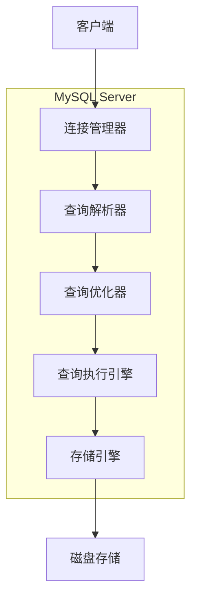
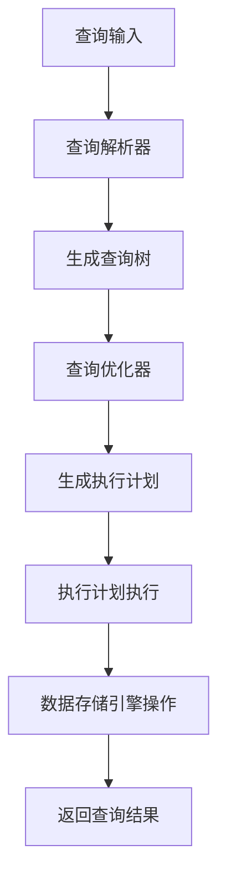
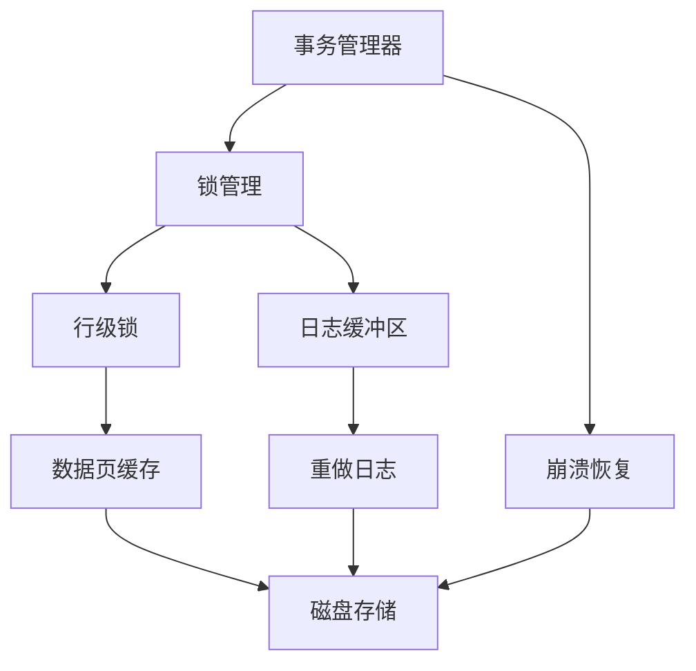

# MySQL 简介与架构概览

## 1.1 **MySQL 简介**
**MySQL** 是一个开源的关系型数据库管理系统，广泛应用于 Web 应用和企业级应用。它支持 SQL 查询语言，具有高性能、可扩展性和易用性。MySQL 在数据存储、查询处理和事务管理方面表现出色，是最常用的数据库系统之一。

### MySQL 的核心特点
| 特性               | 描述                                                     |
|--------------------|----------------------------------------------------------|
| **开源**           | 完全开源，用户可以自由下载、使用和修改源码。               |
| **高性能**         | 通过优化的查询处理机制和索引技术提供高效的数据访问能力。   |
| **事务支持**       | 支持 ACID 事务特性，确保数据的一致性、隔离性和持久性。      |
| **可扩展性**       | 支持大规模数据存储和高并发请求，适合复杂的应用场景。        |
| **多平台支持**     | 支持多个操作系统平台，包括 Linux、Windows、macOS 等。     |

---

## 1.2 **MySQL 架构概览**

MySQL 采用 **客户端-服务器** 架构，客户端通过 SQL 语句与 MySQL 服务器进行交互。MySQL 服务器内部包含多个核心模块，这些模块协同工作，确保 SQL 查询的高效执行。

### MySQL 架构图

### MySQL 查询执行流程
- **客户端发送 SQL 查询**：客户端通过 MySQL 客户端发起 SQL 查询请求。
- **连接管理器**：连接管理器负责管理客户端的连接，验证客户端身份。
- **查询解析器**：解析 SQL 查询语法，将查询转换成查询树，检查语法是否正确。
- **查询优化器**：优化器根据表的统计信息生成最优的执行计划，选择最佳查询路径。
- **查询执行引擎**：根据执行计划处理实际的查询操作，涉及数据的读取与写入。
- **存储引擎**：根据执行引擎的命令进行实际的数据存储和操作，如磁盘文件读取、索引查询等。
- **返回查询结果**：查询完成后，结果返回客户端。

### 查询优化流程图

---
## 1.3 MySQL 的核心组件
### 1.3.1 存储引擎架构
MySQL 支持多种存储引擎，每种引擎有不同的特点和适用场景。存储引擎负责数据的存储和检索操作，决定了数据如何在磁盘上组织和管理。

**常见的存储引擎**
## MySQL 的核心特点
| 存储引擎             | 特点                                                  | 使用场景   |
|-------------------|----------------------------------------------------------|--------|
| **InnoDB**          | 事务支持、行级锁、外键约束、ACID 支持               |高并发、复杂的事务处理|
| **MyISAM**        | 不支持事务，表级锁，不支持外键约束，查询速度较快   |数据仓库、只读或少量写的场景|
| **MEMORY**       | 将数据存储在内存中，速度非常快，支持表级锁    |临时表、缓存数据|
| **CSV**       | 将表数据存储为 CSV 格式，便于导出和处理        |数据导入导出、简单存储|
| **ARCHIVE**     | 用于存储大量归档数据，压缩性强   |存储历史记录，归档数据|

### 1.3.2 InnoDB 存储引擎
**InnoDB** 是 MySQL 默认的存储引擎，提供事务支持、行级锁、外键约束等功能。它非常适合 OLTP（联机事务处理）系统，特别是在高并发的环境下。
 
**InnoDB 存储引擎的特点**
## MySQL 的核心特点
| 特性             | 描述                                        |
|------------------|---------------------------------------------------------|
| **事务支持**         | 完全支持 ACID 事务特性，保证数据的一致性、隔离性和持久性。              |
| **行级锁**        | 采用行级锁机制，提供更细粒度的锁定，避免了表级锁带来的性能瓶颈。 |
| **外键支持**      | 支持外键约束，可以确保数据的完整性与一致性。   |
| **崩溃恢复**       | 提供崩溃恢复机制，保证即使在系统崩溃后也能恢复数据。|
| **MVCC**    | 使用多版本并发控制（MVCC）来实现高并发，保证事务的隔离性。   |

## InnoDB 存储引擎内部架构

- **事务管理器**：负责处理所有事务的提交和回滚。
- **锁管理**：管理事务间的锁，包括行级锁和意向锁。
- **数据页缓存**：将表数据和索引数据存储在内存中，以提高性能。
- **重做日志**：记录对数据库的所有修改操作，用于恢复数据库的一致性。
- **崩溃恢复**：通过日志文件，在系统崩溃后恢复数据库到最后一致状态。