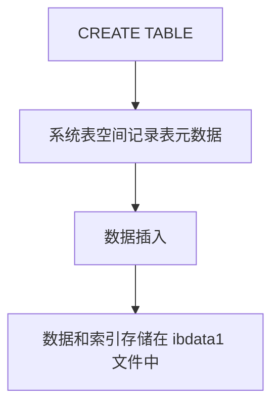
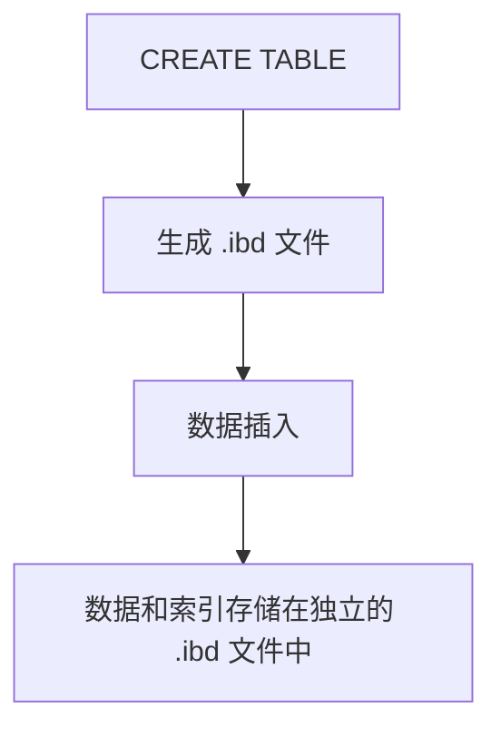
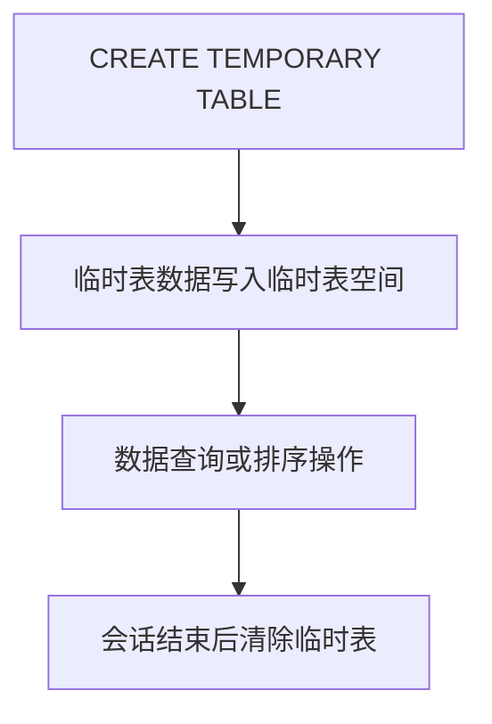

# 2 InnoDB 存储引擎概述

InnoDB 是 MySQL 的默认存储引擎，提供了高性能的事务处理、数据完整性保护和支持高并发的功能。下面将详细介绍 InnoDB 存储引擎的几个关键特性。

## 2.1. 事务性

InnoDB 支持 ACID 事务，即提供了原子性、一致性、隔离性和持久性四个特性，保证了数据库操作的可靠性和数据的完整性。

- **原子性（Atomicity）**：事务中的所有操作要么完全执行，要么完全不执行，确保事务的原子性。
- **一致性（Consistency）**：事务执行前后，数据库的状态是一致的，满足所有数据完整性约束。
- **隔离性（Isolation）**：并发事务的执行不会互相干扰，各个事务的操作彼此隔离。
- **持久性（Durability）**：一旦事务提交，它对数据库的修改就会永久生效，即使系统崩溃也能保证数据不丢失。

InnoDB 支持的事务隔离级别包括：
- **读未提交（Read Uncommitted）**
- **读已提交（Read Committed）**
- **可重复读（Repeatable Read）**
- **串行化（Serializable）**

在这些隔离级别下，InnoDB 能够有效地管理并发事务，防止脏读、不可重复读和幻读等问题。


### InnoDB 事务隔离级别

InnoDB 支持的事务隔离级别主要解决了数据库并发操作中的不同问题，具体包括“脏读”、“不可重复读”和“幻读”问题。每个隔离级别对这些问题的解决程度不同。以下是每个隔离级别的描述、解决的问题和实际举例。

#### 事务隔离级别与问题解决

| 事务隔离级别      | 解决的问题           | 描述                                                               |
|------------------|--------------------|------------------------------------------------------------------|
| **读未提交 (Read Uncommitted)** | 脏读 (Dirty Read)     | 允许事务读取其他事务未提交的数据。最弱的隔离级别，可能会读取到其他事务的临时数据，导致脏读。   |
| **读已提交 (Read Committed)**  | 脏读 (Dirty Read)     | 解决脏读问题，但允许不可重复读问题。一个事务读取的每一行数据都是已提交的数据，但在同一事务中，数据可能会被修改。 |
| **可重复读 (Repeatable Read)** | 脏读、不可重复读 (Non-repeatable Read) | 解决脏读和不可重复读问题。在一个事务中，数据的读取是稳定的，不会被其他事务修改，但可能会出现幻读问题。  |
| **串行化 (Serializable)** | 脏读、不可重复读、幻读 (Phantom Read) | 最强的隔离级别，完全避免脏读、不可重复读和幻读。通过加锁等手段保证事务按顺序执行。 |

### 各个事务隔离级别的详细说明：

#### 1. 读未提交 (Read Uncommitted)
- **问题**：允许事务读取其他事务未提交的数据，可能会读取到其他事务正在修改的数据，这种读取被称为脏读。
- **举例**：
  - **事务 A**：开始，更新某个记录的数据，但没有提交。
  - **事务 B**：查询该记录，读到的是事务 A 未提交的脏数据。
  - 如果事务 A 后续回滚，事务 B 读取的数据就变得无效。
- **解决**：仅避免了事务内的锁竞争，但其他并发事务可能会影响当前事务，导致读取的数据不可靠。

#### 2. 读已提交 (Read Committed)
- **问题**：防止脏读，确保一个事务只能读取其他事务已提交的数据。但这种级别不能保证在同一个事务内读取的结果一致，可能会出现不可重复读的情况。
- **举例**：
  - **事务 A**：开始，查询某个记录的数据并获取值为 100。
  - **事务 B**：在事务 A 执行查询后，更新该记录的值为 200 并提交。
  - **事务 A**：再次查询该记录，此时读取到的新值为 200，而不是最初的 100。
  - 这种情况称为不可重复读，因为事务 A 多次读取相同记录时，数据发生了变化。
- **解决**：事务只能读取已经提交的内容，但事务执行期间其他事务可以更新数据，导致数据在同一事务中读取不一致。

#### 3. 可重复读 (Repeatable Read)
- **问题**：解决了脏读和不可重复读问题，保证了同一事务内多次读取相同数据时结果一致。然而，仍然可能出现幻读（即事务读取的范围外新增、删除或修改的记录）。
- **举例**：
  - **事务 A**：开始，查询某个条件下的所有记录，假设查询条件为 `age > 20`，返回 10 条数据。
  - **事务 B**：插入一条满足该条件的数据，提交。
  - **事务 A**：再次执行相同的查询，返回 11 条数据。
  - 这时，事务 A 看到的记录数发生了变化，这种现象叫做幻读。
- **解决**：锁定读到的数据行，防止其他事务修改或插入相同的数据。InnoDB 在这个级别下通常使用**间隙锁**（Gap Lock）来防止幻读。

#### 4. 串行化 (Serializable)
- **问题**：通过对所有读取的行加锁，避免脏读、不可重复读和幻读，提供最高的隔离级别。事务被完全串行化，所有事务按顺序执行。
- **举例**：
  - **事务 A**：开始，查询某个范围的数据，比如查询 `age > 20` 的所有记录，返回 10 条。
  - **事务 B**：试图插入或更新与事务 A 查询范围匹配的数据，但事务 A 对查询结果加锁，事务 B 无法插入或更新。
  - 这样就避免了所有的并发问题，包括脏读、不可重复读和幻读。
- **解决**：事务完全串行化，确保没有其他事务可以干扰当前事务的执行。虽然此级别最安全，但也可能导致性能问题，因为锁竞争会显著增加。

### 总结

- **读未提交**：最弱的隔离级别，可能出现脏读。
- **读已提交**：避免脏读，但可能出现不可重复读。
- **可重复读**：解决脏读和不可重复读问题，但可能会有幻读。
- **串行化**：最强的隔离级别，解决所有问题，但可能导致性能问题。

通过选择不同的事务隔离级别，可以根据应用的需求在性能和数据一致性之间做出权衡。


## 2.2. mysql锁机制

InnoDB 提供行级锁来实现高并发事务的管理。与表级锁相比，行级锁能够大大提高并发性，避免不必要的锁竞争。

- **行级锁**：锁定数据表中的某一行，只影响正在操作的那一行数据，允许其他事务操作其他行。这样可以提高并发操作的效率。
- **锁粒度**：InnoDB 的行级锁粒度较小，它使用的是 **共享锁（S-lock）** 和 **排他锁（X-lock）** 来控制数据的并发访问。

行级锁的实现基于 **双重索引**（primary key 和 secondary index）和 **锁请求**，通过记录锁定的数据行来确保不同事务对相同数据的安全访问。

### MySQL 锁的分类与应用

在 MySQL 中，锁可以按照以下维度进行分类：**粒度分类**、**模式分类**、**属性分类**、**状态分类**和**算法分类**。不同类型的锁适用于不同的场景，以下详细说明各类锁的特点、示例以及 MySQL 的实际应用场景。

---

#### 粒度分类

根据锁作用的范围，粒度分类包括以下几种：

#### 全局锁
- **解释**：全局锁会对整个数据库实例加锁，禁止其他线程对数据库进行任何操作。
- **使用场景**：通常用于全库备份。
- **MySQL 中的使用**：
  - 使用 `FLUSH TABLES WITH READ LOCK`（FTWRL）命令对整个数据库加锁，确保备份过程中数据一致性。
- **示例**：
  ```sql
  FLUSH TABLES WITH READ LOCK;
  -- 此时整个数据库实例只允许读操作，禁止写入。
  UNLOCK TABLES;
  ```
- **注意**：全局锁会阻塞所有写操作，因此在高并发生产环境中不建议使用。

---

#### 表锁
- **解释**：表锁作用于整张表，阻止其他线程对该表的并发操作。
- **使用场景**：适用于需要大批量修改或操作整张表时。
- **MySQL 中的使用**：
  - MyISAM 存储引擎会在执行查询时自动加表锁。
  - 手动加锁时使用 `LOCK TABLES`。
- **示例**：
  ```sql
  LOCK TABLES my_table WRITE;
  -- 此时其他线程无法对 my_table 进行读写操作。
  UNLOCK TABLES;
  ```

---

#### 行锁
- **解释**：行锁作用于单行数据，是 MySQL InnoDB 引擎的默认锁粒度。行锁的并发能力强，但会有较高的开销。
- **使用场景**：高并发环境下的小范围数据操作。
- **MySQL 中的使用**：
  - 行锁是 InnoDB 存储引擎的特性，在执行 `UPDATE`、`DELETE` 或者带有条件的 `SELECT ... FOR UPDATE` 语句时自动加行锁。
- **示例**：
  ```sql
  BEGIN;
  UPDATE my_table SET value = 100 WHERE id = 1;
  -- 行锁只锁定 id = 1 的行，其他行仍可操作。
  COMMIT;
  ```

---

### 模式分类

根据锁的操作模式，分为乐观锁和悲观锁。

#### 乐观锁
- **解释**：假设并发操作不会冲突，仅在提交数据时检查是否冲突。
- **使用场景**：适用于读多写少的场景。
- **MySQL 中的使用**：
  - 通常依赖程序实现，通过版本号字段控制并发修改。
- **示例**：
  ```sql
  -- 读取数据时获取版本号
  SELECT id, value, version FROM my_table WHERE id = 1;

  -- 提交更新时检查版本号是否一致
  UPDATE my_table
  SET value = 100, version = version + 1
  WHERE id = 1 AND version = 当前版本号;
  ```

---

#### 悲观锁
- **解释**：假设并发操作会冲突，通过加锁保证数据安全。
- **使用场景**：适用于写多读少的场景。
- **MySQL 中的使用**：
  - 使用 `SELECT ... FOR UPDATE` 或 `LOCK IN SHARE MODE` 实现悲观锁。
- **示例**：
  ```sql
  BEGIN;
  SELECT * FROM my_table WHERE id = 1 FOR UPDATE;
  -- 对 id = 1 的行加悲观锁，防止其他事务修改。
  UPDATE my_table SET value = 100 WHERE id = 1;
  COMMIT;
  ```

---

### 属性分类

根据锁的属性，分为共享锁和排他锁。

#### 共享锁（S 锁）
- **解释**：允许多个事务共享读取权限，但不允许写操作。
- **使用场景**：适用于需要并发读取而无修改的场景。
- **MySQL 中的使用**：
  - 使用 `LOCK IN SHARE MODE` 实现。
- **示例**：
  ```sql
  BEGIN;
  SELECT * FROM my_table WHERE id = 1 LOCK IN SHARE MODE;
  -- 其他事务可以继续读取 id = 1 的行，但不能修改。
  COMMIT;
  ```

---

#### 排他锁（X 锁）
- **解释**：禁止其他事务对加锁资源进行读写操作。
- **使用场景**：适用于需要修改数据的场景。
- **MySQL 中的使用**：
  - InnoDB 在执行 `INSERT`、`UPDATE`、`DELETE` 时会自动加排他锁。
- **示例**：
  ```sql
  BEGIN;
  UPDATE my_table SET value = 100 WHERE id = 1;
  -- 对 id = 1 的行加排他锁。
  COMMIT;
  ```

---

### 状态分类

根据锁的状态，分为意向共享锁和意向排他锁。

#### 意向共享锁（IS 锁）
- **解释**：表明事务想要在表中某些记录上加共享锁。
- **使用场景**：用于多粒度锁机制，便于事务协调表锁和行锁的关系。
- **MySQL 中的使用**：系统自动管理。
- **示例**：
  - 在某行加共享锁之前，InnoDB 会自动在表上加 IS 锁。

---

#### 意向排他锁（IX 锁）
- **解释**：表明事务想要在表中某些记录上加排他锁。
- **使用场景**：用于多粒度锁机制，便于事务协调表锁和行锁的关系。
- **MySQL 中的使用**：系统自动管理。
- **示例**：
  - 在某行加排他锁之前，InnoDB 会自动在表上加 IX 锁。

---

### 算法分类

根据加锁的具体算法，分为间隙锁、记录锁和临键锁。

#### 间隙锁（Gap Lock）
- **解释**：锁定一个范围内的数据，但不包含边界值。
- **使用场景**：防止幻读。
- **MySQL 中的使用**：在 `REPEATABLE READ` 隔离级别下用于范围查询。
- **示例**：
  ```sql
  SELECT * FROM my_table WHERE id > 10 FOR UPDATE;
  -- 锁定 id > 10 的间隙，防止其他事务插入新的 id。
  ```

---

#### 记录锁（Record Lock）
- **解释**：锁定某一行记录。
- **使用场景**：用于精确修改某行数据。
- **MySQL 中的使用**：
  - 通过 `UPDATE` 或 `DELETE` 加锁。
- **示例**：
  ```sql
  UPDATE my_table SET value = 100 WHERE id = 1;
  -- 锁定 id = 1 的行。
  ```

---

#### 临键锁（Next-Key Lock）
- **解释**：间隙锁和记录锁的结合，锁定范围和记录本身。
- **使用场景**：防止幻读。
- **MySQL 中的使用**：在 `REPEATABLE READ` 隔离级别下用于范围查询。
- **示例**：
  ```sql
  SELECT * FROM my_table WHERE id > 10 FOR UPDATE;
  -- 锁定 id > 10 的记录和间隙。
  ```

---

### 总结

不同锁类型在 MySQL 中根据需求自动或手动应用。选择合适的锁和隔离级别，可以优化性能并保证数据的一致性。


## 2.3. 数据存储与文件结构

InnoDB 使用表空间（Tablespace）来存储数据，表空间是 InnoDB 存储引擎中一个重要的概念，它涉及到数据文件、日志文件和索引文件等的管理。

###  表空间（Tablespace）

InnoDB 支持多种类型的表空间，主要包括：
- **系统表空间（System Tablespace）**：用于存储大部分 InnoDB 数据文件，包括事务日志和共享的内部数据结构。
- **独立表空间（File-per-table Tablespace）**：每个表有一个单独的表空间文件，存储表的数据和索引。
- **临时表空间（Temporary Tablespace）**：用于存储临时表，通常在复杂查询或排序操作时使用。

**InnoDB 表空间类型及其应用**

InnoDB 存储引擎支持以下三种主要类型的表空间，每种表空间都具有特定的作用和使用场景。

---
**1.系统表空间（System Tablespace）**
**作用**
系统表空间是 InnoDB 的核心，用于存储以下内容：
  - 数据字典信息（例如表结构定义）。
  - 事务日志。
  - InnoDB 的内部数据结构。
  - 某些表的数据和索引（如果未启用独立表空间）。

**示例 SQL**
```sql
CREATE TABLE system_table (
    id INT PRIMARY KEY,
    name VARCHAR(50)
) ENGINE=InnoDB;
```
- 如果未启用 `innodb_file_per_table` 参数，表 `system_table` 的数据和索引会存储在系统表空间中。

### **流程说明**
1. 执行 `CREATE TABLE`。
2. 系统表空间文件（默认是 `ibdata1`）记录表的元数据。
3. 数据插入时，表的数据和索引也存储在 `ibdata1` 文件中。

---

**2. 独立表空间（File-per-table Tablespace）**

- **作用**
  - 独立表空间为每个表单独创建一个 `.ibd` 文件，用于存储该表的数据和索引。
  - 提高了存储管理的灵活性。
  - 支持表级别的备份和恢复。

- **示例 SQL**
```sql
CREATE TABLE independent_table (
    id INT PRIMARY KEY,
    data TEXT
) ENGINE=InnoDB;
```
- 如果启用了 `innodb_file_per_table` 参数，表 `independent_table` 的数据和索引会存储在单独的 `independent_table.ibd` 文件中。


- **流程说明**
  - 1. 执行 `CREATE TABLE`。
  - 2. MySQL 在数据库目录下创建一个 `.ibd` 文件，例如 `independent_table.ibd`。
  - 3. 数据插入时，表的数据和索引写入到对应的 `.ibd` 文件中。

---

- **3. 临时表空间（Temporary Tablespace）**

- **作用**
临时表空间用于存储临时表和中间结果。
  - 应用场景：复杂查询、排序操作、临时表操作等。
  - 临时表空间在数据库关闭时会被自动清理。

- **示例 SQL**
```sql
CREATE TEMPORARY TABLE temp_table (
    id INT,
    value VARCHAR(100)
) ENGINE=InnoDB;

INSERT INTO temp_table VALUES (1, 'temporary data');
SELECT * FROM temp_table;
```
- 临时表 `temp_table` 的数据存储在临时表空间中。

- **流程说明**
  - 1. 执行 `CREATE TEMPORARY TABLE`。
  - 2. MySQL 将临时表的数据写入临时表空间。
  - 3. 查询结束或会话关闭后，临时表被自动删除。

---

### 表空间对比表

| 表空间类型       | 数据存储范围                                       | 典型应用场景                          | 持久化方式                           |
|-------------------|---------------------------------------------------|---------------------------------------|---------------------------------------|
| 系统表空间       | 元数据、事务日志、共享表数据                      | 数据库核心操作                        | 持久化于 `ibdata1` 文件               |
| 独立表空间       | 单个表的数据和索引                                | 表级别的备份、管理和优化              | 每张表对应一个 `.ibd` 文件            |
| 临时表空间       | 临时表和中间结果                                  | 复杂查询、排序、临时数据处理          | 不持久化，数据库关闭时自动清除        |

---

### 流程图说明

#### 系统表空间（System Tablespace）操作流程


#### 独立表空间（File-per-table Tablespace）操作流程


#### 临时表空间（Temporary Tablespace）操作流程


---

###  数据文件和日志文件

- **数据文件**：InnoDB 将表数据存储在物理文件中，这些文件可以是 **.ibd 文件**（对于独立表空间）或者 **ibdata 文件**（系统表空间）。
    - `ibdata1`：默认的数据文件，用于存储系统表空间和共享数据。
    - `.ibd` 文件：独立表空间的数据文件，每个表拥有一个独立的数据文件。

- **日志文件**：InnoDB 使用日志文件来保证事务的持久性和崩溃恢复能力。日志文件记录了所有的事务操作，在事务提交前将操作写入日志文件。
    - **redo log**：用于记录所有的数据库修改操作，保证事务的持久性。
    - **undo log**：用于事务的回滚操作，确保事务的原子性。

###  索引文件

InnoDB 支持多种类型的索引：
- **聚集索引（Clustered Index）**：InnoDB 默认的索引类型，数据存储和索引存储在同一个文件中。每个表只能有一个聚集索引，通常使用主键作为聚集索引。
- **二级索引（Secondary Index）**：除了主键外，其他非主键字段的索引。

InnoDB 的索引文件和数据存储结构有很强的关联性，尤其是在数据访问时，InnoDB 会通过索引来加速查询和优化数据操作。

## 2.4. 总结

InnoDB 存储引擎在 MySQL 中提供了高效的事务管理、支持高并发的行级锁机制、以及多种灵活的数据存储与文件结构。其 ACID 事务、行级锁和数据的存储结构使其在需要保证数据一致性和可靠性的应用场景中，成为 MySQL 的首选存储引擎。

这些特性使得 InnoDB 成为支持大规模并发操作、复杂事务处理的关键存储引擎，并且在各类数据库应用中发挥着重要作用。


## 2.5 InnoDB 的数据存储与索引

InnoDB 存储引擎使用先进的数据存储和索引技术，以确保数据库的高效存储和快速查询。本节将详细介绍 InnoDB 如何通过聚簇索引、二级索引、B+ 树索引等机制来优化数据存储和查询性能。

###  聚簇索引与二级索引

###  聚簇索引（Clustered Index）

在 InnoDB 中，聚簇索引是一种特殊的索引类型，它决定了数据表的物理存储顺序。表的 **主键**（Primary Key）通常是聚簇索引的实现对象。如果没有定义主键，InnoDB 会选择 **唯一索引** 作为聚簇索引。如果没有任何唯一索引，InnoDB 会自动生成一个隐藏的聚簇索引。

- **物理存储顺序**：数据表中的行数据根据聚簇索引的顺序存储，因此，主键的顺序决定了数据在磁盘上的存储位置。
- **主键作为聚簇索引的优势**：因为数据按照主键顺序存储，所以基于主键的查询效率很高。
- **缺点**：当表中没有主键时，InnoDB 会自动生成一个隐藏的聚簇索引，可能会影响性能。由于聚簇索引会重新组织数据行，频繁的插入、删除、更新操作可能导致数据页的碎片化。

### 二级索引（Secondary Index）

二级索引是指除了主键之外，应用于其他字段的索引。在 InnoDB 中，二级索引的存储结构与聚簇索引不同，二级索引包含了 **主键值**，而不是直接包含行数据。

- **存储结构**：二级索引的数据结构是 B+ 树，但它的叶子节点并不直接包含数据行，而是存储主键值。通过主键值可以找到相应的数据行。
- **作用**：二级索引为非主键列的查询提供支持，尤其是针对经常使用的查询条件（如 WHERE 子句中的非主键字段）。

### 聚簇索引与二级索引的差异

| 特性                     | 聚簇索引                          | 二级索引                        |
|--------------------------|-----------------------------------|---------------------------------|
| **存储顺序**              | 数据按主键值顺序存储               | 按索引的顺序存储，并包含主键值    |
| **叶子节点存储**          | 直接存储行数据                     | 存储主键值，用于回表查找数据     |
| **索引效率**              | 针对主键的查询非常高效             | 针对非主键列的查询提供支持       |
| **更新代价**              | 更新主键可能会导致数据行的移动     | 更新二级索引会有额外的代价       |

## 2.6. B+ 树索引

InnoDB 使用 **B+ 树** 来实现索引结构，这是一种自平衡的树形数据结构，广泛应用于数据库管理系统中。

### B+ 树的结构

- **内部节点**：B+ 树的内部节点仅存储键值（key），并作为指向子节点的指针。内部节点不存储数据行。
- **叶子节点**：B+ 树的叶子节点存储实际的数据记录或指向数据记录的指针。在二级索引中，叶子节点存储主键值，而在聚簇索引中，叶子节点存储数据行。
- **顺序链表**：B+ 树的叶子节点是通过指针连接成一个双向链表，以支持范围查询。

### B+ 树的优势

- **高效的范围查询**：由于 B+ 树的叶子节点通过双向链表连接，范围查询非常高效，可以通过遍历叶子节点快速获取连续的记录。
- **平衡性**：B+ 树的平衡性保证了从根节点到任意叶子节点的路径长度相同，从而保证了查询的时间复杂度为 O(log N)。
- **数据检索效率**：B+ 树的索引键有序，使得按顺序检索数据变得非常高效，适用于快速查找、范围查询和排序操作。

### B+ 树在 InnoDB 中的应用

InnoDB 在聚簇索引和二级索引中都使用了 B+ 树结构：
- **聚簇索引**：数据行的存储顺序根据主键排序，因此使用 B+ 树实现。
- **二级索引**：二级索引的叶子节点包含了主键值，因此也使用 B+ 树结构，能够快速定位主键值，进而通过主键回表查询完整数据。

## 2.7. 数据页与索引页

InnoDB 数据存储的基本单位是 **数据页**（Data Page），每个数据页的大小通常为 16 KB，数据页用于存储表数据、索引和其他信息。

### 数据页（Data Page）

- **数据页存储数据行**：每个数据页可以存储多个数据行，数据行按照表的定义进行组织。对于聚簇索引，数据行存储在数据页中，并按照主键排序。
- **数据页类型**：InnoDB 的数据页可以分为不同的类型，包括普通数据页、溢出页、事务日志页等。

### 索引页（Index Page）

- **索引页存储索引结构**：索引页是用于存储 B+ 树索引的结构，包括键值和指向其他索引或数据的指针。
- **二级索引与聚簇索引的差异**：对于聚簇索引，数据页本身充当了索引页和数据存储的双重角色。而对于二级索引，索引页包含了键值和主键指针，通过这些指针可以回表查找数据行。

###  数据页与索引页的物理存储

- **页面格式**：InnoDB 使用 **固定格式** 和 **变长格式** 来存储数据页和索引页，允许存储大量的行和索引键。
- **数据页的碎片化**：随着数据的插入和删除，数据页可能出现碎片化。InnoDB 会进行优化，定期整理数据页以减少碎片，提高查询效率。

## 2.8. 总结

InnoDB 存储引擎使用聚簇索引和二级索引来有效地组织和存储数据，借助 B+ 树索引结构提供了高效的数据访问和检索能力。通过精细化的页管理机制，InnoDB 能够保证数据存储的高效性和查询的响应速度。在实际应用中，合理选择主键、二级索引以及索引优化措施对于提高数据库的性能至关重要。