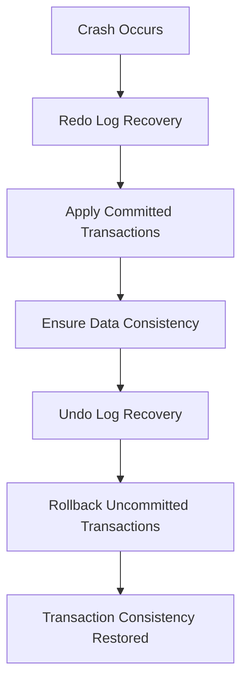

# InnoDB 存储引擎的事务日志、并发控制与性能优化

InnoDB 存储引擎是 MySQL 中最常用的引擎之一，具备高并发、高可靠性的特点。它通过事务日志、并发控制、锁机制等手段确保数据的一致性、隔离性、持久性及高效性能。以下内容将从 **事务日志与恢复机制**、**并发控制与锁优化** 和 **性能优化** 三个方面详细介绍 InnoDB 存储引擎的实现与优化，同时结合代码样例进行分析。

## 3.2 **InnoDB 的事务日志与恢复机制**

### 3.2.1 事务日志（Redo Log）

事务日志（Redo Log）是 InnoDB 用于实现事务持久性的机制，采用了 Write-Ahead Logging (WAL) 技术。它确保在系统崩溃或断电的情况下，已提交的事务能够通过 redo log 恢复。

| 关键点         | 说明                                                          |
| -------------- | ------------------------------------------------------------- |
| **实现原理**   | 每次事务提交时，所有的修改操作首先写入 redo log，确保持久性。 |
| **WAL 技术**   | Write-Ahead Logging 确保修改数据前先写日志。                  |
| **优化效果**   | 提高写入性能，减少数据文件随机写入的频率。                     |
| **代码示例**   | 使用 `log_commit()` 将事务写入 redo log，并通过 `flush_log()` 刷新日志。 |

```cpp
// 写入事务的 redo log
void log_commit(trx_t* trx) {
    log_write(trx->log_entry);  // 将事务日志写入 redo log
    flush_log();                 // 刷新日志到磁盘
}

// 写入日志的操作
void log_write(log_entry_t* entry) {
    buffer_write(entry);  // 将日志写入内存缓冲区
}

// 刷新日志
void flush_log() {
    write_to_disk(log_buffer);  // 将日志刷到磁盘
}
```
### 3.2.2 Undo Log
Undo Log 用于事务回滚，确保事务的原子性（Atomicity）。每当事务修改数据时，InnoDB 会在 undo log 中保存修改前的值，支持在事务回滚时恢复数据。

| 关键点        | 说明                                                          |
| ------------- | ------------------------------------------------------------- |
| **实现原理**   | 每次数据修改前，都会在 undo log 中记录数据的旧值。 |
| **回滚机制**  | 通过 undo log 恢复到事务开始时的状态。                  |
| **代码示例**   | 使用 `log_commit()` 将事务写入 redo log，并通过 `flush_log()` 刷新日志。 |

```cpp
// 创建 undo log 条目
void generate_undo_log(trx_t* trx, data_page_t* page, record_t* record) {
    undo_log_entry_t* undo_entry = create_undo_entry(record);  // 创建 undo log 条目
    write_to_undo_log_buffer(undo_entry);  // 写入 undo log 缓冲区
}

// 创建 undo log 条目
undo_log_entry_t* create_undo_entry(record_t* record) {
    undo_log_entry_t* undo_entry = malloc(sizeof(undo_log_entry_t));
    undo_entry->data = copy_record(record);  // 记录修改前的数据
    return undo_entry;
}

```

### 3.2.3 崩溃恢复

InnoDB 利用 redo log 和 undo log 在系统崩溃后进行恢复操作。通过 redo log 恢复已提交事务，利用 undo log 回滚未提交的事务。


| 恢复类型	        | 说明                                                          |
| ------------- | ------------------------------------------------------------- |
| **Redo Log 恢复**   | 从最后一次正常的 checkpoint 开始，应用 redo log 中的已提交事务。 |
| **Undo Log 回滚**  | 对未提交的事务使用 undo log 恢复到事务开始时的状态。                  |

崩溃恢复的过程包括以下步骤：

1、**重新执行已提交的事务**： 从最后的 checkpoint 开始，应用 redo log 中的所有已提交事务，确保数据的一致性。<br>
2、**回滚未提交的事务**： 对所有尚未提交的事务，利用 undo log 回滚操作，恢复到事务开始时的状态。

具体流程图：

---

## 3.3 InnoDB 的并发控制与锁优化
### 3.3.1 多版本并发控制（MVCC）
InnoDB 使用多版本并发控制（MVCC）来提高事务的隔离性和并发性，避免读写冲突。MVCC 通过为每个事务保存数据的多个版本来实现。

| 关键点        | 说明                                                         |
| ------------- | ------------------------------------------------------------ |
| **实现原理**   | 每个数据项有多个版本，事务可以读取某一版本的数据而不影响其他事务。 |
| **版本链**  | 数据页维护版本链，事务读取最新可见版本。                  |
| **代码示例**   | 使用 `read_record_with_version()` 读取数据的最新版本。|
```cpp
// 读取数据的最新版本
record_t* read_record_with_version(data_page_t* page, trx_t* trx) {
    return find_version_in_chain(page, trx);  // 找到对当前事务可见的版本
}

// 查找可见版本
record_t* find_version_in_chain(data_page_t* page, trx_t* trx) {
    version_t* version = page->version_head;
    while (version) {
        if (version->trx_id <= trx->id && version->commit_time <= trx->commit_time) {
            return version->record;  // 返回可见版本
        }
        version = version->next;
    }
    return NULL;
}

```

### 3.3.2 锁优化策略
InnoDB 通过多种锁机制（行锁、表锁、意向锁等）来优化并发控制。锁机制帮助避免冲突，提高事务并发性能。


| 锁类型       | 说明                                                         |
| ------------- | ------------------------------------------------------------ |
| **行锁**   | 最细粒度的锁，允许多个事务并发操作不同的行。 |
| **表锁**  | 用于对整个表加锁，限制其他事务的访问。                  |
| **意向锁**   | 用于标记事务对某一行的加锁意图，避免死锁。|
| **Gap 锁**   | 用于锁定索引中的间隙，防止插入新的数据。|

## 3.4 InnoDB 性能优化
### 3.4.1 查询优化
查询优化对于提升性能至关重要。InnoDB 通过索引、缓存和执行计划优化来提高查询性能。

| 锁类型  | 说明                                                         |
|------| ------------------------------------------------------------ |
| **索引优化** | 使用合适的索引设计来提高查询效率，减少全表扫描。 |
| **缓存机制** | 利用 Buffer Pool 缓存数据和索引页，减少磁盘 I/O。                 |
| **执行计划优化** | 通过选择最优的执行计划，避免不必要的操作。|

### 3.4.2 批量插入与更新
批量插入和更新操作时，InnoDB 采用优化策略来减少锁竞争和写放大的问题。

| 优化策略  | 说明                                                         |
|------| ------------------------------------------------------------ |
| **批量插入** | 将多条插入操作合并为一次写入，减少 I/O 操作。 |
| **优化日志写入** | 合并多个日志写入，减少磁盘写入次数。               |

### 3.4.3 磁盘 I/O 优化
InnoDB 通过优化磁盘 I/O 操作、数据压缩和智能缓存来提高性能。

| 优化方式  | 说明                                                         |
|------| ------------------------------------------------------------ |
| **双重写入（Doublewrite）** | 确保数据一致性，避免磁盘写入时的错误。 |
| **数据压缩** | 通过压缩存储的数据，减少磁盘占用，提高存储效率。             |

## 总结
InnoDB 存储引擎通过事务日志、并发控制、锁机制等技术实现高并发、高可靠性和高效的事务处理能力。通过深入了解其实现细节，开发者可以更好地优化数据库性能，提升系统的整体效率。事务日志和恢复机制为 InnoDB 提供了持久性和崩溃恢复能力，而 MVCC、锁优化和死锁检测有效地提高了事务的并发处理能力。