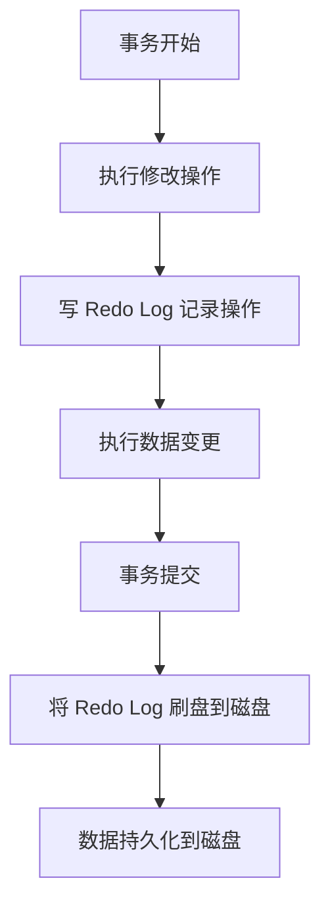
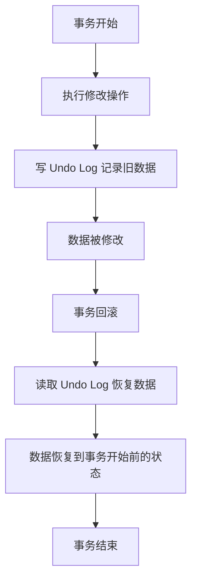
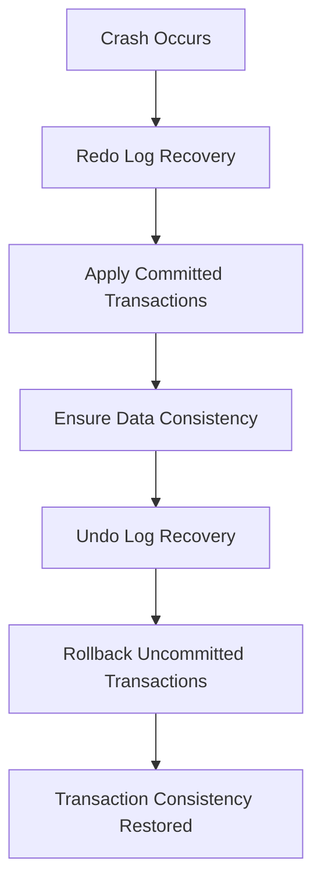
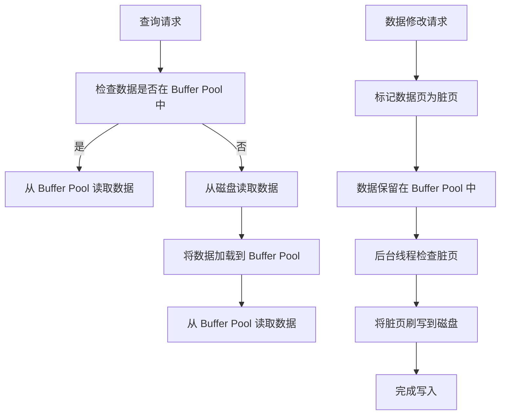
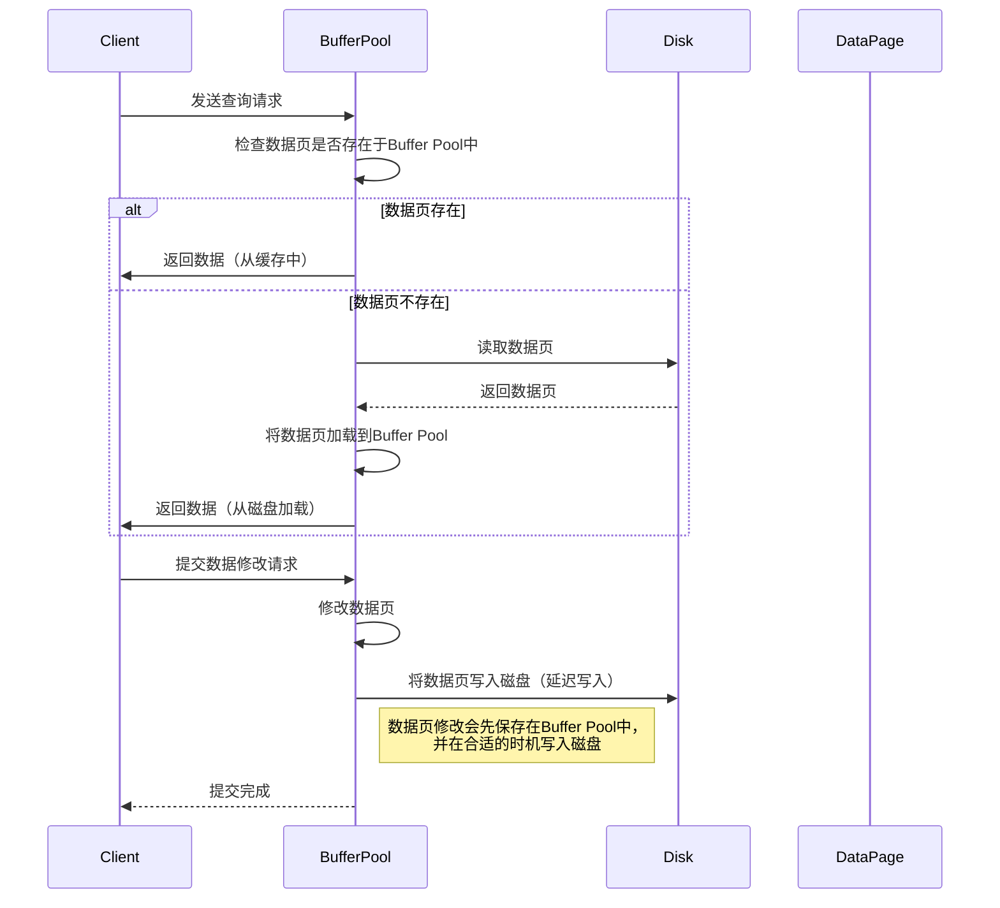

# InnoDB 存储引擎的事务日志、并发控制与性能优化

InnoDB 存储引擎是 MySQL 中最常用的引擎之一，具备高并发、高可靠性的特点。它通过事务日志、并发控制、锁机制等手段确保数据的一致性、隔离性、持久性及高效性能。以下内容将从 **事务日志与恢复机制**、**并发控制与锁优化** 和 **性能优化** 三个方面详细介绍 InnoDB 存储引擎的实现与优化，同时结合代码样例进行分析。

## 3.2 **InnoDB 的事务日志与恢复机制**

### 3.2.1 事务日志（Redo Log）

事务日志（Redo Log）是 InnoDB 用于实现事务持久性的机制，采用了 Write-Ahead Logging (WAL) 技术。它确保在系统崩溃或断电的情况下，已提交的事务能够通过 redo log 恢复。

| 关键点         | 说明                                                          |
| -------------- | ------------------------------------------------------------- |
| **实现原理**   | 每次事务提交时，所有的修改操作首先写入 redo log，确保持久性。 |
| **WAL 技术**   | Write-Ahead Logging 确保修改数据前先写日志。                  |
| **优化效果**   | 提高写入性能，减少数据文件随机写入的频率。                     |
| **代码示例**   | 使用 `log_commit()` 将事务写入 redo log，并通过 `flush_log()` 刷新日志。 |

```cpp
// 写入事务的 redo log
void log_commit(trx_t* trx) {
    log_write(trx->log_entry);  // 将事务日志写入 redo log
    flush_log();                 // 刷新日志到磁盘
}

// 写入日志的操作
void log_write(log_entry_t* entry) {
    buffer_write(entry);  // 将日志写入内存缓冲区
}

// 刷新日志
void flush_log() {
    write_to_disk(log_buffer);  // 将日志刷到磁盘
}
```
- 事务执行时，所有对数据库的写操作都会先记录到 Redo Log 中，确保即使发生系统崩溃，也能恢复未持久化的数据。



### 3.2.2 Undo Log
Undo Log 用于事务回滚，确保事务的原子性（Atomicity）。每当事务修改数据时，InnoDB 会在 undo log 中保存修改前的值，支持在事务回滚时恢复数据。

| 关键点        | 说明                                                          |
| ------------- | ------------------------------------------------------------- |
| **实现原理**   | 每次数据修改前，都会在 undo log 中记录数据的旧值。 |
| **回滚机制**  | 通过 undo log 恢复到事务开始时的状态。                  |
| **代码示例**   | 使用 `log_commit()` 将事务写入 redo log，并通过 `flush_log()` 刷新日志。 |

```cpp
// 创建 undo log 条目
void generate_undo_log(trx_t* trx, data_page_t* page, record_t* record) {
    undo_log_entry_t* undo_entry = create_undo_entry(record);  // 创建 undo log 条目
    write_to_undo_log_buffer(undo_entry);  // 写入 undo log 缓冲区
}

// 创建 undo log 条目
undo_log_entry_t* create_undo_entry(record_t* record) {
    undo_log_entry_t* undo_entry = malloc(sizeof(undo_log_entry_t));
    undo_entry->data = copy_record(record);  // 记录修改前的数据
    return undo_entry;
}

```

- Undo Log 记录了事务操作之前的数据状态。当事务回滚时，通过 Undo Log 恢复数据到事务开始之前的状态。


### 3.2.3 崩溃恢复

InnoDB 利用 redo log 和 undo log 在系统崩溃后进行恢复操作。通过 redo log 恢复已提交事务，利用 undo log 回滚未提交的事务。


| 恢复类型	        | 说明                                                          |
| ------------- | ------------------------------------------------------------- |
| **Redo Log 恢复**   | 从最后一次正常的 checkpoint 开始，应用 redo log 中的已提交事务。 |
| **Undo Log 回滚**  | 对未提交的事务使用 undo log 恢复到事务开始时的状态。                  |

崩溃恢复的过程包括以下步骤：

1、**重新执行已提交的事务**： 从最后的 checkpoint 开始，应用 redo log 中的所有已提交事务，确保数据的一致性。<br>
2、**回滚未提交的事务**： 对所有尚未提交的事务，利用 undo log 回滚操作，恢复到事务开始时的状态。

具体流程图：

---

## 3.3 InnoDB 的并发控制与锁优化
### 3.3.1 多版本并发控制（MVCC）
InnoDB 使用多版本并发控制（MVCC）来提高事务的隔离性和并发性，避免读写冲突。MVCC 通过为每个事务保存数据的多个版本来实现。

| 关键点        | 说明                                                         |
| ------------- | ------------------------------------------------------------ |
| **实现原理**   | 每个数据项有多个版本，事务可以读取某一版本的数据而不影响其他事务。 |
| **版本链**  | 数据页维护版本链，事务读取最新可见版本。                  |
| **代码示例**   | 使用 `read_record_with_version()` 读取数据的最新版本。|
```cpp
// 读取数据的最新版本
record_t* read_record_with_version(data_page_t* page, trx_t* trx) {
    return find_version_in_chain(page, trx);  // 找到对当前事务可见的版本
}

// 查找可见版本
record_t* find_version_in_chain(data_page_t* page, trx_t* trx) {
    version_t* version = page->version_head;
    while (version) {
        if (version->trx_id <= trx->id && version->commit_time <= trx->commit_time) {
            return version->record;  // 返回可见版本
        }
        version = version->next;
    }
    return NULL;
}

```
### 3.3.2. **MVCC 的数据版本管理**

- **数据页中的版本链**：每一页数据会维护一个版本链，每个数据记录有多个版本。
- **事务的可见性控制**：每个事务在开始时会有一个时间戳（通常是事务 ID），系统会根据事务 ID 和数据版本的时间戳来判断数据的可见性。

以下是 InnoDB 中 MVCC 的具体实现过程：

1. **事务读取数据时**，系统会根据当前事务 ID 查找该数据的最新版本。
2. **如果数据是事务修改的**，那么系统会从版本链中返回对当前事务可见的版本。
3. **多个事务并发访问时**，由于版本控制，事务读取的数据不会受到其他事务的影响。

### 3.3.3. **MVCC 过程的具体图解**

以下是 MVCC 工作过程的详细流转图。我们通过 `mermaid` 流程图工具来展示该过程。

```mermaid
graph TD;
    A[事务 T1 开始] --> B[事务 T1 执行查询操作];
    B --> C[系统检查数据版本];
    C --> D[事务 T1 找到可见版本];
    D --> E[返回最新的可见版本];
    
    F[事务 T2 开始] --> G[事务 T2 执行更新操作];
    G --> H[系统为 T2 创建新的数据版本];
    H --> I[修改数据并存储新版本];
    
    I --> J[事务 T2 提交];
    J --> K[事务 T1 执行查询];
    
    K --> L[事务 T1 读取最新版本（包括事务 T2 的修改）];
    L --> M[返回事务 T1 可见的最新数据];
    
    E --> N[事务 T1 提交];
    
    subgraph MVCC
        B
        C
        D
        E
        K
        L
    end
    
 ```
### 3.3.4 详细步骤解释
1. 事务 T1 开始
   当事务 T1 启动时，它会获取一个唯一的事务 ID。此时，所有事务的 ID 会依次分配，事务 T1 拥有一个较小的事务 ID。

2. 事务 T1 执行查询操作
   事务 T1 在执行查询操作时，它会通过 read_record_with_version() 函数读取数据。InnoDB 会检查数据的版本链并返回当前事务 T1 可见的最新版本。此时，T1 会读取自己之前操作的版本或其他已提交事务的数据。

3. 事务 T2 开始并执行更新
   与此同时，事务 T2 开始，它执行更新操作。系统会为事务 T2 创建新的数据版本，该版本会在数据页中作为新的版本加入版本链中。这个新的版本不会立即对事务 T1 可见，除非事务 T2 提交。

4. 事务 T1 查询返回最新版本
   当事务 T1 提交时，其他事务（如事务 T2）提交的修改将对 T1 可见。T1 在查询数据时，会返回一个包含事务 T2 修改的新版本数据。

5. 事务 T2 提交并完成修改
   最后，事务 T2 提交。此时，它对数据所做的更改被正式持久化。

### 3.3.5. MVCC 的性能优势
   - 读操作不需要加锁：由于读操作只读取当前可见版本的快照，因此其他事务的更新不会阻塞读操作。
   - 避免写写冲突：多个事务可以并行修改数据，InnoDB 会确保每个事务看到的数据是符合其隔离级别要求的。
   - 提高并发性能：通过版本管理，事务可以独立工作，减少了锁的竞争，极大提高了并发性能。

```mermaid
graph LR;
    A[事务 T1 开始] --> B[执行查询]
    B --> C[查找最新可见版本]
    C --> D[返回最新版本]
    D --> E[事务 T1 提交]
    E --> F[事务 T2 更新数据]
    F --> G[创建新版本并写入数据]
    G --> H[事务 T2 提交]
    H --> I[事务 T1 执行查询并获取最新版本]
    I --> J[返回最终数据]

```
通过以上流程图和步骤解析，MVCC 的工作机制和性能优势得以呈现，展示了其如何帮助 InnoDB 提供高并发支持的能力。


### 3.3.6 锁优化策略
InnoDB 通过多种锁机制（行锁、表锁、意向锁等）来优化并发控制。锁机制帮助避免冲突，提高事务并发性能。


| 锁类型       | 说明                                                         |
| ------------- | ------------------------------------------------------------ |
| **行锁**   | 最细粒度的锁，允许多个事务并发操作不同的行。 |
| **表锁**  | 用于对整个表加锁，限制其他事务的访问。                  |
| **意向锁**   | 用于标记事务对某一行的加锁意图，避免死锁。|
| **Gap 锁**   | 用于锁定索引中的间隙，防止插入新的数据。|

## 3.4 InnoDB 性能优化
### 3.4.1 查询优化
查询优化对于提升性能至关重要。InnoDB 通过索引、缓存和执行计划优化来提高查询性能。

| 锁类型  | 说明                                                         |
|------| ------------------------------------------------------------ |
| **索引优化** | 使用合适的索引设计来提高查询效率，减少全表扫描。 |
| **缓存机制** | 利用 Buffer Pool 缓存数据和索引页，减少磁盘 I/O。                 |
| **执行计划优化** | 通过选择最优的执行计划，避免不必要的操作。|

### 3.4.2 批量插入与更新
批量插入和更新操作时，InnoDB 采用优化策略来减少锁竞争和写放大的问题。

| 优化策略  | 说明                                                         |
|------| ------------------------------------------------------------ |
| **批量插入** | 将多条插入操作合并为一次写入，减少 I/O 操作。 |
| **优化日志写入** | 合并多个日志写入，减少磁盘写入次数。               |

### 3.4.3 磁盘 I/O 优化
InnoDB 通过优化磁盘 I/O 操作、数据压缩和智能缓存来提高性能。

| 优化方式  | 说明                                                         |
|------| ------------------------------------------------------------ |
| **双重写入（Doublewrite）** | 确保数据一致性，避免磁盘写入时的错误。 |
| **数据压缩** | 通过压缩存储的数据，减少磁盘占用，提高存储效率。             |

## 总结
InnoDB 存储引擎通过事务日志、并发控制、锁机制等技术实现高并发、高可靠性和高效的事务处理能力。通过深入了解其实现细节，开发者可以更好地优化数据库性能，提升系统的整体效率。事务日志和恢复机制为 InnoDB 提供了持久性和崩溃恢复能力，而 MVCC、锁优化和死锁检测有效地提高了事务的并发处理能力。

## 3.5 Buffer Poll
### MySQL 中 Buffer Pool 的具体实现与作用

在 MySQL 中，**Buffer Pool** 是 **InnoDB** 存储引擎用来缓存磁盘数据的内存区域，它在数据库性能优化中扮演了至关重要的角色。Buffer Pool 通过减少磁盘 I/O 操作，显著提高了查询和写入的效率。以下是 **Buffer Pool** 在 MySQL 中的实现及其作用的详细解析。

#### 3.5.1. **Buffer Pool 的作用**

- **减少磁盘 I/O**：Buffer Pool 用于将数据库中的数据页（包括表数据和索引）缓存到内存中，避免每次查询都需要从磁盘读取数据，减少磁盘 I/O 操作，提高性能。
- **提升查询效率**：当查询需要的数据已经存在于 Buffer Pool 中时，InnoDB 可以直接从内存中获取数据，极大地减少了磁盘访问次数，提升了查询的响应速度。
- **提高写入性能**：对于写操作，InnoDB 会先在 Buffer Pool 中修改数据页，并将修改标记为脏页（dirty pages）。这些脏页会在后台被周期性地刷写到磁盘，这样避免了频繁的磁盘写操作。
- **事务的 ACID 保证**：Buffer Pool 还用于缓存撤销日志（undo logs）和重做日志（redo logs），这些日志对于事务的 **原子性**（Atomicity）和 **持久性**（Durability）非常重要。

#### 3.5.2. **Buffer Pool 的具体实现**

- **内存分配**：MySQL 为 Buffer Pool 分配了一块连续的内存区域，这个内存区域用于存储 **InnoDB** 中的数据页（16KB 为一个页大小）。通过配置参数 **`innodb_buffer_pool_size`**，可以控制 Buffer Pool 的大小，通常建议设置为服务器内存的 60%-80%。

- **页面缓存**：Buffer Pool 中的缓存单位是数据页（data page）。每个数据页包含数据库表的一部分数据或索引的一部分。数据页的大小通常为 16KB，可以根据需要调整。Buffer Pool 中缓存的数据页包括表数据、索引数据以及撤销日志（undo log）和重做日志（redo log）信息。

- **LRU 算法**：InnoDB 使用 **LRU（Least Recently Used）** 算法来管理 Buffer Pool 中的缓存数据。当 Buffer Pool 已满时，LRU 算法会将最近最少使用的数据页从内存中剔除，为新的数据页腾出空间。这确保了热点数据（频繁访问的数据）能够长期保留在内存中，减少磁盘 I/O。

- **脏页与刷写**：当数据页被修改时，InnoDB 会将其标记为脏页（dirty page）。脏页表示内存中的数据与磁盘上的数据不一致。InnoDB 并不会立即将脏页写入磁盘，而是通过后台线程定期将脏页刷写到磁盘。这种写入策略可以减少磁盘写操作，提高性能。

#### 3.5.3. **Buffer Pool 的性能优化**

- **合理配置 Buffer Pool 大小**：
   - **`innodb_buffer_pool_size`** 参数用于设置 Buffer Pool 的大小。一个合适的大小可以使得大量的数据页常驻内存，从而减少磁盘访问。建议将 Buffer Pool 设置为物理内存的 60%-80%，确保数据库大部分热数据都能缓存到内存中。
   - 如果 Buffer Pool 太小，频繁的磁盘 I/O 会导致性能瓶颈；如果过大，则可能导致内存不足，影响其他进程的运行。

- **监控 Buffer Pool 使用情况**：
   - 使用 `SHOW ENGINE INNODB STATUS` 可以查看 Buffer Pool 的详细状态，包括缓存的页面数量、脏页数量、命中率等。
   - 使用命令 `SHOW STATUS LIKE 'Innodb_buffer_pool%'` 可以查看当前 Buffer Pool 的大小、命中率、已使用的页面数量、未命中页面数量等指标。

- **调整 Buffer Pool 实例数**：
   - 在多核系统中，设置 **`innodb_buffer_pool_instances`** 参数，可以将 Buffer Pool 划分为多个实例，以提高并发性能。每个实例可以独立地管理数据页，减少锁竞争。

- **避免内存交换**：
   - 增加 Buffer Pool 大小时，确保服务器有足够的物理内存。如果 Buffer Pool 占用了过多内存，可能导致操作系统进行内存交换（swap），从而影响数据库性能。因此，在设置 Buffer Pool 大小时，要确保物理内存足够。

#### 3.5.4. **Buffer Pool 的操作流程**

##### 读取过程：
1. **查询请求**：应用程序发起查询请求。
2. **检查数据是否在 Buffer Pool 中**：InnoDB 首先检查数据是否已经缓存到 Buffer Pool 中。
3. **从 Buffer Pool 中读取数据**：如果数据已经在内存中，直接从 Buffer Pool 读取。
4. **从磁盘读取数据**：如果数据不在 Buffer Pool 中，InnoDB 会从磁盘读取数据页并加载到 Buffer Pool 中，然后提供查询结果。

##### 写入过程：
1. **数据修改请求**：应用程序发起写入请求。
2. **标记脏页**：修改的数据页在 Buffer Pool 中被标记为脏页。
3. **数据保留在 Buffer Pool 中**：修改后的数据保持在内存中，直到后台线程
   - 后台线程会定期将脏页刷写到磁盘，以保证数据的一致性和持久性。

   这种写入策略减少了对磁盘的频繁写入，提高了性能。

### 总结

Buffer Pool 是 **InnoDB** 存储引擎中非常重要的性能优化机制。它通过将数据页缓存在内存中，显著减少了磁盘 I/O 操作，提高了数据库的查询和写入性能。合理配置 Buffer Pool 的大小和管理策略，能够帮助数据库系统在高并发和大数据量的环境下提供更好的性能表现。

通过调整相关参数，监控 Buffer Pool 的使用情况，确保其能够有效地缓存常用数据，减少不必要的磁盘访问，是提高 MySQL 性能的一个重要手段。



### 流程图解释

1. **读取过程**：
   - **查询请求**：用户或应用程序发起一个查询请求。
   - **检查数据是否在 Buffer Pool 中**：InnoDB 首先检查需要访问的数据页是否已经存在于 **Buffer Pool** 中。
   - **从 Buffer Pool 读取数据**：如果数据页已经存在，直接从 **Buffer Pool** 中读取数据，减少磁盘访问。
   - **从磁盘读取数据**：如果数据页不在 **Buffer Pool** 中，InnoDB 会访问磁盘，将数据加载到 **Buffer Pool** 中。
   - **将数据加载到 Buffer Pool**：数据从磁盘加载到 **Buffer Pool** 中，供后续查询使用。

2. **写入过程**：
   - **数据修改请求**：用户或应用程序发起一个写入请求。
   - **标记数据页为脏页**：修改数据时，InnoDB 将数据页标记为脏页，表示该页的内容与磁盘上的内容不一致。
   - **数据保留在 Buffer Pool 中**：脏页不会立即写入磁盘，而是继续保留在 **Buffer Pool** 中，等待后续的刷写操作。
   - **后台线程检查脏页**：后台线程定期检查 **Buffer Pool** 中的脏页，并将这些脏页写入磁盘。
   - **将脏页刷写到磁盘**：通过后台线程将脏页刷新到磁盘，保证数据的持久性。
   - **完成写入**：脏页被成功刷写到磁盘，完成写入过程。

### 总结
- **读取过程** 通过缓存在 **Buffer Pool** 中的数据减少了磁盘 I/O，提高了查询效率。
- **写入过程** 使用脏页机制，修改后的数据先在 **Buffer Pool** 中缓存，直到合适的时机才刷写到磁盘，这样有效提高了写入性能并减少了磁盘 I/O 次数。

该流程图概述了 **InnoDB** 如何通过 **Buffer Pool** 实现高效的读取和写入操作，并利用内存缓存和延迟写入技术来优化性能。



### 时序图解释
- **查询请求**：客户端（Client）发送查询请求，Buffer Pool 检查请求的数据页是否已经加载在内存中。
- **数据页的检查**：
  - 如果数据页已存在于 Buffer Pool 中，则直接返回给客户端。
  - 如果数据页不存在，Buffer Pool 会从磁盘（Disk）加载数据页并将其存储在内存中，然后返回给客户端。
- **提交修改请求**：当客户端提交对数据的修改时，Buffer Pool 会先在内存中修改数据页，并将修改的数据页延迟写入磁盘。
- **延迟写入**：数据页的修改会保存在 Buffer Pool 中，直到系统决定将其写入磁盘（通常是通过写回策略，如写入前日志、检查点等）。
