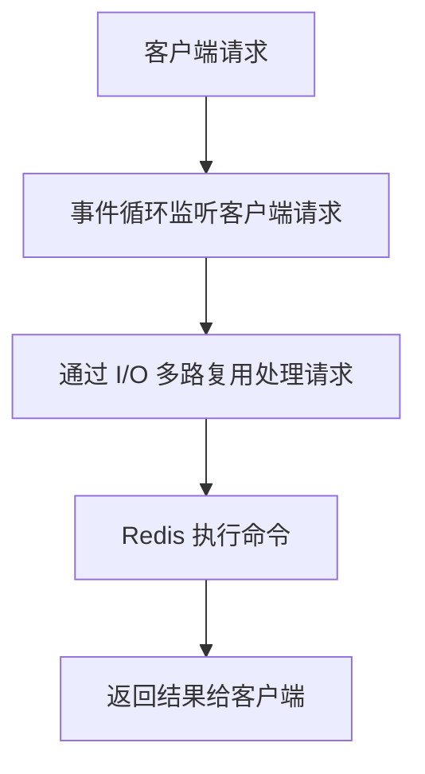
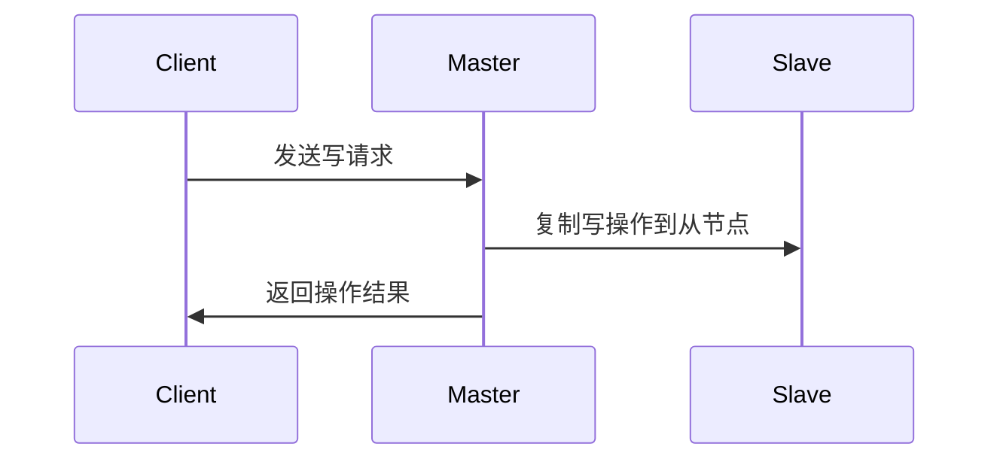
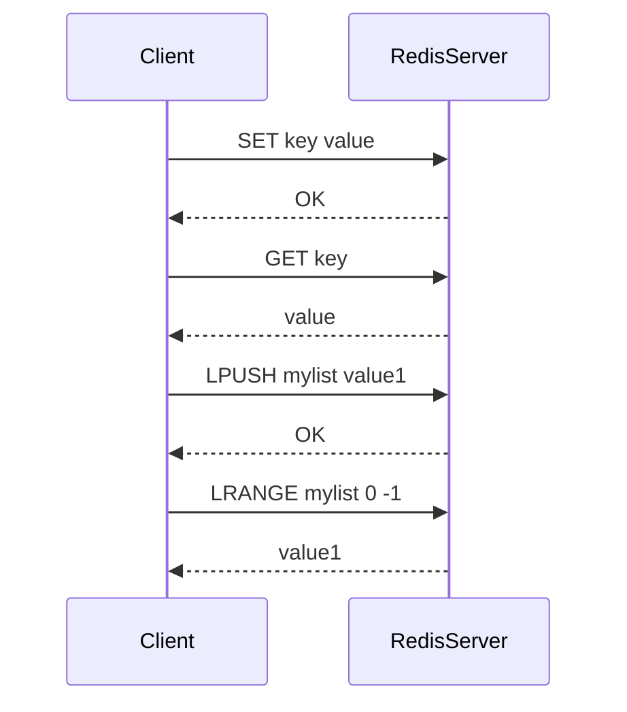
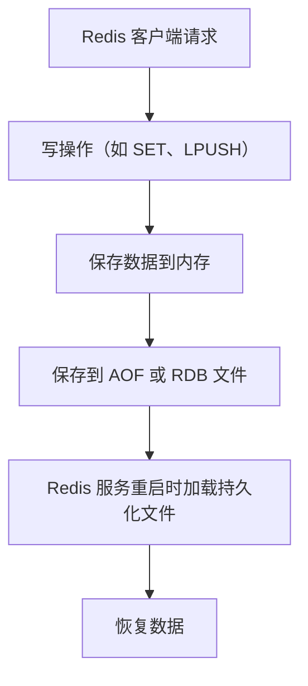

# 1. Redis 概述与架构设计

## 1.1 **Redis 简介**
- **Redis**（Remote Dictionary Server）是一个开源的高性能键值存储数据库，支持持久化和丰富的数据结构，广泛应用于缓存、消息队列等场景。
- Redis 是一个 **单线程模型**，通过 **事件驱动机制** 和 **I/O 多路复用** 技术实现高效的请求处理。

### Redis 特性：
- **内存存储**：所有数据都存储在内存中，读写速度极快。
- **高并发性能**：通过单线程和 I/O 多路复用模型，可以在高并发场景下保持高效的性能。
- **持久化**：支持两种持久化方式：**RDB**（快照）和 **AOF**（追加文件）。
- **丰富的数据结构**：Redis 支持字符串、列表、集合、哈希、有序集合等多种数据结构。

## 1.2 **Redis 核心架构**

### 1.2.1 **客户端与服务器**
- 客户端通过 **TCP 协议** 与 Redis 服务器进行通信。
- Redis 采用 **单线程** 事件循环模型处理请求，所有命令执行都在同一个线程中顺序处理，避免了多线程的上下文切换和锁竞争。

### 1.2.2 **事件驱动与 I/O 多路复用**
Redis 使用 **I/O 多路复用** 技术（如 `epoll` 或 `select`），高效地处理多个客户端的请求。通过 **libevent** 库来实现事件驱动和 I/O 多路复用。

### 1.2.3 主从复制与持久化机制
Redis 提供了**主从复制**和**持久化机制**，保证数据的可靠性和高可用性。

- **主从复制**：Redis 支持将数据从主节点同步到多个从节点，实现数据的冗余备份。
- **持久化机制**：Redis 支持两种持久化方式：
  - **RDB（Redis Database）**：定期生成数据的快照（持久化到磁盘）。
  - **AOF（Append Only File）**：记录每一个写操作（命令），在服务器重启时重新执行这些命令来恢复数据。

### 1.2.4 Redis 高可用性与分布式
- **哨兵模式（Sentinel）**：用于监控 Redis 实例的状态，自动故障转移。
- **集群模式**：支持数据分片（sharding），在多个 Redis 实例之间分配数据，实现水平扩展。

## **1.3 Redis 数据结构与核心命令**

### 1.3.1 Redis 数据结构
Redis 支持多种数据结构，这些数据结构在 Redis 内部的实现方式非常高效。

| 关键点        | 说明                                                          | 实现方式                 |
| ------------- | ------------------------------------------------------------- |----------------------|
| **String**   | 简单的键值对，最多可以存储 512MB 的数据。 | 	动态字符串（SDS）、整数编码、字节数组 |
| **List**  | 有序链表，支持在两端进行插入和删除。               | 双向链表、压缩列表（Ziplist）          |
| **Set**   | 无序集合，支持添加、删除和判断成员是否存在。 | 哈希表、整数集合（Intset）|
| **Hash**   | 键值对集合，可以表示对象。 |  哈希表、压缩列表（Ziplist）  |
| **Sorted Set**   |有序集合，每个成员都关联一个分数值 | 跳表（Skip List）、压缩列表（Ziplist）  |

#### 具体说明：
- **1. String 类型**
   Redis 的 String 类型的实现可以根据不同的情况进行优化。实际上，Redis 使用的 String 类型不仅是一个简单的动态字符串，还支持多种编码方式：

    - **动态字符串（SDV）**：如果字符串的长度较短且不需要频繁更新，Redis 会选择使用动态字符串（SDS）。SDS 是 Redis 自定义的一种结构，它比 C 标准字符串更加高效，具有以下特点：
      - 可以在字符串末尾动态添加字符。
      - 内存是预分配的，避免了频繁的内存分配。
      - 维护了字符串的长度信息，减少了 strlen() 等操作的开销。
    - **整数编码（Int）**：当字符串表示一个整数时，Redis 会将其存储为整数类型，直接用整数进行存储，而不是存储为字符数组，这样可以节省内存空间并加快运算速度。

    - **字节数组（Raw Encoding）**：对于更大的字符串数据（比如二进制数据、长文本等），Redis 使用字节数组进行存储。
---
- **2. List 类型**
   Redis 的 List 类型是一个双向链表，但它并不是唯一的实现方式。Redis 根据 List 中元素的数量和大小来选择不同的实现方式：
  - **双向链表**：对于大部分情况，Redis 使用双向链表来实现 List 类型，支持从两端快速地插入和删除元素。

  - **压缩列表（Ziplist）**：当列表中的元素数量较少，且每个元素的长度较小，Redis 会使用压缩列表来存储数据。压缩列表是通过节省内存的方式实现的，适用于存储较小的元素集合。
---
- **3. Set 类型**
   Redis 的 Set 类型是一个无序的集合，支持快速的成员查找、添加和删除。Redis 会根据 Set 中的成员数量和类型选择不同的存储方式：
  - **哈希表（Hash Table）**：对于大多数情况，Redis 使用哈希表（dict）来实现 Set。这种方式支持 O(1) 时间复杂度的查找、插入和删除操作。

  - **整数集合（Intset）**：当 Set 中的所有成员都是整数时，Redis 会使用整数数组（Intset）来存储，节省内存并提高操作效率。
---
- **4. Hash 类型**
   Redis 的 Hash 类型是一个键值对集合，可以看作是一个对象，通常用于存储多个字段及其值。Redis 的 Hash 类型也有多种实现方式：
  - **哈希表（Hash Table）**：当 Hash 的元素较多时，Redis 会使用哈希表来存储。

  - **压缩列表（Ziplist）**：当 Hash 中的元素较少时，Redis 会使用压缩列表来存储。这种方式适用于小型 Hash 数据。
---
- **5. Sorted Set 类型**
   Redis 的 Sorted Set 类型是一个有序的集合，每个元素都会关联一个分数，Redis 会按照分数的大小来对集合中的元素进行排序。Sorted Set 的实现方式如下：

  - **跳表（Skip List）**：Redis 使用跳表来实现有序集合的元素排序。跳表是一种多层链表的数据结构，支持高效的范围查询和插入操作，时间复杂度为 O(log N)。

  - **压缩列表（Ziplist）**：当 Sorted Set 中的元素数量较少时，Redis 会使用压缩列表来存储，压缩列表的存储方式可以节省内存。

### 1.3.2 Redis 核心命令
Redis 提供了丰富的命令来操作这些数据结构。以下是一些常用命令：

#### **字符串操作命令**
- `SET key value`：设置键 key 的值为 value。
- `GET key`：获取键 key 对应的值。
- `INCR key`：对键 key 的值进行自增。
#### **列表操作命令**
- `LPUSH key value`：将值 value 插入到列表 key 的头部。
- `RPUSH key value`：将值 value 插入到列表 key 的尾部。
- `LRANGE key start stop`：返回列表 key 中指定范围的元素。
#### 集合操作命令
- `SADD` key member：将元素 member 添加到集合 key 中。
- `SMEMBERS key`：返回集合 key 中的所有成员。
- `SISMEMBER key member`：判断元素 member 是否是集合 key 的成员。
#### 有序集合操作命令
- `ZADD key score member`：将元素 member 及其分数 score 添加到有序集合 key 中。
- `ZRANGE key start stop`：返回有序集合 key 中指定范围的成员。

### 1.3.3 命令流程示例

### 1.3.4 持久化与恢复
Redis 的持久化有两个主要机制，分别是 RDB 和 AOF。

- **RDB**：通过定期保存数据快照来实现持久化。当 Redis 服务重启时，RDB 文件会被加载回内存。
- **AOF**：每次执行写操作时，Redis 会将该操作追加到 AOF 文件。当 Redis 重启时，会按照 AOF 文件中的命令重新执行。

