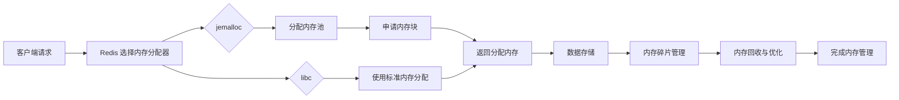

# Redis核心实现原理和源码分析
## 2.1 Redis 内存管理与数据存储

### 内存分配
Redis 使用自定义的内存分配器来管理内存，主要支持两种内存分配器：
- **jemalloc**：这是一款高效的内存分配器，能有效减少内存碎片，适用于处理大规模数据的场景。它提供了更为高效的内存分配和释放机制，尤其在 Redis 这种长时间运行且高并发的环境下，能够显著提升性能。
- **libc**：这是 C 语言标准库自带的内存分配器，适用于一般的内存分配需求。

Redis 会根据操作系统和配置的不同，选择适合的内存分配器。默认情况下，Redis 在大多数系统中会使用 **jemalloc**，因为它对多线程和大内存场景有更好的支持。

#### 内存分配机制
Redis 的内存管理机制包括：
1. **内存池**：Redis 采用了内存池的机制来分配内存，避免了频繁的内存分配和释放。通过使用内存池，Redis 能在需要时直接从池中分配内存，而不必每次都向操作系统申请。

2. **碎片管理**：Redis 的内存分配器通过 `jemalloc` 或 `libc` 来管理内存碎片。jemalloc 尤其擅长解决内存碎片问题，它采用了多级分配算法来管理内存块，并在内存池中进行高效的内存回收。

3. **大数据量存储**：Redis 在处理大数据量时，通过 **压缩数据结构** 来减少内存占用。例如，Redis 使用 **Ziplist**、**Intset** 等数据结构来优化内存使用。当存储的数据量很大时，Redis 会自动选择合适的数据结构来平衡内存占用和访问速度。

#### 关键代码：
```c
void *redis_malloc(size_t size) {
    return zmalloc(size);  // zmalloc 是 jemalloc 或 libc 内存分配器的包装函数
}

void redis_free(void *ptr) {
    zfree(ptr);  // zfree 是 jemalloc 或 libc 内存释放的包装函数
}

```
这些代码用于 Redis 的内存分配和释放，zmalloc 和 zfree 是 Redis 对内存管理的包装函数，具体使用哪个内存分配器（jemalloc 或 libc）取决于配置和操作系统。

#### jemalloc 与 Redis 性能优化：
- 内存碎片：Redis 通过 jemalloc 能够有效地减少内存碎片，确保内存的高效使用，避免内存浪费。jemalloc 提供了更先进的垃圾回收机制，使得 Redis 在长时间运行时能够保持较低的内存碎片率。
- 多线程支持：虽然 Redis 本身是单线程运行的，但 jemalloc 对多线程内存分配的优化能够提高在多核 CPU 上的性能，尤其是在高并发场景下，Redis 仍能维持较好的性能。
#### 内存分配优化：
Redis 还通过一些特性来优化内存的使用，如：

- **内存压缩**：在处理简单的值类型时（如小列表、集合、哈希等），Redis 会使用压缩列表（Ziplist）和整数集合（Intset）等数据结构来减少内存占用。
- **内存限制**：通过配置 maxmemory，Redis 可以限制最大内存使用量，一旦达到限制，Redis 会使用 LRU（Least Recently Used）或 LFU（Least Frequently Used）策略淘汰数据。

###  Redis 内存管理的 Mermaid 流程图 

- 该流程图展示了 Redis 如何根据配置选择内存分配器（jemalloc 或 libc），并在内存池中分配内存，最后存储数据和管理内存碎片。
- 主要流程说明：
  - 客户端请求：客户端发出请求，Redis 需要分配内存来存储数据。
  - 选择内存分配器：Redis 根据配置选择使用 jemalloc 或 libc 作为内存分配器。
  - 内存池与内存块分配：如果使用 jemalloc，内存会从内存池中分配；如果使用 libc，则通过标准内存分配方法分配内存。
  - 数据存储：分配到的内存块被用于存储数据。
  - 内存碎片管理：Redis 使用内存分配器来管理内存碎片，确保内存高效使用。
  - 内存回收与优化：内存回收机制在适当时机回收无用的内存块，优化内存占用。

### Redis 内存分配与数据结构优化
| 内存分配器    |描述|优势|适用场景|
|----------|----|----|----|
| jemalloc |高效的内存分配器，特别适合高并发环境|低内存碎片，高性能，适合大数据量存储|高并发环境，大规模 Redis 实例|
| libc     |C 标准库自带的内存分配器|实现简单，适合一般用途|小规模应用或不需要复杂内存管理的环境|

### Redis 内存优化技术：
- Ziplist：Redis 使用 Ziplist 来存储小型数据结构（如小型哈希表、列表等），通过压缩存储节省内存。
- Intset：对于包含整数的集合，Redis 使用整数集合（Intset）来优化存储，减少内存占用。
跳表（Skiplist）：Redis 使用跳表来实现有序集合的高效存储，跳表提供了较好的插入、删除和查找操作性能。
