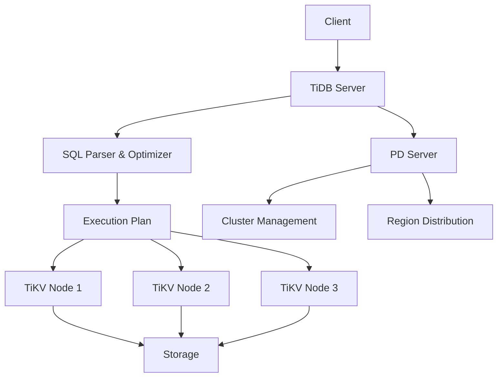
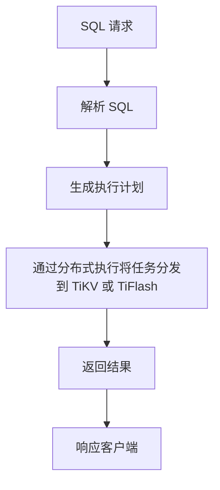
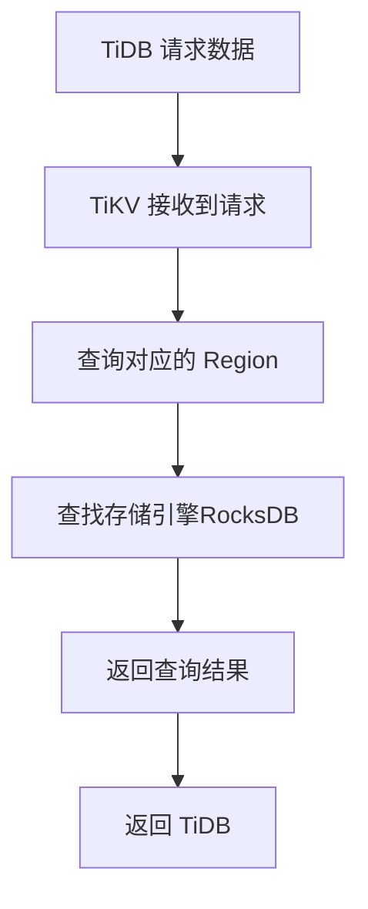
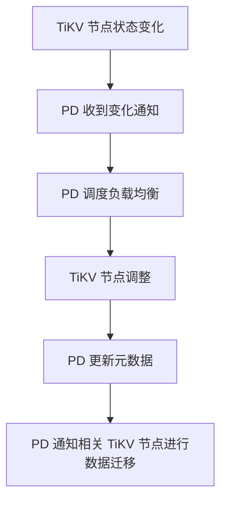
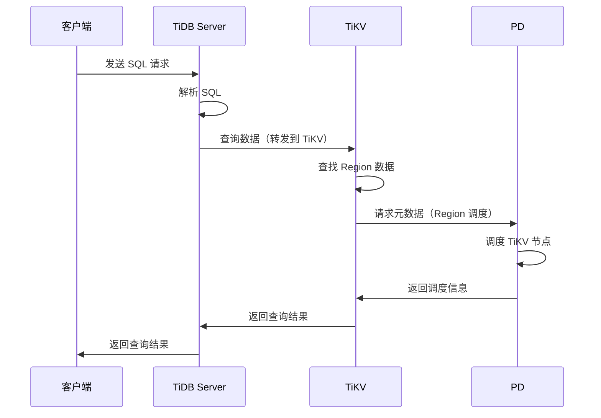
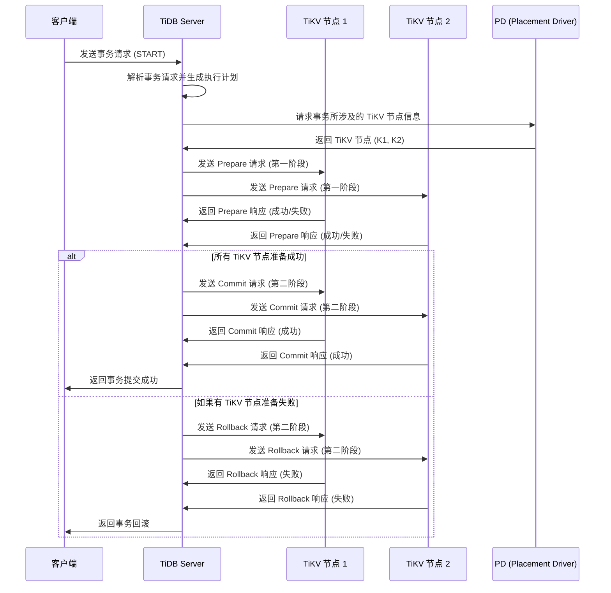

# TiDB 概述与架构设计

## 1.1 TiDB 简介

**TiDB** 是一个开源的分布式 SQL 数据库，兼容 MySQL 协议，设计用于处理大规模在线事务处理（OLTP）和在线分析处理（OLAP）负载。TiDB 提供了一个支持分布式存储和计算的高性能平台，旨在为现代企业提供支持大数据量、高并发、复杂查询的能力。

### 主要特点：
- **分布式架构**：TiDB 的设计基于分布式架构，通过水平扩展来处理大规模数据和高并发请求。
- **水平扩展**：TiDB 能够在不停止服务的情况下，动态添加节点，提供弹性扩展能力。
- **强一致性支持**：TiDB 保证在分布式环境下的强一致性，支持分布式事务处理，确保系统一致性和数据的持久性。
- **高可用性**：TiDB 使用 Raft 协议和副本机制，确保集群在节点故障时的高可用性。

## 1.2 TiDB 架构概览

TiDB 由三个主要组件组成，分别是 **TiDB Server**、**TiKV** 和 **PD (Placement Driver)**，这三者共同协作，提供了 TiDB 的核心功能和分布式处理能力。

### TiDB 架构

### 主要组件：
- **TiDB Server**：
    - 负责 SQL 处理层，接收 SQL 请求，并将请求转发到 TiKV 或 TiFlash 等执行引擎进行数据处理。
    - TiDB 作为 SQL 层，执行 SQL 查询并通过分布式执行计划将任务分发到存储层。

- **TiKV**：
    - TiKV 是 TiDB 的分布式事务键值存储层，负责数据的存储与事务管理。
    - TiKV 使用 **Raft 协议** 来确保数据的高可用性与一致性。它通过对每个数据区域（Region）的复制来保证数据副本的同步。



- **PD (Placement Driver)**：
    - 作为 TiDB 集群的调度层，负责集群的元数据管理、负载均衡、数据迁移、以及副本管理。
    - PD 通过持续监控 TiKV 节点的状态，并根据负载情况动态调整数据的分布，保证负载均衡和高可用性。


#### TiDB Server、TiKV 和 PD 核心组件时序图



### 架构特点：
- **无共享架构**：TiDB 采用无共享架构，SQL 层和存储层解耦，确保了 TiDB 的高可扩展性。TiKV 存储层通过 TiDB Server 接口与外部交互，存储与计算完全分离。
- **水平扩展**：TiDB 使用分布式设计，支持通过增加节点来扩展系统的存储和计算能力。TiDB 的分布式架构支持跨多个物理节点分布数据和计算工作负载。
- **强一致性与高可用性**：TiDB 使用 Raft 协议来确保在分布式环境下的数据一致性，并且通过副本机制确保系统在节点故障时数据不丢失，能够实现高可用性。

## 1.3 TiDB 与 TiKV 的核心设计

### SQL 引擎与分布式事务
TiDB 使用传统的 **MySQL 协议** 来处理 SQL 请求，但背后通过分布式事务技术（如 **Two-Phase Commit**，2PC）来实现分布式一致性。通过将事务分发到多个 TiKV 节点，TiDB 可以保证在高并发情况下事务的一致性和原子性。

- **Two-Phase Commit (2PC)**：TiDB 在执行分布式事务时，首先通过一个预提交阶段确定事务操作，接着在提交阶段确保数据的一致性和持久性。
- **分布式 SQL 处理**：TiDB 将 SQL 解析和优化与数据存储和分布式事务分离，以提升查询性能和系统的扩展性。

### Two-Phase Commit (2PC) 时序图


### 时序图解析

 - 客户端请求
   - 客户端首先向 TiDB Server 发送一个事务请求 (START)。

 - 事务解析
   - TiDB Server 解析事务请求并生成执行计划，然后请求 PD (Placement Driver) 返回涉及的 TiKV 节点信息。

   - TiKV 节点信息
     - PD 返回涉及的 TiKV 节点（例如 K1 和 K2）。
    
   - 第一阶段 (Prepare)
     - TiDB Server 向每个 TiKV 节点发送 Prepare 请求，要求它们准备好提交数据。TiKV 节点准备完成后返回成功或失败的响应。

   - 第二阶段 (Commit/Rollback)
     - **如果所有 TiKV 节点都准备成功**：TiDB Server 向每个 TiKV 节点发送 Commit 请求，最终事务成功提交。
     - **如果有任何 TiKV 节点准备失败**：TiDB Server 向所有 TiKV 节点发送 Rollback 请求，事务被回滚。

   - 返回客户端
     - 最终，TiDB Server 将事务提交成功或回滚的结果返回给客户端。


### TiKV 存储引擎
- **TiKV 存储**：TiKV 使用 **Raft 协议** 来保证数据的一致性，数据在 TiKV 中以键值对的形式存储，并通过 **Region** 来管理数据分布。TiKV 分成多个 Region，每个 Region 内的数据被分片存储在不同的 TiKV 节点上。
- **Raft 协议**：TiKV 通过 Raft 协议确保在多个 TiKV 节点之间进行数据同步，保证数据的一致性。在节点故障时，Raft 协议会自动处理数据副本的恢复，确保系统高可用。

### 分布式 KV 存储
- **Region**：在 TiKV 中，数据分为多个 Region，每个 Region 存储一部分数据。每个 Region 被分配到一个 TiKV 节点上，TiKV 会根据负载均衡自动调整 Region 的分布。
- **Store**：TiKV 存储引擎中每个存储单元叫做 Store，TiKV 集群中的所有节点都是一个 Store，负责存储和管理 Region 中的数据。

### 存储架构
TiKV 提供的底层存储采用 LSM-Tree（Log-Structured Merge Tree）结构，使用 RocksDB 存储引擎进行数据管理。通过对大量写入操作的优化，使得 TiKV 在高并发场景下能保持良好的性能。
#### LSM-Tree 整体架构
```mermaid
graph TD
  A[Write] --> B[WAL Log (Write Ahead Log)]
  A --> C[Memtable (RAM)]
  C --> D[Immutable Memtable]
  D --> E[Flush & Minor Compaction]

  subgraph "Disk"
    direction TB
    E --> F1[SSTable(Level 0)<br>10MB]
    F1 --> F2[SSTable(Level 1)<br>100MB]
    F2 --> F3[SSTable(Level N)<br>1000MB]
  end

  F1 --> G1[Major Compaction]
  F2 --> G2[Major Compaction]

  H[Read] --> C
  H --> F1
  H --> F2
  H --> F3

```
### LSM-Tree 组件解析

- **WAL Log**:  
  写操作被先写入持久化日志（WAL），以确保系统崩溃时可以恢复数据。

- **Memtable**:  
  内存中的可写数据结构，接收实时的写入请求。

- **Immutable Memtable**:  
  当 Memtable 写满后，转化为只读的 Immutable Memtable，等待刷新到磁盘。

- **SSTable**:  
  刷新后的数据被存储在磁盘上的 SSTable 文件中，每一级（Level）通过 Compaction 合并、去重和优化。

- **Compaction**:  
  Major Compaction 在不同层级之间合并数据，提升查询效率和磁盘利用率。

- **读请求 (Read)**:  
  可直接从 Memtable 或者不同层级的 SSTable 文件中获取数据。


#### 工作流程：
- 写入操作首先经过 Memtable 和 Write-Ahead Log (WAL)。
- 一旦 Memtable 满了，它会将数据刷新到磁盘并存储为 SSTable。
- SSTable 文件按层级存储，在不同层之间通过 Compaction 进行合并，减少冗余数据并提高查询性能。

### 总结
TiDB 和 TiKV 的架构实现了 SQL 处理与存储的分离，采用分布式架构保证高可扩展性。TiKV 存储层的设计（包括 Raft 协议、Region 分布、LSM-Tree）使得 TiDB 在处理大规模数据和高并发查询时能够提供一致性、高可用性与扩展性。

