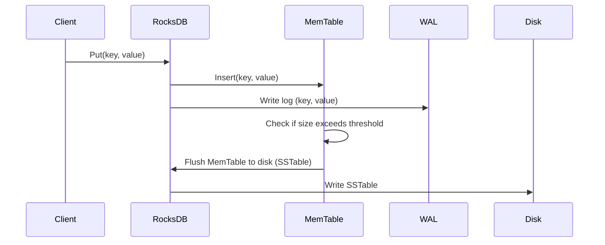
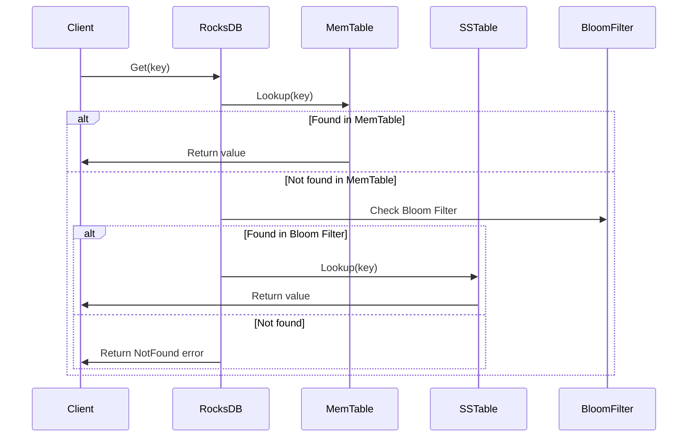

# TiDB 概述与架构设计

## 2.1 TiDB 的 SQL 处理与调度
- ### SQL 解析与优化
 TiDB 的 SQL 解析和优化过程可以分为几个步骤：SQL 解析、查询优化和执行引擎的处理。
- #### SQL 解析
  - 在 TiDB 中，SQL 解析的主要任务是将 SQL 查询转换为结构化的抽象语法树（AST）。TiDB 使用了 Parser 组件来进行 SQL 解析。
    - Parser 组件：TiDB 使用 Go 语言的 parser 包，主要负责将 SQL 字符串解析成抽象语法树（AST）。AST 是 SQL 查询的内部表示形式，包含了 SQL 的所有结构信息。 
- TiDB 使用的 SQL 解析器是由 github.com/pingcap/parser 提供的。它是 TiDB 中 SQL 解析的核心模块。
```go
import "github.com/pingcap/parser"
// Parse SQL query to AST
stmt, err := parser.New().ParseOneStmt("SELECT * FROM t WHERE id = 1", "", "")
if err != nil {
log.Fatal(err)
}
fmt.Println(stmt) // 输出 AST
 
```
上述代码通过 ParseOneStmt 函数将 SQL 查询解析为一个抽象语法树（AST）。stmt 是一个代表 SQL 语句的结构体，可以进一步用于查询优化和执行。


- ### 2.2 查询优化器（Query Planner & Optimizer）
在 TiDB 中，查询优化是通过查询优化器（Optimizer）来完成的。查询优化的目标是根据查询的代价模型选择最佳的执行计划。

TiDB 的查询优化器使用了基于成本的优化策略（Cost-Based Optimization, CBO）。主要优化策略包括：

- **索引选择**：选择最适合的索引来加速查询。
- **表连接优化**：选择合适的连接顺序和连接方式（如 Nested Loop Join、Hash Join）。
- **查询重写**：对 SQL 语句进行等价重写

TiDB 的优化器的核心实现类是 planbuilder，它使用代价模型来评估不同查询计划的成本。

```go
import "github.com/pingcap/tidb/planner/core"

opt := core.NewOptimizer(ctx, tidb.QueryExecutor())
plan, err := opt.Optimize(stmt, tidb.GetAllTables())
if err != nil {
    log.Fatal(err)
}
fmt.Println(plan) // 输出优化后的查询计划

```
`core.NewOptimizer` 创建了一个新的优化器，Optimize 方法用于生成优化后的查询计划。查询计划会根据代价模型选择最优的执行计划。

- ### 2.3 执行引擎（Execution Engine）
执行引擎的任务是将优化后的查询计划转化为实际的执行步骤。执行引擎会根据查询计划向 TiKV 或 TiFlash 发起请求，获取数据并进行处理。

TiDB 执行引擎主要通过一个名为 executor 的模块来实现。执行引擎根据查询计划构建一个执行树，并逐层执行查询。
```go
import "github.com/pingcap/tidb/executor"

// 创建执行器
exec := executor.NewExecutor(ctx, plan)
result, err := exec.Execute()
if err != nil {
    log.Fatal(err)
}
fmt.Println(result) // 输出执行结果

```
`executor.NewExecutor` 用于创建一个执行器，Execute 方法用于执行查询计划并返回结果。执行器会根据不同的操作符（如表扫描、索引扫描等）调用 TiKV 和 TiFlash 进行数据读取和计算。

---
- ### TiDB 的内部组件
- #### 2.1 TiKV 和 TiFlash
TiDB 的执行引擎通过 TiKV 和 TiFlash 来进行数据的存储和处理。
  - TiKV：TiKV 是 TiDB 的分布式事务存储引擎，它采用 Raft 协议保证数据一致性。TiDB 将 SQL 查询转化为 KV 操作，TiKV 提供数据存储和检索功能。
  - TiFlash：TiFlash 是 TiDB 的列存引擎，用于加速分析型查询，特别是支持高效的列式存储和 OLAP 查询。

在执行计划中，TiDB 会根据数据访问模式选择是否使用 TiKV 或 TiFlash。例如，TiFlash 可以用于执行大范围的聚合操作或多维度的查询。
- ### TiDB 查询执行流程
假设我们有一个 SQL 查询：
```sql
SELECT id, name FROM users WHERE age > 30 ORDER BY id LIMIT 10;

```
- **1、SQL 解析**：
TiDB 首先会通过 parser 组件将 SQL 字符串解析为 AST。
查询优化：
TiDB 会通过优化器选择最佳的执行计划，例如使用索引来加速 age > 30 的过滤，使用合适的排序算法（如排序合并）进行排序操作。
- **2、执行引擎**：
TiDB 生成的执行计划可能会涉及到 TiKV 或 TiFlash，执行引擎根据查询的性质选择合适的数据源。

最终，执行引擎会将查询请求分发到 TiKV 或 TiFlash 进行数据读取，并将结果返回给客户端。

---

## 2.2 TiKV 的存储与事务管理
### 2.2.1 TiKV 数据存储结构

TiKV 是一个分布式的 Key-Value 存储系统，底层使用 RocksDB 作为存储引擎。RocksDB 是一个高效的嵌入式数据库，提供高性能的持久化存储。TiKV 基于 RocksDB 进行数据存储和索引的管理。
- **Key-Value 存储**：TiKV 将数据以键值对的形式存储，每个数据条目由一个键（Key）和一个值（Value）组成。TiKV 对键值对进行分布式管理，可以支持水平扩展。
- **RocksDB 存储引擎**：TiKV 使用 RocksDB 作为底层的存储引擎，负责物理存储和事务日志管理。RocksDB 提供高效的写入、读取和压缩算法。
  - **1. RocksDB 的写入流程**
    - **Write Request**：客户端向 RocksDB 发出写请求，数据被写入 MemTable。
    - **MemTable**：RocksDB 将写入的键值对保存在内存中的 MemTable（一个有序的哈希表或跳表）中。MemTable 是一个高效的内存数据结构，所有新的写入操作都会首先进入 MemTable。
    - **Write Ahead Log（WAL）**：同时，所有的写入操作会被记录到 Write-Ahead Log（WAL）中，保证数据的一致性。当发生崩溃恢复时，WAL 可以帮助重放写入操作。
    - **MemTable Flush to Disk**：当 MemTable 达到一定大小后，RocksDB 会将 MemTable 刷新（Flush）到磁盘，创建一个新的 SSTable 文件。
    - **Compaction**：当多个 SSTable 文件在磁盘中生成后，RocksDB 会通过压缩过程将这些 SSTable 合并，以减少存储占用并提高读取效率。
  - 以下是一个简化的 RocksDB 写入流程代码片段，模拟了向 RocksDB 写入数据的过程：
```go
import (
    "github.com/facebook/rocksdb"
    "log"
)

func writeToRocksDB(db *rocksdb.DB, key, value []byte) error {
    // 创建写操作对象
    writeOpts := rocksdb.NewWriteOptions()
    defer writeOpts.Destroy()

    // 执行写操作
    err := db.Put(writeOpts, key, value)
    if err != nil {
        return err
    }
    return nil
}

func main() {
    // 打开 RocksDB 数据库
    options := rocksdb.NewOptions()
    defer options.Destroy()
    options.SetCreateIfMissing(true)

    db, err := rocksdb.OpenDb(options, "/tmp/testdb")
    if err != nil {
        log.Fatal(err)
    }
    defer db.Close()

    // 写入数据
    err = writeToRocksDB(db, []byte("key1"), []byte("value1"))
    if err != nil {
        log.Fatal(err)
    }

    log.Println("Data written successfully!")
}

```
在这个例子中，db.Put 方法会将数据写入 MemTable，同时将写操作记录到 WAL 中。


- **2. RocksDB 的读取流程**

RocksDB 的读取流程是通过查找 MemTable 和 SSTable 文件来完成的，具体步骤如下：

  - **查找 MemTable**：RocksDB 首先会在 MemTable 中查找目标键。如果 MemTable 中找到了该键，返回对应的值。
  - **查找 SSTable**：如果 MemTable 中没有找到，RocksDB 会查找 SSTable 文件。SSTable 是存储在磁盘上的排序文件，RocksDB 会通过布隆过滤器（Bloom Filter）快速判断目标键是否存在于 SSTable 中，避免不必要的磁盘 I/O 操作。
  - **返回数据**：如果目标键存在于 MemTable 或 SSTable 中，RocksDB 会返回对应的值。如果都找不到，返回 NotFound 错误。
以下是一个简化的 RocksDB 读取流程代码片段，模拟了从 RocksDB 读取数据的过程：
```go
import (
"github.com/facebook/rocksdb"
"log"
)

func readFromRocksDB(db *rocksdb.DB, key []byte) ([]byte, error) {
// 创建读取选项
readOpts := rocksdb.NewDefaultReadOptions()
defer readOpts.Destroy()

    // 执行读取操作
    value, err := db.Get(readOpts, key)
    if err != nil {
        return nil, err
    }
    if value == nil {
        return nil, rocksdb.ErrNotFound
    }
    return value, nil
}

func main() {
// 打开 RocksDB 数据库
options := rocksdb.NewOptions()
defer options.Destroy()
options.SetCreateIfMissing(true)

    db, err := rocksdb.OpenDb(options, "/tmp/testdb")
    if err != nil {
        log.Fatal(err)
    }
    defer db.Close()

    // 读取数据
    value, err := readFromRocksDB(db, []byte("key1"))
    if err != nil {
        log.Fatal(err)
    }

    log.Printf("Data read successfully: %s", value)
}

```

- **3. RocksDB 的压缩算法**

RocksDB 使用了 Level-Compaction 和 Universal-Compaction 两种压缩策略来优化存储和读取效率。

- **Level-Compaction**：这种策略通过将数据按照不同的 "Level" 进行组织，每个 Level 的数据量是有上限的。当某个 Level 的数据超出上限时，会触发压缩操作，将数据向下压缩到下一 Level。这种策略适用于写多读少的场景。

- **Universal-Compaction**：这种策略通过合并多个 SSTable 文件，减少存储的碎片并提高查询性能。它适用于写入负载较高的场景。

RocksDB 中的压缩操作是由后台线程自动执行的，确保在数据不断增加时，不会造成过多的 I/O 操作。

RocksDB 支持用户指定压缩算法，例如 Snappy、Zlib、LZ4 等。以下是设置压缩选项的代码：

```go
import (
    "github.com/facebook/rocksdb"
    "log"
)

func configureCompression() *rocksdb.Options {
    options := rocksdb.NewOptions()
    // 使用 Snappy 压缩算法
    options.SetCompression(rocksdb.SnappyCompression)
    return options
}

func main() {
    options := configureCompression()
    defer options.Destroy()

    // 打开 RocksDB 数据库
    db, err := rocksdb.OpenDb(options, "/tmp/testdb")
    if err != nil {
        log.Fatal(err)
    }
    defer db.Close()

    log.Println("RocksDB configured with Snappy compression")
}

```
###  RocksDB 写入与读取时序图（流程图）
下面是一个简化的写入和读取流程时序图，展示了数据从写入到读取的过程。我们使用 Mermaid 语法来描述时序图。
- 写入流程时序图

- 读取流程时序图

