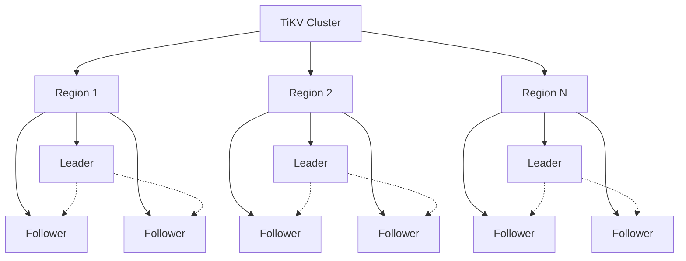
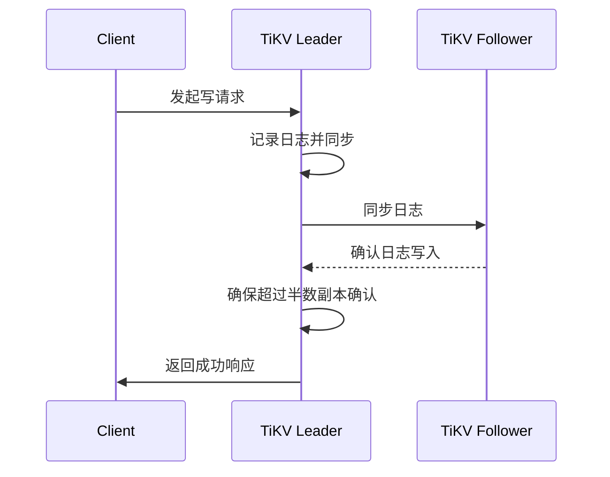
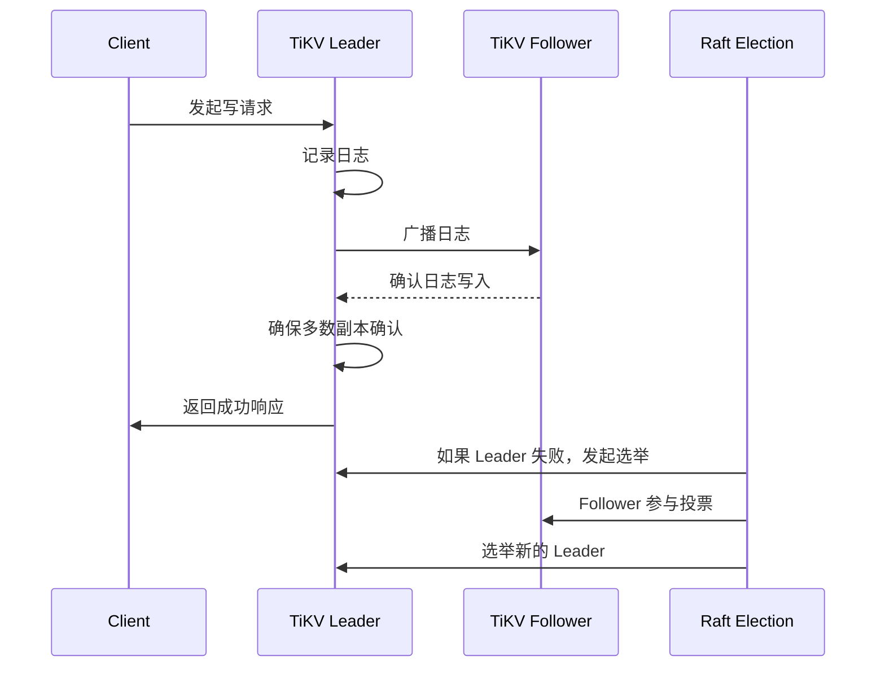
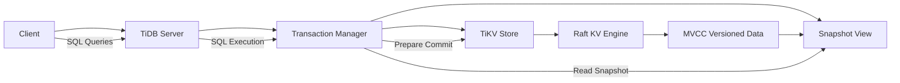
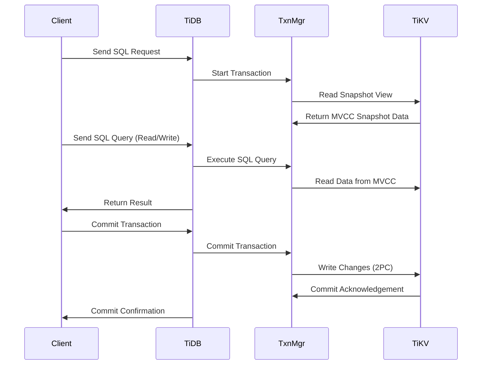

# TiDB 概述与架构设计

## 2.1 TiDB 的 SQL 处理与调度
- ### SQL 解析与优化
 TiDB 的 SQL 解析和优化过程可以分为几个步骤：SQL 解析、查询优化和执行引擎的处理。
- #### SQL 解析
  - 在 TiDB 中，SQL 解析的主要任务是将 SQL 查询转换为结构化的抽象语法树（AST）。TiDB 使用了 Parser 组件来进行 SQL 解析。
    - Parser 组件：TiDB 使用 Go 语言的 parser 包，主要负责将 SQL 字符串解析成抽象语法树（AST）。AST 是 SQL 查询的内部表示形式，包含了 SQL 的所有结构信息。 
- TiDB 使用的 SQL 解析器是由 github.com/pingcap/parser 提供的。它是 TiDB 中 SQL 解析的核心模块。
```go
import "github.com/pingcap/parser"
// Parse SQL query to AST
stmt, err := parser.New().ParseOneStmt("SELECT * FROM t WHERE id = 1", "", "")
if err != nil {
log.Fatal(err)
}
fmt.Println(stmt) // 输出 AST
 
```
上述代码通过 ParseOneStmt 函数将 SQL 查询解析为一个抽象语法树（AST）。stmt 是一个代表 SQL 语句的结构体，可以进一步用于查询优化和执行。


- ### 查询优化器（Query Planner & Optimizer）
在 TiDB 中，查询优化是通过查询优化器（Optimizer）来完成的。查询优化的目标是根据查询的代价模型选择最佳的执行计划。

TiDB 的查询优化器使用了基于成本的优化策略（Cost-Based Optimization, CBO）。主要优化策略包括：

- **索引选择**：选择最适合的索引来加速查询。
- **表连接优化**：选择合适的连接顺序和连接方式（如 Nested Loop Join、Hash Join）。
- **查询重写**：对 SQL 语句进行等价重写

TiDB 的优化器的核心实现类是 planbuilder，它使用代价模型来评估不同查询计划的成本。

```go
import "github.com/pingcap/tidb/planner/core"

opt := core.NewOptimizer(ctx, tidb.QueryExecutor())
plan, err := opt.Optimize(stmt, tidb.GetAllTables())
if err != nil {
    log.Fatal(err)
}
fmt.Println(plan) // 输出优化后的查询计划

```
`core.NewOptimizer` 创建了一个新的优化器，Optimize 方法用于生成优化后的查询计划。查询计划会根据代价模型选择最优的执行计划。

- ### 执行引擎（Execution Engine）
执行引擎的任务是将优化后的查询计划转化为实际的执行步骤。执行引擎会根据查询计划向 TiKV 或 TiFlash 发起请求，获取数据并进行处理。

TiDB 执行引擎主要通过一个名为 executor 的模块来实现。执行引擎根据查询计划构建一个执行树，并逐层执行查询。
```go
import "github.com/pingcap/tidb/executor"

// 创建执行器
exec := executor.NewExecutor(ctx, plan)
result, err := exec.Execute()
if err != nil {
    log.Fatal(err)
}
fmt.Println(result) // 输出执行结果

```
`executor.NewExecutor` 用于创建一个执行器，Execute 方法用于执行查询计划并返回结果。执行器会根据不同的操作符（如表扫描、索引扫描等）调用 TiKV 和 TiFlash 进行数据读取和计算。

---
- ### TiDB 的内部组件
- #### TiKV 和 TiFlash
TiDB 的执行引擎通过 TiKV 和 TiFlash 来进行数据的存储和处理。
  - TiKV：TiKV 是 TiDB 的分布式事务存储引擎，它采用 Raft 协议保证数据一致性。TiDB 将 SQL 查询转化为 KV 操作，TiKV 提供数据存储和检索功能。
  - TiFlash：TiFlash 是 TiDB 的列存引擎，用于加速分析型查询，特别是支持高效的列式存储和 OLAP 查询。

在执行计划中，TiDB 会根据数据访问模式选择是否使用 TiKV 或 TiFlash。例如，TiFlash 可以用于执行大范围的聚合操作或多维度的查询。
- ### TiDB 查询执行流程
假设我们有一个 SQL 查询：
```sql
SELECT id, name FROM users WHERE age > 30 ORDER BY id LIMIT 10;

```
- **1、SQL 解析**：
TiDB 首先会通过 parser 组件将 SQL 字符串解析为 AST。
查询优化：
TiDB 会通过优化器选择最佳的执行计划，例如使用索引来加速 age > 30 的过滤，使用合适的排序算法（如排序合并）进行排序操作。
- **2、执行引擎**：
TiDB 生成的执行计划可能会涉及到 TiKV 或 TiFlash，执行引擎根据查询的性质选择合适的数据源。

最终，执行引擎会将查询请求分发到 TiKV 或 TiFlash 进行数据读取，并将结果返回给客户端。

---

## 2.2 TiKV 的存储与事务管理
### TiKV 数据存储结构

TiKV 是一个分布式的 Key-Value 存储系统，底层使用 RocksDB 作为存储引擎。RocksDB 是一个高效的嵌入式数据库，提供高性能的持久化存储。TiKV 基于 RocksDB 进行数据存储和索引的管理。
- **Key-Value 存储**：TiKV 将数据以键值对的形式存储，每个数据条目由一个键（Key）和一个值（Value）组成。TiKV 对键值对进行分布式管理，可以支持水平扩展。
- **RocksDB 存储引擎**：TiKV 使用 RocksDB 作为底层的存储引擎，负责物理存储和事务日志管理。RocksDB 提供高效的写入、读取和压缩算法。
  - **1. RocksDB 的写入流程**
    - **Write Request**：客户端向 RocksDB 发出写请求，数据被写入 MemTable。
    - **MemTable**：RocksDB 将写入的键值对保存在内存中的 MemTable（一个有序的哈希表或跳表）中。MemTable 是一个高效的内存数据结构，所有新的写入操作都会首先进入 MemTable。
    - **Write Ahead Log（WAL）**：同时，所有的写入操作会被记录到 Write-Ahead Log（WAL）中，保证数据的一致性。当发生崩溃恢复时，WAL 可以帮助重放写入操作。
    - **MemTable Flush to Disk**：当 MemTable 达到一定大小后，RocksDB 会将 MemTable 刷新（Flush）到磁盘，创建一个新的 SSTable 文件。
    - **Compaction**：当多个 SSTable 文件在磁盘中生成后，RocksDB 会通过压缩过程将这些 SSTable 合并，以减少存储占用并提高读取效率。
  - 以下是一个简化的 RocksDB 写入流程代码片段，模拟了向 RocksDB 写入数据的过程：
```go
import (
    "github.com/facebook/rocksdb"
    "log"
)

func writeToRocksDB(db *rocksdb.DB, key, value []byte) error {
    // 创建写操作对象
    writeOpts := rocksdb.NewWriteOptions()
    defer writeOpts.Destroy()

    // 执行写操作
    err := db.Put(writeOpts, key, value)
    if err != nil {
        return err
    }
    return nil
}

func main() {
    // 打开 RocksDB 数据库
    options := rocksdb.NewOptions()
    defer options.Destroy()
    options.SetCreateIfMissing(true)

    db, err := rocksdb.OpenDb(options, "/tmp/testdb")
    if err != nil {
        log.Fatal(err)
    }
    defer db.Close()

    // 写入数据
    err = writeToRocksDB(db, []byte("key1"), []byte("value1"))
    if err != nil {
        log.Fatal(err)
    }

    log.Println("Data written successfully!")
}

```
在这个例子中，db.Put 方法会将数据写入 MemTable，同时将写操作记录到 WAL 中。


- **2. RocksDB 的读取流程**

RocksDB 的读取流程是通过查找 MemTable 和 SSTable 文件来完成的，具体步骤如下：

  - **查找 MemTable**：RocksDB 首先会在 MemTable 中查找目标键。如果 MemTable 中找到了该键，返回对应的值。
  - **查找 SSTable**：如果 MemTable 中没有找到，RocksDB 会查找 SSTable 文件。SSTable 是存储在磁盘上的排序文件，RocksDB 会通过布隆过滤器（Bloom Filter）快速判断目标键是否存在于 SSTable 中，避免不必要的磁盘 I/O 操作。
  - **返回数据**：如果目标键存在于 MemTable 或 SSTable 中，RocksDB 会返回对应的值。如果都找不到，返回 NotFound 错误。
以下是一个简化的 RocksDB 读取流程代码片段，模拟了从 RocksDB 读取数据的过程：
```go
import (
"github.com/facebook/rocksdb"
"log"
)

func readFromRocksDB(db *rocksdb.DB, key []byte) ([]byte, error) {
// 创建读取选项
readOpts := rocksdb.NewDefaultReadOptions()
defer readOpts.Destroy()

    // 执行读取操作
    value, err := db.Get(readOpts, key)
    if err != nil {
        return nil, err
    }
    if value == nil {
        return nil, rocksdb.ErrNotFound
    }
    return value, nil
}

func main() {
// 打开 RocksDB 数据库
options := rocksdb.NewOptions()
defer options.Destroy()
options.SetCreateIfMissing(true)

    db, err := rocksdb.OpenDb(options, "/tmp/testdb")
    if err != nil {
        log.Fatal(err)
    }
    defer db.Close()

    // 读取数据
    value, err := readFromRocksDB(db, []byte("key1"))
    if err != nil {
        log.Fatal(err)
    }

    log.Printf("Data read successfully: %s", value)
}

```

- ** RocksDB 的压缩算法**

RocksDB 使用了 Level-Compaction 和 Universal-Compaction 两种压缩策略来优化存储和读取效率。

- **Level-Compaction**：这种策略通过将数据按照不同的 "Level" 进行组织，每个 Level 的数据量是有上限的。当某个 Level 的数据超出上限时，会触发压缩操作，将数据向下压缩到下一 Level。这种策略适用于写多读少的场景。

- **Universal-Compaction**：这种策略通过合并多个 SSTable 文件，减少存储的碎片并提高查询性能。它适用于写入负载较高的场景。

RocksDB 中的压缩操作是由后台线程自动执行的，确保在数据不断增加时，不会造成过多的 I/O 操作。

RocksDB 支持用户指定压缩算法，例如 Snappy、Zlib、LZ4 等。以下是设置压缩选项的代码：

```go
import (
    "github.com/facebook/rocksdb"
    "log"
)

func configureCompression() *rocksdb.Options {
    options := rocksdb.NewOptions()
    // 使用 Snappy 压缩算法
    options.SetCompression(rocksdb.SnappyCompression)
    return options
}

func main() {
    options := configureCompression()
    defer options.Destroy()

    // 打开 RocksDB 数据库
    db, err := rocksdb.OpenDb(options, "/tmp/testdb")
    if err != nil {
        log.Fatal(err)
    }
    defer db.Close()

    log.Println("RocksDB configured with Snappy compression")
}

```
###  RocksDB 写入与读取时序图（流程图）
下面是一个简化的写入和读取流程时序图，展示了数据从写入到读取的过程。我们使用 Mermaid 语法来描述时序图。
- 写入流程时序图

- 读取流程时序图


### TiKV 和 Raft 协议

TiKV 是一个分布式键值数据库，支持水平扩展和强一致性。它使用了 **Raft 协议** 来保证数据的一致性和高可用性。TiKV 将数据分为多个 **Region**，每个 Region 大约包含 96MB 的数据。以下是关于 TiKV 如何通过 Raft 协议实现数据一致性和高可用性的详细解释：

#### 1. Region 设计

- **Region** 是 TiKV 数据的基本存储单位。每个 Region 大约 96MB，并且是 TiKV 中的一个逻辑分区。Region 存储的是一段连续的键值对。
- 每个 Region 会有多个副本（通常是 3 个副本），这些副本分布在集群中的不同节点上。副本之间的数据会通过 Raft 协议同步，确保数据的一致性。

-  Region 设计架构图（Mermaid）


- **解释**：

`TiKV Cluster` 包含多个 `Region`。
每个 `Region` 有一个 `Leader` 和多个 `Follower` 副本。
`Leader` 和 `Follower` 副本之间通过 Raft 协议同步数据（虚线表示副本之间的数据同步关系）。

- **时序图**


- **时序图说明：**

- 1、Client 发起一个写请求到 TiKV Leader。
- 2、Leader 将写请求记录到日志，并将日志同步到所有的 Follower 副本。
- 3、Follower 返回确认信息给 Leader。
- 4、当大多数副本（包括 Leader）确认日志成功后，Leader 向客户端返回成功响应。

**Region 管理（Region 请求的处理）**
```rust
struct Region {
    id: u64,
    leader: Option<u64>,  // 当前 Region 的 Leader 节点
    peers: Vec<Peer>,     // Region 的副本（包括 Leader 和 Follower）
}

impl Region {
    // 处理写请求
    fn handle_write(&mut self, key: String, value: String) -> Result<()> {
        // 创建写入日志条目
        let entry = Entry {
            key: key,
            value: value,
        };

        // 调用 Raft 协议进行日志提交
        if let Some(leader) = self.leader {
            leader.propose(entry)?;  // 提交给 Leader 处理
        }
        Ok(())
    }
}

```

- **解释：**

`Region` 结构体表示 TiKV 中的一个 Region，包含 Region 的 ID、Leader 节点以及副本（Peers）。
`handle_write() `方法处理写请求，并通过 Raft 协议将写请求提交到 Leader。


#### 2. Raft 协议概述

Raft 是一种一致性算法，设计用于分布式系统中保证日志的一致性和状态机的一致性。Raft 协议通过以下几个主要机制来保证数据的一致性和高可用性：

- **日志复制**：Raft 确保每个服务器上的日志序列是相同的，从而确保数据一致性。
- **选举机制**：Raft 保证集群中的一个节点始终处于领导者（Leader）角色，领导者负责处理所有的写操作和日志的复制。
- **副本同步**：Raft 会确保副本之间的数据一致性，所有写入请求必须先在 Leader 节点上进行，并通过日志复制到 Follower 节点。
- **故障恢复**：Raft 确保如果 Leader 发生故障，集群中的其他节点可以通过选举机制选举出新的 Leader，从而继续保证数据的一致性和可用性。

- Raft 协议时序图


**解释：**
- **`Client`** 发起写请求：客户端向 TiKV 发送写请求。
- **`Leader`** 记录日志并广播给 Follower：Leader 节点接收请求后，将写操作记录到 Raft 日志并广播到 Follower 节点。
- **`Follower`** 确认日志：Follower 节点接收到日志后，确认已写入。
- **`Leader`** 确保多数副本确认：Leader 节点等待大多数副本确认日志写入。
- **返回响应**：当大多数副本确认日志时，Leader 向客户端返回成功响应。
- **选举过程**：当 Leader 发生故障时，Raft 协议通过选举过程选出新的 Leader。


- **raft故障选举流程**
- Raft 协议中的选举机制确保集群在 Leader 故障时能够选举出一个新的 Leader。下面是选举过程的简化代码：
```rust
// 在 Candidate 状态下发起选举
impl Raft {
    fn start_election(&mut self) -> Result<()> {
        self.state = RaftState::Candidate;
        self.term += 1;  // 增加任期
        self.leader_id = None;  // 重置 Leader ID

        // 广播投票请求
        self.broadcast_vote_request()?;

        // 处理选举逻辑，例如等待投票
        // 如果超过半数节点投票，成为新的 Leader
        Ok(())
    }

    // 选举完成后，设置 Leader
    fn become_leader(&mut self) {
        self.state = RaftState::Leader;
        self.leader_id = Some(self.id);
    }
}


```

**解释**：

  - 当节点变为 `Candidate` 时，会发起选举，向所有节点请求投票。
- 如果 `Candidate` 获得超过半数的投票，它就会成为新的 Leader，状态变为 Leader。
- `become_leader()` 方法用于将节点状态切换为 Leader。


### 3. TiKV 如何利用 Raft 协议

TiKV 使用 Raft 协议来管理每个 Region 的副本，从而保证数据的一致性、可靠性和高可用性。具体来说，TiKV 通过以下方式实现：

#### a) 副本同步

- 每个 Region 会有多个副本（默认 3 个），这些副本分布在不同的 TiKV 节点上。
- Raft 协议确保所有副本的数据一致性。在 TiKV 中，副本分为 Leader 副本和 Follower 副本：
  - **Leader 副本**：负责接收客户端的写请求并将其记录到日志中，之后将日志同步到所有 Follower 副本。
  - **Follower 副本**：接收 Leader 副本同步过来的日志，并将数据持久化到磁盘。如果 Leader 副本故障，集群会选举一个新的 Leader 副本来继续服务。

#### b) 选举机制

- Raft 协议中的选举机制保证集群中始终有一个 Leader。当 TiKV 启动时，Region 会选择一个 Leader 节点来处理所有的写操作。
- 如果当前的 Leader 节点发生故障，集群中的其他副本会通过 Raft 的选举机制选举出一个新的 Leader，确保 TiKV 服务的持续可用性。

#### c) 日志复制

- TiKV 的写请求会首先发送到 Leader 节点，Leader 节点会将写入操作（写日志）复制到所有 Follower 副本。
- 当大多数副本（即超过半数）确认日志复制成功后，Leader 会向客户端返回操作成功的响应，保证数据的一致性。
- 如果某个副本由于网络延迟或故障未能及时接收到日志，Raft 协议会确保这些副本在恢复连接后会通过日志重放机制同步数据。

#### d) 数据恢复

- 如果 TiKV 中的某个节点发生故障，Raft 协议会确保失效的节点能够从其他节点的日志中恢复数据。
- 当一个新的 TiKV 节点加入集群或原来的节点重新加入时，Raft 会确保该节点通过复制操作获得当前最新的日志，并与集群中的其他节点保持一致。

### 4. TiKV 中的 Region 与 Raft 协议结合

- 每个 Region 维护着自己的 Raft 状态，包括 Leader 副本和 Follower 副本。
- 当 Region 的数据发生更新时，Raft 协议会确保 Leader 副本的数据更新被同步到 Follower 副本，以此来保持数据的一致性。
- TiKV 的 Region 可以跨多个 TiKV 实例（节点），这些节点通过 Raft 协议进行副本同步，确保每个 Region 在多个节点间的一致性和高可用性。

### 5. 故障恢复与高可用性

- TiKV 使用 Raft 协议的日志复制与选举机制来确保高可用性。如果一个 TiKV 节点故障或出现网络分区，其他节点可以通过选举机制快速选举出新的 Leader。
- TiKV 还提供了 **Region 移动** 和 **副本重建** 功能，确保在节点发生故障时，集群能够继续正常工作，同时进行数据恢复。


---
## TiDB 的分布式事务与一致性保证
### TiDB 分布式事务原理与实现

在 **TiDB** 中，分布式事务的实现是其关键特性之一，TiDB 通过一系列技术（如 **乐观锁**、**悲观锁**、**两阶段提交协议（2PC）** 和 **分布式快照隔离（SI）**）来确保跨节点、跨 Region 的事务一致性和高并发控制。以下是对这些概念和实现的深入分析。

### 1. 分布式事务原理：强一致性

TiDB 是基于 **分布式事务** 来实现其强一致性的。为了保证跨多个节点和多个 Region 的事务原子性，TiDB 使用了分布式事务协议（尤其是基于 **Percolator** 模型），其中包括：
- **乐观锁**（Optimistic Locking）
- **悲观锁**（Pessimistic Locking）
- **两阶段提交协议**（2PC）
- **分布式快照隔离**（Snapshot Isolation, SI）

这些机制共同作用，确保在分布式环境下处理并发事务时能够有效避免 **脏读**、**不可重复读**、**幻读** 等问题，并保证数据一致性和隔离性。

---

### 2. 乐观锁与悲观锁：并发控制

#### 悲观锁（Pessimistic Locking）

悲观锁是一种保守的锁机制，它假设事务之间会发生冲突，因此在访问数据之前就对数据加锁，确保在事务提交前其他事务不能修改被锁的数据。

- **实现原理**：
  - 在 TiDB 中，悲观锁通常用于执行 **写操作**，例如通过 `SELECT ... FOR UPDATE` 锁定数据行。
  - 事务开始时，TiDB 会为相关数据行加上悲观锁，确保同一数据行不能被其他事务修改，直到当前事务提交。
  - 悲观锁保证了事务在整个过程中不会被其他事务修改，提供了较强的隔离性，但会影响系统的并发性。

- **适用场景**：
  - 当事务中包含多个数据写操作，且存在较大冲突的可能性时，悲观锁可以有效避免冲突和丢失更新问题。

- **缺点**：
  - 悲观锁会导致较高的锁竞争和性能下降，特别是在并发量较大的情况下。

#### 乐观锁（Optimistic Locking）

乐观锁是一种乐观的策略，假设事务之间不会发生冲突，因此不会在开始时对数据加锁，而是允许事务在提交时进行冲突检查。如果检测到数据冲突（即数据已经被其他事务修改），事务会被回滚并重新执行。

- **实现原理**：
  - 在 TiDB 中，乐观锁基于 **版本号** 或 **时间戳** 来实现。每个数据行都有一个版本号或时间戳，事务在读取数据时会记录该行的版本号或时间戳。
  - 在提交事务时，TiDB 会检查该数据的版本号或时间戳是否和读取时一致。如果一致，表示没有其他事务修改该数据，当前事务可以成功提交；否则，表示有其他事务修改了数据，当前事务需要回滚。

- **适用场景**：
  - 当事务之间的冲突较少时，乐观锁能够提升并发性能，减少锁竞争。

- **缺点**：
  - 当发生冲突时，事务需要回滚并重试，可能导致性能损失。

---

###  两阶段提交协议（2PC）

#### 2PC 协议概述

在分布式事务中，为了确保多个节点的数据一致性和事务的原子性，TiDB 使用了 **两阶段提交协议（2PC）**。

- **阶段 1：准备阶段**（Prepare Phase）：
  - 当 TiDB 事务需要跨多个 Region 执行时，TiDB 会先在所有参与节点上执行准备操作。此时，TiDB 向所有参与节点发送“预提交”请求，请求节点准备好提交事务。
  - 每个节点会检查其本地数据是否满足提交条件，如果满足，则锁定相关资源，准备提交。

- **阶段 2：提交阶段**（Commit Phase）：
  - 如果所有参与节点都返回准备就绪，TiDB 会发送提交请求，要求所有节点正式提交事务。
  - 如果任何节点未准备好（例如发生冲突或数据错误），TiDB 会发送回滚请求，要求所有节点回滚事务。

#### TiDB 中的 2PC 实现

在 TiDB 中，2PC 协议用于保证跨多个 Region 的事务具有 **原子性**：
- 在执行事务的过程中，TiDB 会向各个 Region 的 **TiKV** 发送 2PC 请求，通过 **预提交** 确保所有节点准备好后，再进行 **提交**。
- 如果在任何阶段发现冲突（例如由于写锁竞争导致的事务冲突），TiDB 会确保事务回滚，从而避免数据不一致。

- 核心代码实现
- TiDB 的 2PC 协议的核心代码主要分布在以下几个组件中：
  - `txn（事务管理`）：用于处理事务的开启、提交和回滚。
  - `store`：TiDB 集群的分布式存储引擎，负责与 TiKV 进行交互。
  - `raftstore`：负责管理 Raft 存储引擎及其与 TiKV 的通信。


- **txn 模块 - 事务提交流程**
```go 
// TiDB 中提交事务的方法
func (s *txnState) commitTxn(ctx context.Context) error {
// 1. 检查是否需要进行两阶段提交
if !s.need2PC {
return nil
}

// 2. 获取所有参与的 Region（TiKV 节点）
regions, err := s.getRegionsToCommit()
if err != nil {
return err
}

// 3. 创建一个 2PC 请求，发送到所有参与的 TiKV 节点
req := &pb.CommitRequest{
Regions: regions,
}

// 4. 向所有 TiKV 节点发起准备阶段请求
for _, region := range regions {
if err := s.send2PCPrepare(ctx, region, req); err != nil {
return err
}
}

// 5. 如果所有节点都返回了准备成功，则发送提交请求
if err := s.send2PCCommit(ctx, req); err != nil {
return err
}

return nil
}

```

- `store` 模块 - 向 TiKV 发送 2PC 请求

在提交事务之前，TiDB 会向 TiKV 节点发起 2PC 请求，具体实现如下：
```go

// 发送 2PC 准备请求
func (s *txnState) send2PCPrepare(ctx context.Context, region *metapb.Region, req *pb.CommitRequest) error {
    // 创建一个新的 2PC 请求
    rpcReq := &raftCmdRequest{
        region: region,
        cmd:    req,
    }

    // 调用 TiKV 的接口发送预提交请求
    _, err := s.store.SendRPC(ctx, rpcReq)
    if err != nil {
        log.Errorf("2PC prepare failed for region: %v, error: %v", region, err)
        return err
    }

    return nil
}

// 发送 2PC 提交请求
func (s *txnState) send2PCCommit(ctx context.Context, req *pb.CommitRequest) error {
    // 向所有参与提交的 Region 发送提交请求
    for _, region := range req.Regions {
        if err := s.store.SendRPC(ctx, region); err != nil {
            return err
        }
    }

    return nil
}

```

在这里，store.SendRPC 负责通过网络将事务请求发送给 TiKV 节点，并等待响应。TiKV 会处理请求并返回状态。


- **TiKV 端的 2PC 处理**
  TiKV 端的 2PC 处理逻辑主要分为两部分：预提交（Prepare） 和 提交（Commit）。每个 TiKV 节点接收到预提交请求后，会执行以下操作：
  - 预提交阶段，TiKV 将资源锁定，记录事务的写入日志。
  - 提交阶段，TiKV 确认所有节点都准备好后，提交数据。
```go 
// TiKV 处理预提交请求
func (s *storeServer) handle2PCPrepare(req *pb.CommitRequest) error {
    // 锁定相关数据
    if err := s.lockRegion(req.Region); err != nil {
      return err
    }
    
    // 记录日志，准备提交
    if err := s.write2PCLockLog(req); err != nil {
      return err
    }
    
      return nil
}
  
  // TiKV 处理提交请求
func (s *storeServer) handle2PCCommit(req *pb.CommitRequest) error {
  // 提交事务
  if err := s.commitRegion(req.Region); err != nil {
    return err
  }

    return nil
}

```

- **TiDB 的 2PC 与事务管理**

在 TiDB 的事务中，所有的 2PC 相关操作都会经过事务的状态管理器，事务状态管理器会根据事务的执行情况（是否需要跨多个 Region）来决定是否进行 2PC 的流程。

```go
// 启动一个新的事务并准备执行 2PC
func (s *txnState) beginTxn() {
    s.need2PC = true  // 确定是否需要进行 2PC
    s.txn = newTxn()   // 创建一个新的事务
}

// 执行事务提交
func (s *txnState) commit() error {
    if s.need2PC {
        return s.commitTxn(context.TODO())  // 调用 2PC 提交
    }

    // 如果不需要 2PC，直接提交
    return s.txn.Commit()
}

```


---

### 分布式快照隔离（Snapshot Isolation，SI）

####  SI 的概念

**分布式快照隔离（SI）** 是一种事务隔离级别，它可以有效避免 **脏读** 和 **不可重复读** 的问题，并允许并发读写操作。

- **快照隔离**通过为每个事务提供 **快照视图**，使得每个事务只能看到事务开始时的数据状态。这意味着即使其他事务正在对数据库进行修改，当前事务也只会看到事务开始时的数据状态，避免了读取到其他事务未提交的脏数据。

###  TiDB 中的 SI 实现

- **事务隔离级别**：TiDB 实现了 **快照隔离（SI）**，通过存储引擎提供的 **多版本并发控制（MVCC）** 机制，确保每个事务能够获取到一致的视图。
- **读视图**：在事务开始时，TiDB 会创建一个 **读视图**，该视图确保事务只能读取到当前事务开始时可见的数据版本，而不能读取到其他事务尚未提交的修改。

####   SI 的优点与缺点

- **优点**：
  - SI 提供较强的并发控制，并避免了脏读问题。
  - 相比于 **串行化隔离**，SI 提供更高的并发性能。

- **缺点**：
  - SI 无法完全避免 **幻读** 问题，即在事务执行过程中，另一个事务可能会插入新数据，导致当前事务的查询结果不一致。


### 分布式快照隔离（SI）的架构图和流程图
#### **架构图**：展示了 TiDB 如何实现 SI 的核心组件，包括 TiDB、TiKV 和 Raft 存储引擎。

#### 流程图：展示了 TiDB 中事务如何通过分布式快照隔离进行隔离的处理流程。


---


